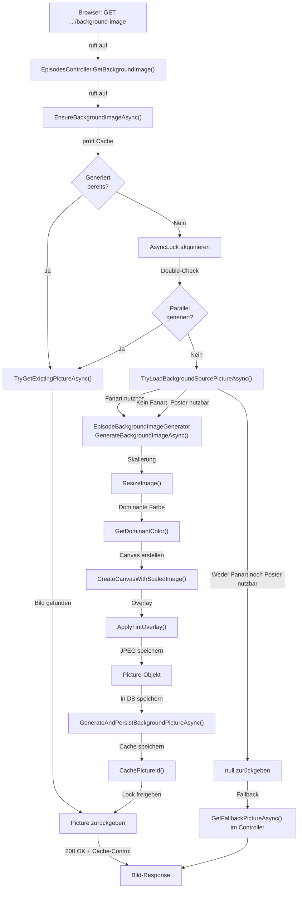

← [Zurück zur Übersicht](index.md)

# Episoden — Technischer Ablauf

## Übersicht

Die Hintergrundbild-Generierung für Episoden folgt einem Lazy-Loading-Pattern mit Thread-Safety durch AsyncLock. Der Prozess erstreckt sich über mehrere Komponenten: API-Controller, Service-Layer, Generator und Datenbank. Parallele Requests auf die gleiche Episode werden synchronisiert, um redundante Generierungen zu vermeiden.

**Architekturregel:** Razor-Komponenten greifen niemals direkt auf Services zu — jeglicher Zugriff läuft über die API. `TVShowDetails.razor` injiziert daher weder `EpisodeBackgroundImageService` noch ruft es dessen Methoden auf; die Komponente rendert lediglich die Bild-URL des API-Endpoints (siehe Abschnitt „UI-Rendering"). Die Generierung wird ausschließlich vom `EpisodesController` beim Abruf des Bildes angestoßen.

## Ablauf: Episode-Detailseite laden und Hintergrundbild sicherstellen

### 1. Browser ruft Hintergrundbild-Endpoint auf

**Komponente:** `TVShowDetails.razor` rendert den Header mit `style="background-image: url('@GetHeaderBackgroundUrl()')"`. Der Browser lädt dieses Bild als eigenständigen HTTP-Request — unabhängig vom initialen Seiten-Rendering der Blazor-Komponente.

**Endpoint:** `EpisodesController.GetBackgroundImage(long episodeId, CancellationToken cancellationToken)`

Der Endpoint lädt die Episode und stößt die Generierung direkt an:

```csharp
[HttpGet("{episodeId}/background-image")]
public async Task<IActionResult> GetBackgroundImage(long episodeId, CancellationToken cancellationToken)
{
    CheckLogedIn();

    var episode = await _db.TVShowEpisodes.AsNoTracking()
        .FirstOrDefaultAsync(e => e.Id == episodeId, cancellationToken);
    if (episode is null)
        return NotFound();

    var picture = await _backgroundImageService.EnsureBackgroundImageAsync(episode, cancellationToken);
    picture ??= await GetFallbackPictureAsync(episode);
    // ... liefert picture, Fallback (Banner/Fanart) oder Placeholder aus
}
```

**Entscheidung synchron vs. 202 Accepted:** Die Generierung erfolgt synchron innerhalb des Requests. Da der Bild-Request als separater HTTP-Aufruf (CSS `background-image`) erfolgt und nicht das initiale Seiten-Rendering blockiert, ist die Latenz von bis zu ~1 Sekunde bei der ersten Generierung tolerierbar; ein zweistufiger Ablauf mit `202 Accepted` und clientseitigem Retry würde unnötige Komplexität hinzufügen, ohne die Ladezeit der Seite selbst zu verbessern.

### 2. Service prüft Existenz und Cache

**Komponente:** `EpisodeBackgroundImageService.EnsureBackgroundImageAsync()`

Der Service prüft zunächst, ob bereits ein gültiges generiertes Bild vorliegt:

1. Prüfung: Ist `GeneratedBackgroundPictureId` gesetzt UND `BackgroundImageRequiresUpdate == false`?
2. Falls ja: Bild aus Cache oder Datenbank laden und zurückgeben
3. Falls nein: Akquiriere `AsyncLock` für die Episode-ID (verhindert Parallelprozesse)

**Beteiligte Methoden:**
- `TryGetExistingPictureAsync()` — Lädt Bild aus Cache/DB, falls vorhanden
- `TryGetCachedImageIdAsync()` — Konsultiert In-Memory Cache

### 3. Lazy-Loading mit Thread-Safety

**Komponente:** `EpisodeBackgroundImageService` (innerhalb Lock)

Im geschützten Lock-Block wird:

1. Episode neu aus DB geladen (Optimistic Lock, um parallele Änderungen zu berücksichtigen)
2. Nochmals geprüft, ob Bild bereits vorhanden (Double-Check)
3. Quellbild geladen: `TryLoadBackgroundSourcePictureAsync()`
   - Prüft zuerst: Ist `FanartPictureId` gesetzt und liefert gültige Bilddaten?
   - Falls nicht: Fällt auf `PosterPictureId` zurück (gleiche Prüfung)
   - Falls weder Fanart noch Poster nutzbare Bilddaten liefern: `null` zurückgeben → Keine Generierung
4. Generierung aufgerufen: `GenerateAndPersistBackgroundPictureAsync()`

### 4. Bildgenerierung

**Komponente:** `EpisodeBackgroundImageGenerator.GenerateBackgroundImageAsync()`

Der Generator führt folgende Schritte aus:

1. **ResizeImage()** — Skaliert das Quellbild (Fanart oder Poster) auf max 1920×1080, erhält Seitenverhältnis
2. **GetDominantColor()** — Berechnet dominante Farbe mittels 8×8 Pixel-Sampling-Grid
3. **CreateCanvasWithScaledImage()** — Erstellt 1920×1080 Canvas gefüllt mit dominanter Farbe, platziert skaliertes Quellbild zentriert
4. **ApplyTintOverlay()** — Wendet 40% schwarzes Overlay an für Textlesbarkeit
5. **Als JPEG speichern** — Quality 85%, Returns `Picture` Objekt mit Binärdaten

**Fehlerbehandlung:** Falls ein Schritt fehlschlägt, wird Exception geloggt (wenn `EnableLogging == true`) und `null` zurückgegeben.

### 5. Persistierung in DB

**Komponente:** `EpisodeBackgroundImageService.GenerateAndPersistBackgroundPictureAsync()`

Nach erfolgreicher Generierung:

1. Alte generierte Picture löschen (falls vorhanden): `RemoveObsoleteGeneratedPictureAsync()`
2. Neue Picture in DB speichern:
   - Set `IsGeneratedBackground = true`
   - Set `EpisodeId = episode.Id`
   - `SaveChangesAsync()`
3. Episode aktualisieren:
   - Set `GeneratedBackgroundPictureId = picture.Id`
   - Set `BackgroundImageGeneratedAt = DateTime.UtcNow`
   - Set `BackgroundImageRequiresUpdate = false`
   - `SaveChangesAsync()`
4. Picture-ID in In-Memory Cache eintragen: `CachePictureId(episodeId, pictureId)`
5. Lock freigeben und Picture zurückgeben

### 6. UI-Rendering

**Komponente:** `TVShowDetails.razor`

Die Komponente greift nicht mehr direkt auf `EpisodeBackgroundImageService` zu (Architekturregel: Razor-Komponenten dürfen niemals direkt auf Services zugreifen). Solange eine Episode ausgewählt ist, wird die Bild-URL immer auf den API-Endpoint gesetzt — der Endpoint entscheidet serverseitig, ob das generierte Bild, ein Fallback (Banner/Fanart) oder der Placeholder ausgeliefert wird:

```csharp
private string GetHeaderBackgroundUrl()
    => selectedEpisode is not null
        ? BuildEpisodeBackgroundImageUrl(selectedEpisode.Id, Client.AuthorizationToken)
        : GetBannerUrl(/* Fallback auf Staffel- oder Show-Ebene */);
```

Header-Markup mit Hintergrundbild:

```html
<div class="tvshow-header" 
     style="background-image: url('@GetHeaderBackgroundUrl()'); position: relative;">
    <!-- ... Inhalte ... -->
</div>
```

Die Komponente fügt bewusst **keine** zusätzliche CSS-Verdunkelung über `.tvshow-header` hinzu (kein `background-with-overlay`-Modifier mehr). Der Tint-Schleier (siehe `ApplyTintOverlay()` oben) wird bereits serverseitig in das generierte Bild eingebacken; eine zusätzliche CSS-Ebene würde Episoden-Header gegenüber Film-/Staffel-/Collection-Headern spürbar dunkler erscheinen lassen, die nur den gemeinsamen Gradient-Overlay `.tvshow-header-overlay` erhalten.

## Ablauf: Fanart- oder Poster-Update nach Media-Scanner

### 1. Scanner findet neues Fanart oder Poster

**Komponente:** `MediaSourceClassifier.AssignPicturesToTVShowEpisodeAsync()`

1. Neue Picture wird erstellt/aktualisiert (vom Scanner)
2. `Episode.FanartPictureId` bzw. `Episode.PosterPictureId` wird gesetzt
3. Service aufgerufen: `EpisodeBackgroundImageService.MarkBackgroundImageForUpdateAsync(episodeId, cancellationToken)` — sowohl bei neuem Fanart als auch bei neuem Poster, da Letzteres als Fallback-Quelle dient

### 2. Service markiert für Regenerierung

**Komponente:** `EpisodeBackgroundImageService.MarkBackgroundImageForUpdateAsync()`

1. Episode aus DB laden
2. Set `BackgroundImageRequiresUpdate = true`
3. Cache-Eintrag löschen: `_cache.Remove(GetCacheKey(episodeId))`
4. Änderungen speichern

### 3. Beim nächsten Episode-Aufruf

Beim nächsten Zugriff auf die Episode wird `EnsureBackgroundImageAsync()` aufgerufen und erkennt das Update-Flag → Regenerierung wie in Schritt 1–5 oben.

## Ablauf: API-Endpoint Bildbereitstellung

### Endpoint: `GET /api/episodes/{episodeId}/background-image`

**Komponente:** `EpisodesController.GetBackgroundImage(long episodeId, CancellationToken cancellationToken)`

1. Login-Prüfung (`CheckLogedIn()`)
2. Episode laden; falls unbekannt: `404 Not Found`
3. `EpisodeBackgroundImageService.EnsureBackgroundImageAsync()` aufrufen — generiert das Bild bei Bedarf synchron (lazy, mit Cache/Lock wie oben beschrieben) und liefert das bestehende oder frisch generierte `Picture` zurück
4. Falls kein generiertes Bild verfügbar ist (kein Fanart/Poster oder Generierung fehlgeschlagen): Fallback auf Banner oder Fanart der Episode laden
5. Falls ein Bild (generiert oder Fallback) mit Daten vorhanden ist:
   - Response mit Status 200 OK
   - Content-Type aus `Picture.ContentType` (z. B. `image/jpeg`)
   - Cache-Control-Header: `public, max-age=3600, must-revalidate` sowie ein `ETag`-Header auf Basis der `Picture.Id`. Da die URL nicht versioniert ist und sich das ausgelieferte Bild einer Episode durch `MarkBackgroundImageForUpdateAsync()` (bei Poster-/Fanart-/Thumb-Änderung) nun regenerieren kann, wird bewusst nur eine Stunde statt unbegrenzt lange gecacht; per `If-None-Match` kann der Client danach günstig mit `304 Not Modified` bedient werden, solange sich die `Picture.Id` nicht geändert hat
   - Bild-Binärdaten aus `Picture.Data` zurückgeben
6. Andernfalls: Placeholder-Bild aus `wwwroot/images/placeholder.png` zurückgeben (ohne Cache-Control-Header)

**Latenz:** Die erste Anfrage für eine Episode ohne bestehendes generiertes Bild löst die synchrone Generierung aus (bis zu ~1 Sekunde). Da der Bild-Request als eigenständiger Browser-Request (CSS `background-image`) erfolgt, blockiert dies nicht das Rendering der Seite selbst.

## Diagramm: Generierungsablauf



## Thread-Safety-Mechanismus

**Primitive:** `ConcurrentDictionary<long, AsyncLock>`

- Pro Episode-ID wird ein `AsyncLock` verwaltet (statisch in `EpisodeBackgroundImageService`)
- Mehrere parallele Requests auf gleiche Episode werden serialisiert
- Nur ein Request führt Generierung aus, andere warten auf Lock-Release
- Nach Freigabe nutzen wartende Requests das gecachte Resultat

**Beispiel:** 5 parallele Requests auf Episode #42
1. Request 1 akquiriert Lock → beginnt Generierung
2. Requests 2–5 warten auf Lock
3. Request 1 generiert, persistiert, cached → Lock freigeben
4. Requests 2–5 akquirieren nacheinander Lock → finden Picture im Cache → sofort zurück

## Fehlerbehandlung

| Szenario | Fehlerfall | Verhalten |
|----------|-----------|-----------|
| Weder Fanart noch Poster vorhanden | `FanartPictureId` und `PosterPictureId` sind null | `null` zurückgeben → Fallback auf Banner/Fanart |
| Fanart- und Poster-Daten ungültig | `Picture.Data` bei beiden null/leer | `null` zurückgeben → Fallback |
| Bildverarbeitung schlägt fehl | Exception in Generator | Exception geloggt (wenn EnableLogging=true), `null` zurückgeben → Fallback |
| DB-Fehler beim Speichern | `SaveChangesAsync()` Exception | Exception propagiert bis in `EpisodesController.GetBackgroundImage()`, dort als `500 Internal Server Error` geloggt und beantwortet; Episode-Seite selbst bleibt unberührt, da der Bild-Request unabhängig vom Seiten-Rendering läuft |
| Cache-Hit nach Fehler | GeneratedBackgroundPictureId gesetzt, aber Picture gelöscht | `null` → Fallback |

Alle Fehler sind graceful: Die Episode wird weiterhin angezeigt, nur ohne generiertes Hintergrundbild.
