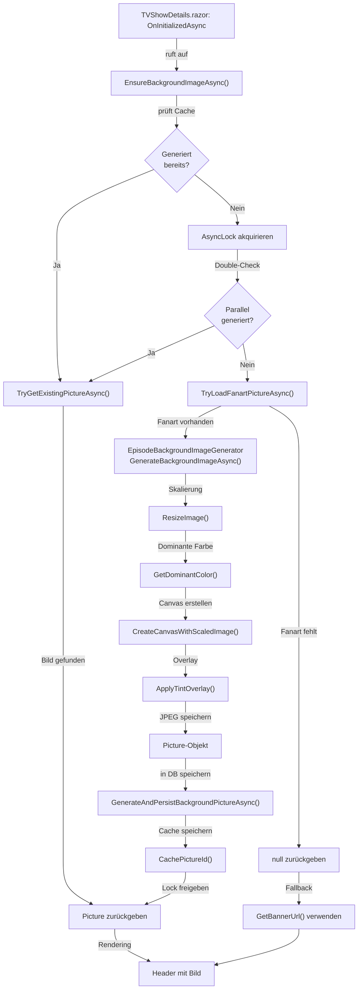

← [Zurück zur Übersicht](index.md)

# Episoden — Technischer Ablauf

## Übersicht

Die Hintergrundbild-Generierung für Episoden folgt einem Lazy-Loading-Pattern mit Thread-Safety durch AsyncLock. Der Prozess erstreckt sich über mehrere Komponenten: UI-Component, Service-Layer, Generator und Datenbank. Parallele Requests auf die gleiche Episode werden synchronisiert, um redundante Generierungen zu vermeiden.

## Ablauf: Episode-Detailseite laden und Hintergrundbild sicherstellen

### 1. UI-Component lädt Episode

**Komponente:** `TVShowDetails.razor` (OnInitializedAsync)

Beim Laden der Episode-Detailseite wird die `EnsureEpisodeBackgroundImageAsync()` Methode aufgerufen:

```csharp
private async Task EnsureEpisodeBackgroundImageAsync()
{
    if (selectedEpisode is null)
        return;

    try
    {
        var episode = await Db.TVShowEpisodes.AsNoTracking()
            .FirstOrDefaultAsync(e => e.Id == selectedEpisode.Id);
        if (episode is null)
            return;

        var picture = await BackgroundImageService
            .EnsureBackgroundImageAsync(episode, CancellationToken.None);
        selectedEpisode.GeneratedBackgroundPictureId = picture?.Id;
    }
    catch (Exception ex)
    {
        Logger.LogWarning(ex, "Hintergrundbild für Episode {EpisodeId} konnte nicht sichergestellt werden.", 
            selectedEpisode?.Id);
    }
}
```

### 2. Service prüft Existenz und Cache

**Komponente:** `EpisodeBackgroundImageService.EnsureBackgroundImageAsync()`

Der Service prüft zunächst, ob bereits ein gültiges generiertes Bild vorliegt:

1. Prüfung: Ist `GeneratedBackgroundPictureId` gesetzt UND `BackgroundImageRequiresUpdate == false`?
2. Falls ja: Bild aus Cache oder Datenbank laden und zurückgeben
3. Falls nein: Akquiriere `AsyncLock` für die Episode-ID (verhindert Parallelprozesse)

**Beteiligte Methoden:**
- `TryGetExistingPictureAsync()` — Lädt Bild aus Cache/DB, falls vorhanden
- `TryGetCachedImageIdAsync()` — Konsultiert In-Memory Cache

### 3. Lazy-Loading mit Thread-Safety

**Komponente:** `EpisodeBackgroundImageService` (innerhalb Lock)

Im geschützten Lock-Block wird:

1. Episode neu aus DB geladen (Optimistic Lock, um parallele Änderungen zu berücksichtigen)
2. Nochmals geprüft, ob Bild bereits vorhanden (Double-Check)
3. Fanart-Bild geladen: `TryLoadFanartPictureAsync()`
   - Prüft: Ist `FanartPictureId` gesetzt?
   - Lädt Bild-Binärdaten aus `Picture.Data`
   - Falls kein Fanart: `null` zurückgeben → Keine Generierung
4. Generierung aufgerufen: `GenerateAndPersistBackgroundPictureAsync()`

### 4. Bildgenerierung

**Komponente:** `EpisodeBackgroundImageGenerator.GenerateBackgroundImageAsync()`

Der Generator führt folgende Schritte aus:

1. **ResizeImage()** — Skaliert Fanart auf max 1920×1080, erhält Seitenverhältnis
2. **GetDominantColor()** — Berechnet dominante Farbe mittels 8×8 Pixel-Sampling-Grid
3. **CreateCanvasWithScaledImage()** — Erstellt 1920×1080 Canvas gefüllt mit dominanter Farbe, platziert skaliertes Fanart zentriert
4. **ApplyTintOverlay()** — Wendet 40% schwarzes Overlay an für Textlesbarkeit
5. **Als JPEG speichern** — Quality 85%, Returns `Picture` Objekt mit Binärdaten

**Fehlerbehandlung:** Falls ein Schritt fehlschlägt, wird Exception geloggt (wenn `EnableLogging == true`) und `null` zurückgegeben.

### 5. Persistierung in DB

**Komponente:** `EpisodeBackgroundImageService.GenerateAndPersistBackgroundPictureAsync()`

Nach erfolgreicher Generierung:

1. Alte generierte Picture löschen (falls vorhanden): `RemoveObsoleteGeneratedPictureAsync()`
2. Neue Picture in DB speichern:
   - Set `IsGeneratedBackground = true`
   - Set `EpisodeId = episode.Id`
   - `SaveChangesAsync()`
3. Episode aktualisieren:
   - Set `GeneratedBackgroundPictureId = picture.Id`
   - Set `BackgroundImageGeneratedAt = DateTime.UtcNow`
   - Set `BackgroundImageRequiresUpdate = false`
   - `SaveChangesAsync()`
4. Picture-ID in In-Memory Cache eintragen: `CachePictureId(episodeId, pictureId)`
5. Lock freigeben und Picture zurückgeben

### 6. UI-Rendering

**Komponente:** `TVShowDetails.razor`

Die Component prüft, ob Hintergrundbild vorhanden ist:

```csharp
private string GetHeaderBackgroundUrl()
    => HasGeneratedBackgroundImage()
        ? $"/api/episodes/{selectedEpisode!.Id}/background-image?access_token={Client.AuthorizationToken}"
        : GetBannerUrl(/* Fallback */);

private bool HasGeneratedBackgroundImage()
    => selectedEpisode is not null && (selectedEpisode.GeneratedBackgroundPictureId ?? 0) > 0;
```

Header-Markup mit Hintergrundbild:

```html
<div class="tvshow-header background-with-overlay" 
     style="background-image: url('@GetHeaderBackgroundUrl()'); position: relative;">
    <!-- ... Inhalte ... -->
</div>
```

CSS-Klasse `background-with-overlay` wendet Transparenz an (opacity: 0.4 oder ähnlich).

## Ablauf: Fanart-Update nach Media-Scanner

### 1. Scanner findet neues Fanart

**Komponente:** `MediaSourceClassifier.AssignPicturesToTVShowEpisodeAsync()`

1. Neue Picture wird erstellt/aktualisiert (vom Scanner)
2. `Episode.FanartPictureId = newFanartId` gesetzt
3. Service aufgerufen: `EpisodeBackgroundImageService.MarkBackgroundImageForUpdateAsync(episodeId, cancellationToken)`

### 2. Service markiert für Regenerierung

**Komponente:** `EpisodeBackgroundImageService.MarkBackgroundImageForUpdateAsync()`

1. Episode aus DB laden
2. Set `BackgroundImageRequiresUpdate = true`
3. Cache-Eintrag löschen: `_cache.Remove(GetCacheKey(episodeId))`
4. Änderungen speichern

### 3. Beim nächsten Episode-Aufruf

Beim nächsten Zugriff auf die Episode wird `EnsureBackgroundImageAsync()` aufgerufen und erkennt das Update-Flag → Regenerierung wie in Schritt 1–5 oben.

## Ablauf: API-Endpoint Bildbereitstellung

### Endpoint: `GET /api/episodes/{episodeId}/background-image`

**Komponente:** `EpisodesController.GetBackgroundImageAsync(long episodeId)`

1. Episode und GeneratedBackgroundPictureId laden
2. Prüfe: Ist Picture vorhanden und `IsGeneratedBackground == true`?
3. Falls ja:
   - Response mit Status 200 OK
   - Content-Type: `image/jpeg`
   - Cache-Control-Header: `public, max-age=31536000` (1 Jahr, da Bilder unveränderlich)
   - Bild-Binärdaten aus `Picture.Data` zurückgeben
4. Falls nein:
   - Fallback: Banner oder Fanart der Episode laden
   - Oder Placeholder-Bild aus `wwwroot/images/placeholder.png` zurückgeben

## Diagramm: Generierungsablauf



## Thread-Safety-Mechanismus

**Primitive:** `ConcurrentDictionary<long, AsyncLock>`

- Pro Episode-ID wird ein `AsyncLock` verwaltet (statisch in `EpisodeBackgroundImageService`)
- Mehrere parallele Requests auf gleiche Episode werden serialisiert
- Nur ein Request führt Generierung aus, andere warten auf Lock-Release
- Nach Freigabe nutzen wartende Requests das gecachte Resultat

**Beispiel:** 5 parallele Requests auf Episode #42
1. Request 1 akquiriert Lock → beginnt Generierung
2. Requests 2–5 warten auf Lock
3. Request 1 generiert, persistiert, cached → Lock freigeben
4. Requests 2–5 akquirieren nacheinander Lock → finden Picture im Cache → sofort zurück

## Fehlerbehandlung

| Szenario | Fehlerfall | Verhalten |
|----------|-----------|-----------|
| Fanart nicht vorhanden | `FanartPictureId` ist null | `null` zurückgeben → Fallback auf Banner/Fanart |
| Fanart-Daten ungültig | `Picture.Data` ist null/leer | `null` zurückgeben → Fallback |
| Bildverarbeitung schlägt fehl | Exception in Generator | Exception geloggt (wenn EnableLogging=true), `null` zurückgeben → Fallback |
| DB-Fehler beim Speichern | `SaveChangesAsync()` Exception | Exception propagiert, Component loggt Warning, Episode-Seite lädt trotzdem |
| Cache-Hit nach Fehler | GeneratedBackgroundPictureId gesetzt, aber Picture gelöscht | `null` → Fallback |

Alle Fehler sind graceful: Die Episode wird weiterhin angezeigt, nur ohne generiertes Hintergrundbild.
