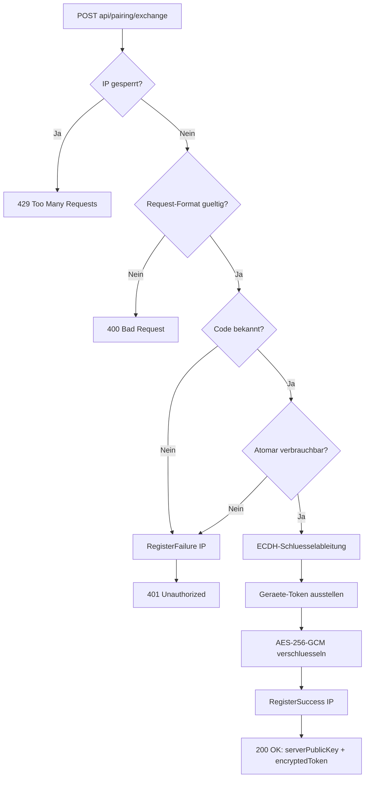

← [Zurück zur Übersicht](index.md)

# Geräte — Technischer Ablauf

## Übersicht

Das Geräte-Pairing besteht aus drei Abläufen: der Erzeugung eines Einmal-Pairing-Codes in der Admin-UI, dem öffentlichen Austausch des Codes gegen ein verschlüsselt übertragenes Geräte-Token und der Validierung des Geräte-Tokens am `X-API-Key`-Gate. Hinzu kommen die Verwaltungsaktionen Auflisten, Umbenennen und Widerrufen.

## Ablauf

### 1. Pairing-Code erzeugen (Admin-UI)

Der Administrator öffnet `/admin/devices` und klickt `Pairing-Code erzeugen`. `PairingService.CreatePairingCodeAsync` generiert einen zufälligen Code (Standard: 8 Zeichen aus einem Alphabet ohne verwechselbare Zeichen, `RandomNumberGenerator.GetString`), speichert nur `SHA-256(code)` als `PairingCode.CodeHash` und gibt den Klartext einmalig an die UI zurück.

Beteiligte Komponenten:
- `Devices.razor` (`CreateCodeAsync`) — Admin-Seite, `IsAdmin`-Claim-Prüfung in `OnInitializedAsync`
- `IPairingService.CreatePairingCodeAsync` — Code-Erzeugung und Persistenz
- `PairingCode` — Entität (`CodeHash`, `CreatedAtUtc`, `ExpiresAtUtc`, `ConsumedAtUtc`, `CreatedByUserId`)
- `HashHelper.Sha256Hex` — SHA-256-Hash des Klartext-Codes
- `IConfiguration` — liest `Pairing:CodeLength` (Default `8`) und `Pairing:CodeTtlMinutes` (Default `5`)

### 2. Pairing-Exchange (öffentlicher Endpunkt)

`POST api/pairing/exchange` trägt weder `ApiTokenCheck` noch `BearerTokenCheck`. Der `PairingController` prüft zuerst die IP-Sperre und delegiert dann an `PairingService.ExchangeAsync`.

1. `ILoginIpBlockService.IsBlocked(remoteIp)` → gesperrt: `429`.
2. Request-Format prüfen (`Code`/`ClientPublicKey` nicht leer, `ClientPublicKey` als SubjectPublicKeyInfo importierbar mit Kurve `nistP256`, `DeviceName` ≤ 200 Zeichen) → ungültig: `400`, ohne Fehlversuchszählung.
3. Code-Lookup über `CodeHash`; unbekannt → `RegisterFailure(ip)` + `401`.
4. Atomarer Verbrauch per `ExecuteUpdateAsync` (`ConsumedAtUtc` setzen nur wenn `ConsumedAtUtc == null && ExpiresAtUtc > now`); 0 betroffene Zeilen → `RegisterFailure(ip)` + `401`.
5. Flüchtiges ECDH-Schlüsselpaar (`nistP256`) erzeugen, AES-Schlüssel via `DeriveKeyFromHmac` (SHA-256) ableiten.
6. `IDeviceTokenService.IssueAsync` erzeugt das Geräte-Token (32 Byte Zufall, Base64Url) und speichert `PairedDevice` mit `TokenHash` = SHA-256.
7. Token mit AES-256-GCM verschlüsseln; Response `serverPublicKey` (Base64-SPKI) + `encryptedToken` = Base64(nonce ‖ ciphertext ‖ tag), 12-Byte-Nonce, 16-Byte-Tag. `RegisterSuccess(ip)` löscht den Fehlerzähler.

Beteiligte Komponenten:
- `PairingController.Exchange` — Endpunkt, IP-Sperrprüfung, Statuscode-Mapping
- `IPairingService.ExchangeAsync` / `PairingExchangeResult` / `PairingExchangeErrorKind` — Validierung, atomarer Verbrauch, Krypto
- `IDeviceTokenService.IssueAsync` — Token-Erzeugung und `PairedDevice`-Persistenz
- `ILoginIpBlockService` — `IsBlocked`, `RegisterFailure`, `RegisterSuccess`
- `PairingExchangeRequest` / `PairingExchangeResponse` — DTOs in `VideoWebPlayer.Client/Models/`

### 3. Request-Gate mit Geräte-Token

`ApiTokenCheckAttribute.OnActionExecutionAsync` liest `X-API-Key` (inkl. `Bearer `-Präfix-Entfernung). Matcht der Wert einen Config-Token des Scopes, passiert der Request wie bisher. Nur bei `ApiTokenScope.MauiOnly` und ohne Config-Treffer wird `IDeviceTokenService` aus `RequestServices` aufgelöst und `IsValidDeviceTokenAsync` prüft `SHA-256(token)` gegen `PairedDevices` mit `RevokedAtUtc == null`. Bei Treffer wird `LastUsedAtUtc` aktualisiert. `AnyClient` führt nie eine DB-Prüfung durch.

Beteiligte Komponenten:
- `ApiTokenCheckAttribute` — Async-Filter mit Config-Fast-Path und DB-Fallback
- `IDeviceTokenService.IsValidDeviceTokenAsync` — Hash-Vergleich plus `LastUsedAtUtc`-Pflege
- `AuthController.Login` — einziger `MauiOnly`-Endpunkt

### 4. Geräte verwalten (Admin-UI)

`Devices.razor` lädt aktive Codes über `IPairingService.GetActiveCodesAsync` (nur Metadaten, nie Code oder Hash) und Geräte über `IDeviceTokenService.GetDevicesAsync`. `RenameAsync` trimmt und validiert den Namen (1–200 Zeichen), `RevokeAsync` setzt `RevokedAtUtc`; der Widerruf ist in der UI durch eine Checkbox-Bestätigung gesichert.

Beteiligte Komponenten:
- `Devices.razor` — `LoadAsync`, `SaveRenameAsync`, `ConfirmRevokeAsync`
- `IDeviceTokenService` — `GetDevicesAsync`, `RenameAsync`, `RevokeAsync`
- `UserManager<ApplicationUser>` — Auflösung der Ersteller-Anzeigenamen

## Diagramm

## Fehlerbehandlung

- `400` bei Formatfehlern (fehlende Felder, nicht importierbarer oder falscher Kurven-Typ des Client-Schlüssels, `DeviceName` > 200 Zeichen) — ohne Einfluss auf den Fehlversuchszähler.
- `401` generisch bei unbekanntem, abgelaufenem oder bereits verbrauchtem Code — zählt als Fehlversuch für die Client-IP; ab 5 Fehlversuchen wird die IP über `BlockedLoginIps` gesperrt (`429`).
- Race-Bedingungen beim Einlösen werden durch den atomaren `ExecuteUpdateAsync`-Verbrauch abgefangen.
- Fehlt `IDeviceTokenService` in `RequestServices` (isolierte Tests), verhält sich das Gate wie bisher und liefert `Unauthorized`.
