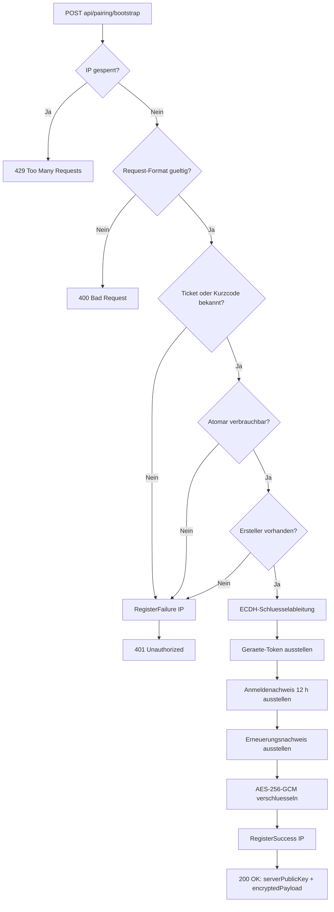

← [Zurück zur Übersicht](index.md)

# Geräte — Technischer Ablauf

## Übersicht

Das Geräte-Pairing besteht aus zwei Kopplungswegen und der anschließenden Sitzungsverwaltung:

1. Erzeugung eines Einmal-Pairing-Codes in der Admin-UI und dessen Austausch gegen ein Geräte-Token (`api/pairing/exchange`),
2. Erzeugung eines Bootstrap-Tickets auf der Profilseite und dessen Einlösung gegen Geräte-Token, Benutzersitzung und Erneuerungsnachweis (`api/pairing/bootstrap`),
3. Validierung des Geräte-Tokens am `X-API-Key`-Gate,
4. Erneuerung der Sitzung mit Rotation des Erneuerungsnachweises (`api/auth/refresh`) und Abmelden (`api/auth/logout`),
5. die Verwaltungsaktionen Auflisten, Umbenennen und Widerrufen.

## Ablauf

### 1. Pairing-Code erzeugen (Admin-UI)

Der Administrator öffnet `/admin/devices` und klickt `Pairing-Code erzeugen`. `PairingService.CreatePairingCodeAsync` generiert einen zufälligen Code (Standard: 8 Zeichen aus einem Alphabet ohne verwechselbare Zeichen, `RandomNumberGenerator.GetString`), speichert nur `SHA-256(code)` als `PairingCode.CodeHash` und gibt den Klartext einmalig an die UI zurück.

Beteiligte Komponenten:
- `Devices.razor` (`CreateCodeAsync`) — Admin-Seite, `IsAdmin`-Claim-Prüfung in `OnInitializedAsync`
- `IPairingService.CreatePairingCodeAsync` — Code-Erzeugung und Persistenz
- `PairingCode` — Entität (`Kind = AdminCode`, `CodeHash`, `CreatedAtUtc`, `ExpiresAtUtc`, `ConsumedAtUtc`, `CreatedByUserId`)
- `HashHelper.Sha256Hex` — SHA-256-Hash des Klartext-Codes
- `IConfiguration` — liest `Pairing:CodeLength` (Default `8`) und `Pairing:CodeTtlMinutes` (Default `5`)

### 2. Pairing-Exchange (öffentlicher Endpunkt)

`POST api/pairing/exchange` trägt weder `ApiTokenCheck` noch `BearerTokenCheck`. Der `PairingController` prüft zuerst die IP-Sperre und delegiert dann an `PairingService.ExchangeAsync`.

1. `ILoginIpBlockService.IsBlocked(remoteIp)` → gesperrt: `429`.
2. Request-Format prüfen (`Code`/`ClientPublicKey` nicht leer, `ClientPublicKey` als SubjectPublicKeyInfo importierbar mit Kurve `nistP256`, `DeviceName` ≤ 200 Zeichen) → ungültig: `400`, ohne Fehlversuchszählung.
3. Code-Lookup über `CodeHash`; unbekannt → `RegisterFailure(ip)` + `401`.
4. Atomarer Verbrauch per `ExecuteUpdateAsync` (`ConsumedAtUtc` setzen nur wenn `ConsumedAtUtc == null && ExpiresAtUtc > now`); 0 betroffene Zeilen → `RegisterFailure(ip)` + `401`.
5. Flüchtiges ECDH-Schlüsselpaar (`nistP256`) erzeugen, AES-Schlüssel via `DeriveKeyFromHmac` (SHA-256) ableiten.
6. `IDeviceTokenService.IssueAsync` erzeugt das Geräte-Token (32 Byte Zufall, Base64Url) und speichert `PairedDevice` mit `TokenHash` = SHA-256.
7. Token mit AES-256-GCM verschlüsseln; Response `serverPublicKey` (Base64-SPKI) + `encryptedToken` = Base64(nonce ‖ ciphertext ‖ tag), 12-Byte-Nonce, 16-Byte-Tag. `RegisterSuccess(ip)` löscht den Fehlerzähler.

Beteiligte Komponenten:
- `PairingController.Exchange` — Endpunkt, IP-Sperrprüfung, Statuscode-Mapping
- `IPairingService.ExchangeAsync` / `PairingExchangeResult` / `PairingExchangeErrorKind` — Validierung, atomarer Verbrauch, Krypto
- `IDeviceTokenService.IssueAsync` — Token-Erzeugung und `PairedDevice`-Persistenz
- `ILoginIpBlockService` — `IsBlocked`, `RegisterFailure`, `RegisterSuccess`
- `PairingExchangeRequest` / `PairingExchangeResponse` — DTOs in `VideoWebPlayer.Client/Models/`

### 3. Bootstrap-Ticket erzeugen (Profilseite)

Der angemeldete Anwender öffnet `/Account/Manage/Devices` und klickt `Gerät koppeln`. `PairingBootstrapService.CreateBootstrapTicketAsync` prüft und erzeugt:

1. **Berechtigung:** Ist `Pairing:BootstrapAdminOnly` (Default `false`) gesetzt und der Anwender kein Administrator → `BootstrapTicketErrorKind.Forbidden`, die Seite zeigt den entsprechenden Hinweis.
2. **Quote:** Zahl der eigenen `PairingCodes` mit `Kind = BootstrapTicket` der letzten Stunde ≥ `Pairing:BootstrapMaxTicketsPerHour` (Default `10`) → `RateLimited`.
3. **Ticket:** 24 Byte Zufall, Base64Url — das lange Geheimnis für den QR-Code.
4. **Kurzcode:** 8 Zeichen aus dem Alphabet `ABCDEFGHJKMNPQRSTUVWXYZ23456789` als Alias zum Abtippen.
5. **Persistenz:** ein `PairingCode` mit `Kind = BootstrapTicket`, `TicketHash = SHA-256(ticket)`, `CodeHash = SHA-256(shortCode)`, `CreatedByUserId` = Id des Anwenders und `ExpiresAtUtc = now + Pairing:BootstrapTicketTtlMinutes` (Default `5`, Minimum `1`). Keiner der beiden Klartextwerte wird gespeichert.
6. **Anzeige:** Die Seite rendert den QR-Code (`QRCoder`) mit der URL `<scheme>://<host>/pairing?t=<ticket>`, dazu den Kurzcode und die verbleibende Gültigkeit. Läuft der Server unter einer Loopback-Adresse, erscheint zusätzlich ein Hinweis, dass der QR-Code so nur auf demselben Rechner funktioniert.

### 4. Bootstrap einlösen (öffentlicher Endpunkt)

`POST api/pairing/bootstrap` trägt wie der Exchange keinerlei Schlüsselprüfung. `PairingController.Bootstrap` prüft die IP-Sperre und delegiert an `PairingBootstrapService.BootstrapAsync`:

1. Request-Format prüfen (`Ticket`/`ClientPublicKey` nicht leer, Schlüssel importierbar mit Kurve `nistP256`, `DeviceName` ≤ 200 Zeichen) → ungültig: `400`.
2. Datensatz suchen: `Kind = BootstrapTicket` und `TicketHash == SHA-256(vorgelegt)` **oder** `CodeHash == SHA-256(vorgelegt)` — QR-Ticket und Kurzcode treffen denselben Datensatz.
3. Atomarer Verbrauch per `ExecuteUpdateAsync` (`ConsumedAtUtc` setzen nur wenn noch `null` und nicht abgelaufen); 0 Zeilen → `401`.
4. Anwender über `CreatedByUserId` laden; existiert er nicht mehr → `401`.
5. `IDeviceTokenService.IssueAsync` stellt das Geräte-Token aus (neuer `PairedDevice`-Datensatz).
6. `AuthorizationTokenService.CreateToken(user)` stellt den Anmeldenachweis aus (siehe unten).
7. `IRefreshTokenService.IssueAsync(userId, deviceId)` stellt den Erneuerungsnachweis aus (32 Byte Zufall, Base64Url; gespeichert wird nur `SHA-256`).
8. Die drei Werte plus Ablaufzeitpunkt werden als JSON serialisiert, mit dem aus dem flüchtigen Server-ECDH-Schlüssel und dem Client-Schlüssel abgeleiteten AES-256-Schlüssel per AES-256-GCM verschlüsselt und als `encryptedPayload` zurückgegeben.

Das Gerät entschlüsselt mit seinem privaten Schlüssel und hat danach alles, was es braucht — ohne dass jemals ein Passwort auf dem Gerät eingegeben wurde.

Beteiligte Komponenten:
- `PairingController.Bootstrap` — Endpunkt, IP-Sperrprüfung, Statuscode-Mapping
- `IPairingBootstrapService` / `PairingBootstrapService` — Ticket-Erzeugung, Einlösung, Krypto
- `IDeviceTokenService`, `IRefreshTokenService`, `AuthorizationTokenService`
- `PairingBootstrapRequest` / `PairingBootstrapResponse` / `PairingBootstrapPayload` — DTOs in `VideoWebPlayer.Client/Models/`

### 5. Anmeldenachweis (JWT)

`AuthorizationTokenService.CreateToken` erzeugt den Anmeldenachweis, den sowohl das Web als auch ein gekoppeltes Gerät verwenden:

- Claims: `sub` und `NameIdentifier` = Id des Anwenders, `email`, `name` (Benutzername) und `IsAdmin` (`True`/`False`).
- Aussteller und Zielgruppe: `Jwt:Issuer` (Default `VideoWebPlayer`).
- Signatur: HMAC-SHA-256 mit dem Schlüssel aus `Jwt:Key`.
- Gültigkeit: **12 Stunden** ab Ausstellung.

Der Nachweis ist damit an den **Anwender** gebunden, nicht an das Gerät: Nach einem Bootstrap gehört er dem Ersteller des Tickets, nach einem `POST api/auth/login` auf dem Gerät dem dort angemeldeten Anwender. Welche Playlists ein Gerät sieht, entscheidet ausschließlich dieser Anwender.

### 6. Request-Gate mit Geräte-Token

`ApiTokenCheckAttribute.OnActionExecutionAsync` liest `X-API-Key` (inkl. `Bearer `-Präfix-Entfernung). Matcht der Wert einen Config-Token des Scopes, passiert der Request wie bisher. Nur bei `ApiTokenScope.MauiOnly` und ohne Config-Treffer wird `IDeviceTokenService` aus `RequestServices` aufgelöst und `IsValidDeviceTokenAsync` prüft `SHA-256(token)` gegen `PairedDevices` mit `RevokedAtUtc == null`. Bei Treffer wird `LastUsedAtUtc` aktualisiert. `AnyClient` führt nie eine DB-Prüfung durch.

Beteiligte Komponenten:
- `ApiTokenCheckAttribute` — Async-Filter mit Config-Fast-Path und DB-Fallback
- `IDeviceTokenService.IsValidDeviceTokenAsync` — Hash-Vergleich plus `LastUsedAtUtc`-Pflege
- `AuthController.Login`, `AuthController.Refresh`, `AuthController.Logout` — die drei `MauiOnly`-Endpunkte

Unabhängig davon akzeptiert `BearerTokenCheckAttribute` den Anmeldenachweis auch als Abfrageparameter `access_token`, wenn keine `Authorization`-Kopfzeile vorliegt — der Weg, auf dem ein Gerät Bilder und Videoströme lädt (z. B. `GET api/playlists/{id}/cover?access_token=<JWT>`).

### 7. Sitzung erneuern (Rotation und Wiederverwendungserkennung)

`POST api/auth/refresh` (`ApiTokenCheck(MauiOnly)`) übergibt den vorgelegten Nachweis an `RefreshTokenService.RotateAsync`:

1. Datensatz über `SHA-256(refreshToken)` laden (ungetrackt, damit der aktuelle Datenbankstand gilt); unbekannt → Fehlschlag.
2. **Wiederverwendungserkennung:** Ist `RevokedAtUtc` bereits gesetzt, wurde derselbe Nachweis schon einmal eingelöst. Der Server sperrt daraufhin **alle** noch offenen Nachweise derselben Kombination aus `UserId` und `DeviceId` und meldet Fehlschlag.
3. Abgelaufen (`ExpiresAtUtc <= now`) → Fehlschlag.
4. Gerät laden; unbekannt oder `RevokedAtUtc != null` → Fehlschlag.
5. **Rotation:** In einer einzigen `ExecuteUpdateAsync`-Operation (`WHERE Id = … AND RevokedAtUtc IS NULL AND ExpiresAtUtc > now`) wird der alte Nachweis gesperrt und `ReplacedByHash` auf den Hash des neuen gesetzt. 0 betroffene Zeilen (paralleler Aufruf) → Fehlschlag.
6. Der neue Nachweis wird gespeichert (nur als Hash) und zusammen mit einem frischen Anmeldenachweis zurückgegeben.

Jeder Fehlschlag wird im `AuthController` zu `401 Unauthorized` mit einer generischen Meldung — der Client erfährt nicht, welcher der Gründe zutraf.

### 8. Abmelden

`POST api/auth/logout` (`ApiTokenCheck(MauiOnly)`) ruft `RefreshTokenService.RevokeAsync`: Der Nachweis mit passendem Hash und `RevokedAtUtc == null` wird gesperrt. Der Endpunkt ist idempotent und antwortet immer mit `200 OK`, auch ohne Body oder bei unbekanntem Nachweis. Der Anmeldenachweis selbst wird dabei **nicht** ungültig; er läuft regulär ab.

### 9. Geräte verwalten und widerrufen (Admin-UI)

`Devices.razor` lädt aktive Codes über `IPairingService.GetActiveCodesAsync` (nur Metadaten, nie Code oder Hash) und Geräte über `IDeviceTokenService.GetDevicesAsync`. `RenameAsync` trimmt und validiert den Namen (1–200 Zeichen).

`DeviceTokenService.RevokeAsync(deviceId)` führt zwei Schritte in Folge aus:

1. `PairedDevice.RevokedAtUtc` setzen — ab sofort scheitert jede Prüfung des Geräte-Tokens am `X-API-Key`-Gate mit `401`.
2. `IRefreshTokenService.RevokeAllForDeviceAsync(deviceId)` — alle noch offenen Erneuerungsnachweise des Geräts werden gesperrt; `POST api/auth/refresh` antwortet danach mit `401`.

Bereits ausgestellte Anmeldenachweise werden **nicht** zurückgezogen: Sie sind signierte, zustandslose Werte und gelten bis zu ihrem `exp` (bis zu 12 Stunden). Eine laufende Wiedergabe — auch aus einer Playlist — arbeitet in dieser Zeit weiter; erst danach kann das Gerät nichts mehr abrufen, weil es die Sitzung nicht mehr erneuern kann.

Beteiligte Komponenten:
- `Devices.razor` — `LoadAsync`, `SaveRenameAsync`, `ConfirmRevokeAsync`
- `IDeviceTokenService` — `GetDevicesAsync`, `RenameAsync`, `RevokeAsync`
- `IRefreshTokenService.RevokeAllForDeviceAsync`
- `UserManager<ApplicationUser>` — Auflösung der Ersteller-Anzeigenamen

## Diagramm

```mermaid
flowchart TD
    A[POST api/pairing/bootstrap] --> B{IP gesperrt?}
    B -- Ja --> R429[429 Too Many Requests]
    B -- Nein --> C{Request-Format gueltig?}
    C -- Nein --> R400[400 Bad Request]
    C -- Ja --> D{Ticket oder Kurzcode bekannt?}
    D -- Nein --> F[RegisterFailure IP]
    D -- Ja --> E{Atomar verbrauchbar?}
    E -- Nein --> F
    E -- Ja --> U{Ersteller vorhanden?}
    U -- Nein --> F
    F --> R401[401 Unauthorized]
    U -- Ja --> G[ECDH-Schluesselableitung]
    G --> G1[Geraete-Token ausstellen]
    G1 --> G2[Anmeldenachweis 12 h ausstellen]
    G2 --> G3[Erneuerungsnachweis ausstellen]
    G3 --> H[AES-256-GCM verschluesseln]
    H --> I[RegisterSuccess IP]
    I --> R200[200 OK: serverPublicKey + encryptedPayload]
```

## Fehlerbehandlung

- `400` bei Formatfehlern (fehlende Felder, nicht importierbarer oder falscher Kurven-Typ des Client-Schlüssels, `DeviceName` > 200 Zeichen) — ohne Einfluss auf den Fehlversuchszähler. Bei `api/auth/refresh` zusätzlich, wenn kein Body oder ein leerer `refreshToken` ankommt.
- `401` generisch bei unbekanntem, abgelaufenem oder bereits verbrauchtem Code bzw. Ticket — zählt als Fehlversuch für die Client-IP; ab 5 Fehlversuchen wird die IP über `BlockedLoginIps` gesperrt (`429`).
- `401` bei `api/auth/refresh` für jeden Ablehnungsgrund (unbekannter, abgelaufener, bereits rotierter oder gesperrter Nachweis, widerrufenes Gerät, gelöschtes Konto) mit derselben Meldung.
- Race-Bedingungen beim Einlösen und beim Rotieren werden durch die atomaren `ExecuteUpdateAsync`-Operationen abgefangen: Von zwei parallelen Aufrufen kommt genau einer durch.
- Fehlt `IDeviceTokenService` in `RequestServices` (isolierte Tests), verhält sich das Gate wie bisher und liefert `Unauthorized`.
