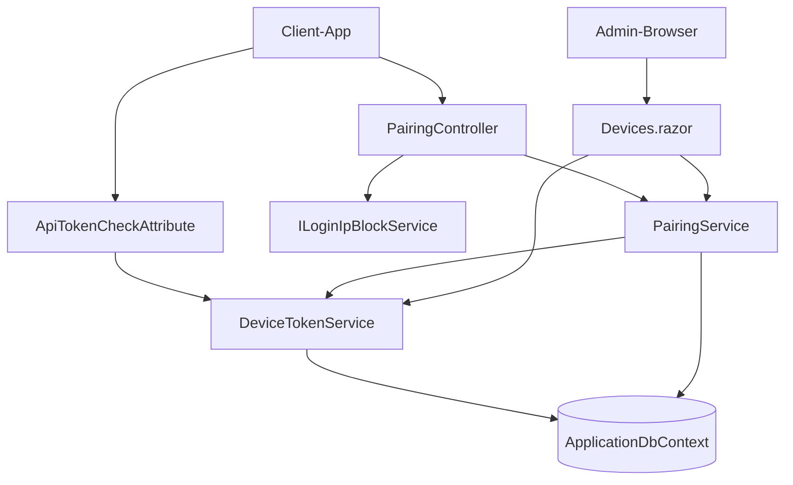

← [Zurück zur Übersicht](index.md)

# Geräte — Architektur

## Beteiligte Komponenten

| Komponente | Typ | Rolle |
|------------|-----|-------|
| `Devices.razor` (`/admin/devices`) | Blazor-Seite (`InteractiveServer`) | Admin-UI: Codes erzeugen, Geräte auflisten, umbenennen, widerrufen |
| `AdminIndex.razor` (`/admin`) | Blazor-Seite | Kachel `Geraete` als Einstieg |
| `PairingController` | API-Controller (`api/pairing`) | Öffentlicher Endpunkt `POST exchange`, IP-Sperrprüfung |
| `IPairingService` / `PairingService` | Scoped Service | Code-Erzeugung/-Validierung, atomarer Verbrauch, ECDH + AES-256-GCM |
| `IDeviceTokenService` / `DeviceTokenService` | Scoped Service | Token-Issuing, Hash-Validierung, `LastUsedAtUtc`, Widerruf, Umbenennen |
| `ILoginIpBlockService` | Singleton Service | Geteilter Bruteforce-Schutz (Schwelle 5) mit dem Web-Login |
| `ApiTokenCheckAttribute` | Action-Filter | `X-API-Key`-Gate; `MauiOnly` prüft zusätzlich Geräte-Tokens |
| `HashHelper` | interne Hilfsklasse | SHA-256-Hashing von Codes und Tokens |
| `ApplicationDbContext` | EF-Core-Kontext | `PairedDevices`, `PairingCodes` |
| Client-App (`VideoPlayer-App`) | Externe Anwendung | Ruft `POST api/pairing/exchange` auf; JSON-Vertrag über DTOs in `VideoWebPlayer.Client/Models/` |

## Abhängigkeiten

- Interne Abhängigkeiten sind synchron und pro Request (`scoped`); `ILoginIpBlockService` ist ein Singleton mit persistenter Sperrliste (`BlockedLoginIps`).
- Externe Abhängigkeit: Die Client-App muss den verbindlichen JSON-Vertrag (`code`, `clientPublicKey`, `deviceName` / `serverPublicKey`, `encryptedToken`) und die Krypto-Parameter (ECDH `nistP256`, SPKI/Base64, SHA-256-Schlüsselableitung, AES-256-GCM mit 12-Byte-Nonce) implementieren.
- Keine neuen NuGet-Pakete; Kryptografie nutzt `System.Security.Cryptography`.

## Datenfluss

1. Admin-UI → `PairingService` → `PairingCodes` (nur Hash persistiert; Klartext nur in der Response an die UI).
2. App → `PairingController` → `PairingService` → `DeviceTokenService` → `PairedDevices` (nur Token-Hash persistiert); das Klartext-Token verlässt den Server ausschließlich AES-256-GCM-verschlüsselt in der Exchange-Response.
3. App → `AuthController.Login` → `ApiTokenCheckAttribute` → `DeviceTokenService` → `PairedDevices` (Hash-Vergleich, `LastUsedAtUtc`-Update).

## Diagramm

## Skalierung und Zuverlässigkeit

Der atomare Verbrauch des Pairing-Codes per `ExecuteUpdateAsync` macht den Exchange race-sicher. Der flüchtige Server-ECDH-Schlüssel und das Klartext-Token werden nie persistiert. Die geteilte IP-Sperrliste bedeutet, dass eine bruteforcende IP auch für Admin-Logins gesperrt wird (gewollt).
