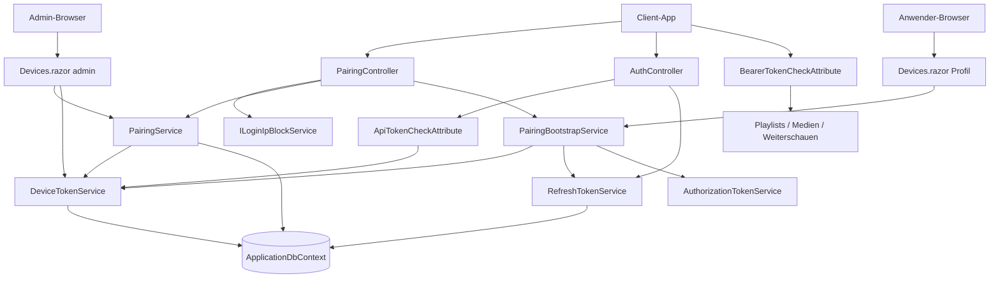

← [Zurück zur Übersicht](index.md)

# Geräte — Architektur

## Beteiligte Komponenten

| Komponente | Typ | Rolle |
|------------|-----|-------|
| `Devices.razor` (`/admin/devices`) | Blazor-Seite (`InteractiveServer`) | Admin-UI: Codes erzeugen, Geräte auflisten, umbenennen, widerrufen |
| `Devices.razor` (`/Account/Manage/Devices`) | Blazor-Seite (statisch, Formular-Post) | Self-Service im Profil: Bootstrap-Ticket erzeugen, QR-Code und Kurzcode anzeigen |
| `AdminIndex.razor` (`/admin`) | Blazor-Seite | Kachel `Geraete` als Einstieg |
| `PairingController` | API-Controller (`api/pairing`) | Öffentliche Endpunkte `POST exchange` und `POST bootstrap`, IP-Sperrprüfung |
| `AuthController` | API-Controller (`api/auth`) | `POST login`, `POST refresh`, `POST logout` im Scope `MauiOnly` |
| `IPairingService` / `PairingService` | Scoped Service | Code-Erzeugung/-Validierung, atomarer Verbrauch, ECDH + AES-256-GCM |
| `IPairingBootstrapService` / `PairingBootstrapService` | Scoped Service | Ticket-Erzeugung mit Quote und Admin-Schalter, Einlösung, Ausstellung des gesamten Pakets |
| `IDeviceTokenService` / `DeviceTokenService` | Scoped Service | Token-Issuing, Hash-Validierung, `LastUsedAtUtc`, Widerruf, Umbenennen |
| `IRefreshTokenService` / `RefreshTokenService` | Scoped Service | Erneuerungsnachweise ausstellen, rotieren, sperren; Wiederverwendungserkennung |
| `AuthorizationTokenService` | Service | Erzeugt den Anmeldenachweis (JWT, 12 Stunden) |
| `ILoginIpBlockService` | Singleton Service | Geteilter Bruteforce-Schutz (Schwelle 5) mit dem Web-Login |
| `ApiTokenCheckAttribute` | Action-Filter | `X-API-Key`-Gate; `MauiOnly` prüft zusätzlich Geräte-Tokens |
| `BearerTokenCheckAttribute` | Action-Filter | Prüft den Anmeldenachweis, aus der Kopfzeile oder aus `?access_token=` |
| `HashHelper` | interne Hilfsklasse | SHA-256-Hashing von Codes, Tickets und Tokens |
| `ApplicationDbContext` | EF-Core-Kontext | `PairedDevices`, `PairingCodes`, `RefreshTokens` |
| `VideoWebPlayer.Client` (`VideoWebPlayerClient`) | Client-Bibliothek | Kapselt Kopplung, Sitzungserneuerung, Abmeldung und die Fach-Aufrufe für Apps (siehe [Client-Bibliothek](client-bibliothek.md)) |
| Client-App (`VideoPlayer-App`) | Externe Anwendung | Ruft `POST api/pairing/exchange` bzw. `POST api/pairing/bootstrap` auf; JSON-Vertrag über DTOs in `VideoWebPlayer.Client/Models/` |

## Zwei Kopplungswege, ein Ergebnis

| | Einmal-Pairing-Code (`exchange`) | Bootstrap-Ticket (`bootstrap`) |
|---|---|---|
| Wer erzeugt | nur Administrator, `Einrichtung` > `Geräte` | jeder angemeldete Anwender im Profil (`Pairing:BootstrapAdminOnly` schränkt auf Administratoren ein) |
| Eingabe am Gerät | 8-stelliger Code abtippen | QR-Code scannen oder 8-stelligen Kurzcode abtippen |
| Einmalig | ja, atomarer Verbrauch | ja, atomarer Verbrauch |
| Gültigkeit | `Pairing:CodeTtlMinutes` (Default 5 Min.) | `Pairing:BootstrapTicketTtlMinutes` (Default 5 Min.) |
| Mengenbegrenzung | keine (nur Administratoren) | `Pairing:BootstrapMaxTicketsPerHour` je Anwender (Default 10/Stunde) |
| Ergebnis | nur das Geräte-Token | Geräte-Token **plus** fertige Benutzersitzung **plus** Erneuerungsnachweis |
| Anmeldung danach | separat über `POST api/auth/login` | entfällt — das Gerät ist sofort als Ticket-Ersteller angemeldet |

Beide Wege erzeugen denselben `PairedDevice`-Datensatz und unterscheiden sich in der Datenbank nur über `PairingCode.Kind`. Der Widerruf funktioniert für beide identisch.

## Geräteverwaltung und Kopplung sind getrennt

- **Kopplung** ist ein Vorgang des Anwenders: Wer ein Ticket erzeugt, koppelt ein Gerät an *seine* Identität. Dafür braucht es keine Administratorrechte, solange `Pairing:BootstrapAdminOnly` nicht gesetzt ist.
- **Geräteverwaltung** (auflisten, umbenennen, widerrufen) bleibt dem Administrationsbereich vorbehalten. Die Self-Service-Seite im Profil erzeugt ausschließlich Tickets; sie zeigt weder gekoppelte Geräte noch bietet sie einen Widerruf an.

Das ist bewusst so aufgeteilt: Das Koppeln betrifft nur das eigene Konto, der Widerruf dagegen den Zugang eines Geräts insgesamt.

## Erneuerungsnachweise

- Gespeichert wird nur `SHA-256` des Nachweises; der Klartext verlässt den Server genau zweimal — verschlüsselt im Bootstrap-Paket und in der Antwort auf `POST api/auth/refresh`.
- **Rotation bei jeder Erneuerung:** Der vorgelegte Nachweis wird gesperrt und durch einen neuen ersetzt. `ReplacedByHash` hält die Kette nachvollziehbar, ohne Klartext zu speichern.
- **Wiederverwendungserkennung:** Ein bereits rotierter Nachweis, der erneut vorgelegt wird, deutet auf einen entwendeten Nachweis hin. Der Server sperrt dann die gesamte Kette dieses Anwenders auf diesem Gerät — das Gerät muss neu gekoppelt werden.
- Die Gültigkeit des Nachweises (`Auth:RefreshTokenTtlDays`, Default 30 Tage) ist deutlich länger als die des Anmeldenachweises (12 Stunden). Damit bleibt ein Gerät wochenlang nutzbar, ohne dass ein langlebiger Anmeldenachweis im Umlauf ist.

## Sitzung und Playlists

Welche Playlists ein Gerät sieht, entscheidet allein der Anwender im Anmeldenachweis — nicht das Gerät. Nach dem Bootstrap ist das der Ersteller des Tickets; nach einem `POST api/auth/login` auf dem Gerät der dort angemeldete Anwender. Der Playlist-Dienst kennt keine Geräte: Er prüft immer nur den anfragenden Anwender (Besitzer oder — bei öffentlichen Playlists — beliebiger Angemeldeter). Siehe [Playlists — API](../playlists-api.md).

## Abhängigkeiten

- Interne Abhängigkeiten sind synchron und pro Request (`scoped`); `ILoginIpBlockService` ist ein Singleton mit persistenter Sperrliste (`BlockedLoginIps`).
- Externe Abhängigkeit: Die Client-App muss den verbindlichen JSON-Vertrag (`code`/`ticket`, `clientPublicKey`, `deviceName` / `serverPublicKey`, `encryptedToken` bzw. `encryptedPayload`) und die Krypto-Parameter (ECDH `nistP256`, SPKI/Base64, SHA-256-Schlüsselableitung, AES-256-GCM mit 12-Byte-Nonce) implementieren. Die Bibliothek `VideoWebPlayer.Client` erledigt das bereits.
- NuGet: `QRCoder` für die QR-Darstellung auf der Profilseite; die Kryptografie nutzt `System.Security.Cryptography`.

## Datenfluss

1. Admin-UI → `PairingService` → `PairingCodes` (nur Hash persistiert; Klartext nur in der Response an die UI).
2. Profilseite → `PairingBootstrapService` → `PairingCodes` (`Kind = BootstrapTicket`, Hashes von Ticket und Kurzcode); der Klartext geht nur in den angezeigten QR-Code bzw. Kurzcode.
3. App → `PairingController` → `PairingService` bzw. `PairingBootstrapService` → `DeviceTokenService` (+ `AuthorizationTokenService` und `RefreshTokenService` beim Bootstrap) → `PairedDevices`/`RefreshTokens` (nur Hashes persistiert); die Klartextwerte verlassen den Server ausschließlich AES-256-GCM-verschlüsselt.
4. App → `AuthController.Login`/`Refresh`/`Logout` → `ApiTokenCheckAttribute` → `DeviceTokenService` (Hash-Vergleich, `LastUsedAtUtc`-Update) → `RefreshTokenService`.
5. App → Fach-Endpunkte (Playlists, Medien, Weiterschauen) → `BearerTokenCheckAttribute` → Anwender aus dem Anmeldenachweis.

## Diagramm

```mermaid
graph TD
    Admin[Admin-Browser] --> UI[Devices.razor admin]
    User[Anwender-Browser] --> Profile[Devices.razor Profil]
    UI --> PS[PairingService]
    UI --> DTS[DeviceTokenService]
    Profile --> PBS[PairingBootstrapService]
    App[Client-App] --> PC[PairingController]
    PC --> IPB[ILoginIpBlockService]
    PC --> PS
    PC --> PBS
    PBS --> DTS
    PBS --> RTS[RefreshTokenService]
    PBS --> ATS[AuthorizationTokenService]
    PS --> DTS
    PS --> DB[(ApplicationDbContext)]
    DTS --> DB
    RTS --> DB
    App --> AC[AuthController]
    AC --> ATC[ApiTokenCheckAttribute]
    ATC --> DTS
    AC --> RTS
    App --> BTC[BearerTokenCheckAttribute]
    BTC --> API[Playlists / Medien / Weiterschauen]
```

## Skalierung und Zuverlässigkeit

Der atomare Verbrauch von Pairing-Code und Bootstrap-Ticket sowie die atomare Rotation des Erneuerungsnachweises (jeweils per `ExecuteUpdateAsync` mit Bedingung) machen alle drei Vorgänge race-sicher: Von parallelen Aufrufen kommt genau einer durch. Der flüchtige Server-ECDH-Schlüssel und sämtliche Klartext-Geheimnisse werden nie persistiert. Der Widerruf wirkt sofort auf Gate und Erneuerung, nicht aber auf bereits ausgestellte, zustandslose Anmeldenachweise — eine bewusst akzeptierte Restlaufzeit von höchstens 12 Stunden. Die geteilte IP-Sperrliste bedeutet, dass eine bruteforcende IP auch für Admin-Logins gesperrt wird (gewollt).
