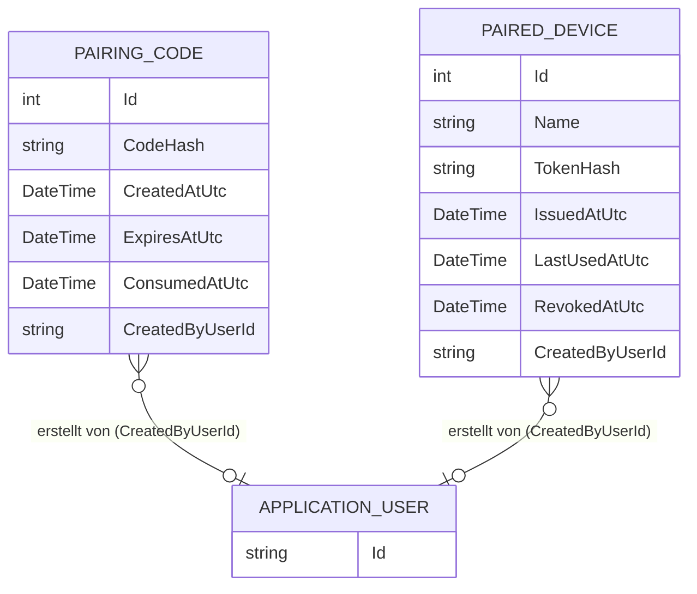

← [Zurück zur Übersicht](index.md)

# Geräte — Datenmodell

## Entitäten

### `PairedDevice` (Tabelle `PairedDevices`)

| Eigenschaft | Typ | Beschreibung |
|-------------|-----|--------------|
| `Id` | int | Primärschlüssel. |
| `Name` | string (max. 200) | Anzeigename; Default `Geraet vom <Ausstellungszeitpunkt>`, in der UI umbenennbar. |
| `TokenHash` | string (max. 128) | SHA-256-Hash des Geräte-Tokens, Unique-Index; Klartext wird nie gespeichert. |
| `IssuedAtUtc` | DateTime | Ausstellungszeitpunkt des Tokens. |
| `LastUsedAtUtc` | DateTime? | Letzte erfolgreiche Token-Validierung am Gate; `null` bis zur ersten Verwendung. |
| `RevokedAtUtc` | DateTime? | Widerrufszeitpunkt; `null` = aktiv (indiziert). |
| `CreatedByUserId` | string? (max. 64) | Id des Administrators, der den Pairing-Code erzeugt hat. |

### `PairingCode` (Tabelle `PairingCodes`)

| Eigenschaft | Typ | Beschreibung |
|-------------|-----|--------------|
| `Id` | int | Primärschlüssel. |
| `CodeHash` | string (max. 128) | SHA-256-Hash des Pairing-Codes (indiziert); Klartext wird nie gespeichert. |
| `CreatedAtUtc` | DateTime | Erstellungszeitpunkt. |
| `ExpiresAtUtc` | DateTime | Ablaufzeitpunkt (indiziert), `CreatedAtUtc` + `Pairing:CodeTtlMinutes`. |
| `ConsumedAtUtc` | DateTime? | Verbrauchszeitpunkt; wird atomar per `ExecuteUpdateAsync` gesetzt, `null` = noch einlösbar. |
| `CreatedByUserId` | string? (max. 64) | Id des erstellenden Administrators. |

## Beziehungen

Beide Entitäten sind eigenständig und über `CreatedByUserId` lose an `ApplicationUser` referenziert (keine FK-Beziehung, kein Navigation Property). Ein `PairingCode` führt beim erfolgreichen Exchange zu genau einem `PairedDevice`; die Verknüpfung ist nicht modelliert, sondern ergibt sich aus `CreatedByUserId` und den Zeitstempeln.

## Diagramm

Die Migration `20260923074815_AddDevicePairing` legt beide Tabellen samt Indizes an und wird beim Anwendungsstart automatisch angewendet.
