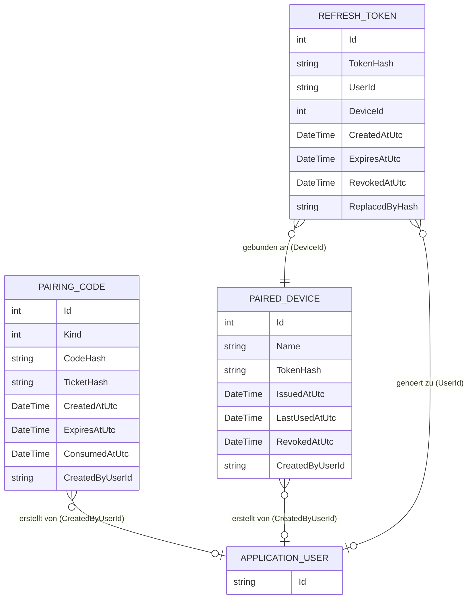

← [Zurück zur Übersicht](index.md)

# Geräte — Datenmodell

## Entitäten

### `PairedDevice` (Tabelle `PairedDevices`)

| Eigenschaft | Typ | Beschreibung |
|-------------|-----|--------------|
| `Id` | int | Primärschlüssel. |
| `Name` | string (max. 200) | Anzeigename; Default `Geraet vom <Ausstellungszeitpunkt>`, in der UI umbenennbar. |
| `TokenHash` | string (max. 128) | SHA-256-Hash des Geräte-Tokens, Unique-Index; Klartext wird nie gespeichert. |
| `IssuedAtUtc` | DateTime | Ausstellungszeitpunkt des Tokens. |
| `LastUsedAtUtc` | DateTime? | Letzte erfolgreiche Token-Validierung am Gate; `null` bis zur ersten Verwendung. |
| `RevokedAtUtc` | DateTime? | Widerrufszeitpunkt; `null` = aktiv (indiziert). |
| `CreatedByUserId` | string? (max. 64) | Id des Anwenders, der den Pairing-Code bzw. das Bootstrap-Ticket erzeugt hat. |

### `PairingCode` (Tabelle `PairingCodes`)

| Eigenschaft | Typ | Beschreibung |
|-------------|-----|--------------|
| `Id` | int | Primärschlüssel. |
| `Kind` | `PairingCodeKind` (int, indiziert) | Art des Datensatzes: `AdminCode` (0) für den Einmal-Code des Administrators, `BootstrapTicket` (1) für das Ticket des QR-Bootstraps. Der Wert `DeviceInitiated` (2) ist für die umgekehrte Richtung (Gerät zeigt einen Code) reserviert und noch nicht umgesetzt. Standardwert beim Einfügen: `AdminCode`. |
| `CodeHash` | string (max. 128) | SHA-256-Hash des Codes (indiziert). Beim Bootstrap-Ticket steht hier der Hash des 8-stelligen Kurzcodes. Klartext wird nie gespeichert. |
| `TicketHash` | string? (max. 128, indiziert) | Nur bei `Kind = BootstrapTicket` gesetzt: SHA-256-Hash des langen Tickets aus dem QR-Code. Beim Einlösen wird der vorgelegte Wert gegen `TicketHash` **oder** `CodeHash` geprüft — QR-Ticket und Kurzcode lösen denselben Datensatz auf. |
| `CreatedAtUtc` | DateTime | Erstellungszeitpunkt; zugleich Grundlage der Stundenquote für Bootstrap-Tickets. |
| `ExpiresAtUtc` | DateTime | Ablaufzeitpunkt (indiziert): `CreatedAtUtc` + `Pairing:CodeTtlMinutes` bzw. + `Pairing:BootstrapTicketTtlMinutes`. |
| `ConsumedAtUtc` | DateTime? | Verbrauchszeitpunkt; wird atomar per `ExecuteUpdateAsync` gesetzt, `null` = noch einlösbar. |
| `CreatedByUserId` | string? (max. 64) | Id des erstellenden Anwenders. Beim Bootstrap entscheidet dieser Wert, **wessen** Sitzung das Gerät erhält. |

### `RefreshToken` (Tabelle `RefreshTokens`)

Der Erneuerungsnachweis einer Gerätesitzung. Er entsteht beim Bootstrap und wird bei jeder Erneuerung ausgetauscht.

| Eigenschaft | Typ | Beschreibung |
|-------------|-----|--------------|
| `Id` | int | Primärschlüssel. |
| `TokenHash` | string (max. 128) | SHA-256-Hash des Nachweises, **Unique-Index**; der Klartext verlässt den Server nur einmal (verschlüsselt im Bootstrap-Paket bzw. in der Antwort auf `POST /api/auth/refresh`). |
| `UserId` | string (max. 64) | Id des Anwenders, zu dem die Sitzung gehört. |
| `DeviceId` | int (indiziert) | Id des `PairedDevice`, an das der Nachweis gebunden ist. Keine Fremdschlüsselbeziehung, aber fachlich eindeutig: Der Widerruf des Geräts sperrt über diese Spalte alle zugehörigen Nachweise. |
| `CreatedAtUtc` | DateTime | Ausstellungszeitpunkt. |
| `ExpiresAtUtc` | DateTime | Ablaufzeitpunkt: `CreatedAtUtc` + `Auth:RefreshTokenTtlDays` (Standard 30 Tage). |
| `RevokedAtUtc` | DateTime? (indiziert) | Sperrzeitpunkt; `null` = gültig. Gesetzt bei Rotation, beim Abmelden, beim Widerruf des Geräts und bei erkannter Wiederverwendung. |
| `ReplacedByHash` | string? (max. 128) | Hash des Nachfolgers, der diesen Nachweis bei der Rotation abgelöst hat. Macht die Kette nachvollziehbar, ohne einen Klartextwert zu speichern. |

Eine eigene Spalte für die Wiederverwendungserkennung gibt es nicht: Ein Nachweis mit gesetztem `RevokedAtUtc`, der erneut vorgelegt wird, **ist** der erkannte Wiederverwendungsfall — der Server sperrt daraufhin alle noch offenen Nachweise derselben Kombination aus `UserId` und `DeviceId`.

## Beziehungen

Die drei Entitäten sind eigenständig; `PairingCode.CreatedByUserId`, `PairedDevice.CreatedByUserId` und `RefreshToken.UserId` verweisen lose auf `ApplicationUser` (keine FK-Beziehung, kein Navigation Property), `RefreshToken.DeviceId` ebenso lose auf `PairedDevice`. Ein `PairingCode` führt beim erfolgreichen Einlösen zu genau einem `PairedDevice`; beim Bootstrap kommt zusätzlich genau ein `RefreshToken` hinzu.

## Playlist-Bezug

Die Playlists selbst liegen außerhalb dieses Features (siehe [Playlists — Datenmodell](../playlists-datenmodell.md)). Für Geräte ist eine Spalte dort besonders wichtig: `ContinueWatchingEntries.PlaylistId` (nullable) hält fest, aus welcher Playlist ein Titel gerade abgespielt wurde. Meldet ein Gerät Fortschritt mit `playlistId`, entsteht der Weiterschauen-Eintrag mit diesem Bezug, und die Weiterschauen-Liste zeigt den Playlist-Namen dazu. Ohne `playlistId` bleibt die Spalte `null` (Wiedergabe außerhalb einer Playlist).

## Diagramm

```mermaid
erDiagram
    PAIRED_DEVICE {
        int Id
        string Name
        string TokenHash
        DateTime IssuedAtUtc
        DateTime LastUsedAtUtc
        DateTime RevokedAtUtc
        string CreatedByUserId
    }
    PAIRING_CODE {
        int Id
        int Kind
        string CodeHash
        string TicketHash
        DateTime CreatedAtUtc
        DateTime ExpiresAtUtc
        DateTime ConsumedAtUtc
        string CreatedByUserId
    }
    REFRESH_TOKEN {
        int Id
        string TokenHash
        string UserId
        int DeviceId
        DateTime CreatedAtUtc
        DateTime ExpiresAtUtc
        DateTime RevokedAtUtc
        string ReplacedByHash
    }
    APPLICATION_USER {
        string Id
    }
    PAIRING_CODE }o--o| APPLICATION_USER : "erstellt von (CreatedByUserId)"
    PAIRED_DEVICE }o--o| APPLICATION_USER : "erstellt von (CreatedByUserId)"
    REFRESH_TOKEN }o--o| APPLICATION_USER : "gehoert zu (UserId)"
    REFRESH_TOKEN }o--|| PAIRED_DEVICE : "gebunden an (DeviceId)"
```

## Migrationen

- `20260923074815_AddDevicePairing` legt `PairedDevices` und `PairingCodes` samt Indizes an.
- `20260924103134_AddPairingBootstrapAndRefreshTokens` ergänzt `PairingCodes.Kind` (Standardwert `0`) und `PairingCodes.TicketHash`, legt die Tabelle `RefreshTokens` an und erzeugt die Indizes `IX_PairingCodes_Kind`, `IX_PairingCodes_TicketHash`, `IX_RefreshTokens_DeviceId`, `IX_RefreshTokens_RevokedAtUtc` sowie den eindeutigen Index `IX_RefreshTokens_TokenHash`.

Beide Migrationen werden beim Anwendungsstart automatisch angewendet.
