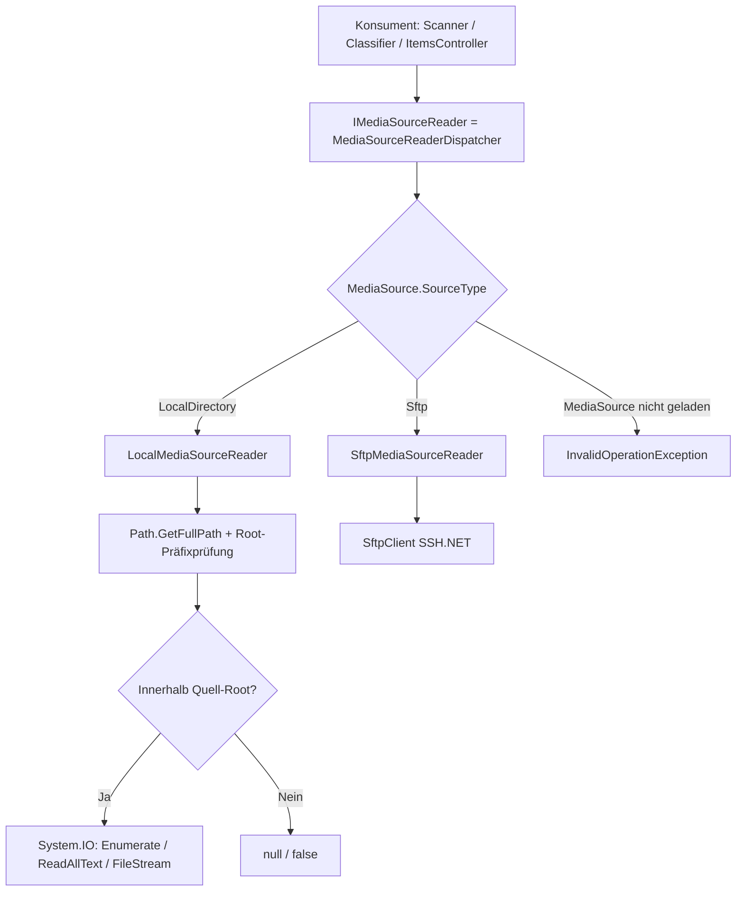

← [Zurück zur Übersicht](index.md)

# Medienquellen — Technischer Ablauf

## Übersicht

Der gesamte Dateizugriff auf Medienquellen läuft über die Abstraktion `IMediaSourceReader`. Der `MediaSourceReaderDispatcher` ist als `IMediaSourceReader` im DI-Container registriert und leitet jeden Aufruf anhand von `MediaSource.SourceType` an `SftpMediaSourceReader` (SFTP) oder `LocalMediaSourceReader` (System.IO) weiter. Die Konsumenten `MediaSourceScanner`, `MediaSourceClassifier` und `ItemsController` kennen nur das Interface.

## Ablauf

### 1. Quelle anlegen/bearbeiten (Admin-UI)

`MediaSourceAdminDetails.razor` (`/admin/mediasources/new`, `/admin/mediasources/{Id}`) bindet `editSource.SourceType` an ein `InputSelect` (`SFTP-Server`/`Lokales Verzeichnis`), das bei bestehenden Quellen deaktiviert ist (`disabled="@(!IsNew)"`). SFTP-Felder (`Host`, `Port`, `Username`, `Password`) werden nur bei `SourceType == Sftp` gerendert.

Beteiligte Komponenten:
- `MediaSourceAdminDetails.Save` — ruft bei `LocalDirectory` zuerst `TryValidateLocalDirectory` auf, neutralisiert danach die SFTP-Felder (`Host = string.Empty`, `Port = 0`, `Username`/`Password = null`, da `Host` non-nullable ist) und persistiert über `ApplicationDbContext.AddMediaSourceAsync` bzw. `UpdateMediaSourceAsync`.
- `MediaSourceAdminDetails.TryValidateLocalDirectory` — prüft `Path.IsPathRooted`, `Path.GetFullPath`, `Directory.Exists` und einen Testzugriff per `Directory.EnumerateFileSystemEntries`; liefert differenzierte Fehlertexte.
- `MediaSourceExtensions.Update` — kopiert `SourceType` beim Update mit.
- `MediaSourceAdmin.razor` — Übersicht mit `Typ`-Spalte (`Lokal`/`SFTP`); SFTP-Spalten zeigen bei lokalen Quellen `—`.

### 2. Scan einer Quelle

`MediaSourceScanner.ScanAllSourcesAsync` ruft `_reader.ReadRootDirectory(source)` auf; `ScanMediaCollectionInternalAsync` ruft `_reader.ReadDirectoryEntries(next)`.

- `LocalMediaSourceReader.ReadRootDirectory` — liefert eine Root-`MediaCollection` mit `Path = source.Path`, `Name` = letztes Pfadsegment (`DirectoryInfo.Name`, Fallback `source.Path`) und `CreatedAt = Directory.GetLastWriteTimeUtc` (echte Änderungserkennung; fehlendes Verzeichnis liefert den stabilen Sentinel `1601-01-01`).
- `LocalMediaSourceReader.ReadDirectoryEntries` — enumeriert per `Directory.EnumerateFileSystemEntries`, überspringt Einträge mit führendem `.` (`MediaEntryFilter.IsIgnoredEntry`) und `FileAttributes.ReparsePoint`; erzeugt `MediaCollection` (Unterverzeichnis) bzw. `MediaItem` (Datei) mit vollem Pfad und `GetLastWriteTimeUtc`.
- `MediaSourceScanner.ScanMediaCollectionInternalAsync` — der `catch`-Filter umfasst neben `SftpPathNotFoundException`/`SftpPermissionDeniedException` auch `DirectoryNotFoundException`, `UnauthorizedAccessException` und `IOException`: Die Collection wird übersprungen und `ScanDueAt` neu terminiert.

### 3. Klassifizierung

`MediaSourceClassifier` nutzt `IMediaSourceReader` an allen Aufrufstellen (`FileExistsAsync`, `ReadFileAsync`, `ReadFileStreamAsync`) für `tvshow.nfo`, Episoden-/Film-NFOs, Poster/Banner/Fanart/Thumbs und Schauspielerbilder.

- `LocalMediaSourceReader.ResolveFilePath` — löst Dateiangaben (auch relative Unterpfade wie `.actors/Name.jpg` aus NFO-`<thumb>`-Elementen) per `Path.GetFullPath(Path.Combine(collection.Path, fileName))` auf und prüft, dass das Ergebnis innerhalb des normalisierten Quell-Roots (`MediaSource.Path`) liegt. Die Pfadsegmente werden case-insensitiv (`OrdinalIgnoreCase`) über Verzeichnis-Enumeration aufgelöst; `ReparsePoint`-Einträge und Verzeichnisse als Endziel werden abgelehnt. Bei jeder Verletzung wird `null` zurückgegeben — die Datei gilt als nicht vorhanden.

### 4. Streaming und Download

`ItemsController.StreamMediaItem` ermittelt `fileName = Path.GetFileName(mediaItem.Path)` und ruft `_reader.OpenFileStream(mediaCollection, fileName)`.

- `LocalMediaSourceReader.OpenFileStream` — liefert nach erfolgreicher `ResolveFilePath`-Prüfung einen `FileStream` (`FileMode.Open`, `FileAccess.Read`, `FileShare.Read`); `null` bei fehlender Datei oder Root-Verletzung.
- `SftpMediaSourceReader.OpenFileStream` — früher `GetSftpFileStream`; Rückgabetyp verallgemeinert auf `Stream?`, intern weiterhin `SftpStreamWrapper`.
- `File(stream, contentType, enableRangeProcessing: true)` und `Download` sind unverändert; `FileStream` ist seekbar und damit range-fähig.

## Diagramm

## Fehlerbehandlung

- `MediaSourceScanner` fängt `SftpPathNotFoundException`, `SftpPermissionDeniedException`, `DirectoryNotFoundException`, `UnauthorizedAccessException` und `IOException` pro Collection ab → Eintrag wird übersprungen, `ScanDueAt` neu terminiert.
- `LocalMediaSourceReader` fängt `IOException`, `UnauthorizedAccessException`, `ArgumentException` und `NotSupportedException` beim Attribut-/Pfadzugriff und beim Enumerieren ab → Eintrag wird übersprungen bzw. `null`/`false` geliefert, kein Exception-Durchstich.
- `MediaSourceAdminDetails.TryValidateLocalDirectory` bildet ungültige Pfade, fehlende Verzeichnisse und Zugriffsfehler auf jeweils eigene Meldungen ab.
- `ItemsController.StreamMediaItem` liefert `NotFound`, wenn `OpenFileStream` `null` zurückgibt (fehlende Datei, Traversal-Versuch, Reparse Point).
