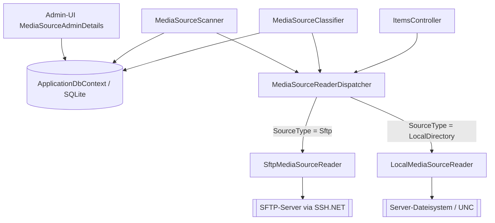

← [Zurück zur Übersicht](index.md)

# Medienquellen — Architektur

## Beteiligte Komponenten

| Komponente | Typ | Rolle |
|------------|-----|-------|
| `MediaSourceAdminDetails.razor` / `MediaSourceAdmin.razor` | Blazor-Komponenten | Admin-UI: Typauswahl, typabhängige Felder, Pfadvalidierung, Typ-Spalte in der Übersicht |
| `MediaSource` / `MediaSourceType` | Datenmodell | `SourceType`-Diskriminator (`Sftp` = 0, `LocalDirectory` = 1) |
| `IMediaSourceReader` | Interface | Einheitlicher Dateizugriff: Verzeichnis-Enumeration, Datei-Existenz/-Inhalt, Streaming |
| `SftpMediaSourceReader` | Service (scoped) | Implementierung für entfernte SFTP-Quellen (SSH.NET `SftpClient`) |
| `LocalMediaSourceReader` | Service (scoped) | Implementierung für lokale Verzeichnisse per `System.IO` inkl. Root-Präfixprüfung |
| `MediaSourceReaderDispatcher` | Service (scoped, als `IMediaSourceReader` registriert) | Wählt pro Aufruf anhand von `SourceType` den konkreten Reader |
| `MediaEntryFilter` | Interne Hilfsklasse | Gemeinsame `.`-Ignorierregel beider Reader |
| `MediaSourceScanner` / `MediaSourceClassifier` | Services | Scan und Klassifizierung über `IMediaSourceReader` |
| `ItemsController` | API-Controller | Streaming/Download über `OpenFileStream` |
| `VideoWebPlayerBackupData` | Backup-Service | Serialisiert `SourceType` automatisch; Restore-Toleranz via `OptionalRestoreColumns`/`OptionalRestoreIntDefaults` |

## Abhängigkeiten

- `SftpMediaSourceReader` → externer SFTP-Server via SSH.NET (`Renci.SshNet`), synchron aus Sicht der Anwendung.
- `LocalMediaSourceReader` → Server-Dateisystem (`System.IO`), inkl. UNC-Pfaden/Netzwerkfreigaben; keine neue externe Abhängigkeit.
- DI-Registrierung in `ServiceCollectionExtensions` (Zeile ~232): `SftpMediaSourceReader` und `LocalMediaSourceReader` scoped; `IMediaSourceReader` → `MediaSourceReaderDispatcher` (scoped).

## Datenfluss

1. Admin legt Quelle mit `SourceType` an → `ApplicationDbContext` persistiert in Tabelle `MediaSources` (Spalte `SourceType`, `int`).
2. `MediaSourceScanner` fragt `IMediaSourceReader.ReadRootDirectory`/`ReadDirectoryEntries` → Dispatcher wählt Reader → Ergebnisse landen als `MediaCollections`/`MediaItems` in der Datenbank.
3. `MediaSourceClassifier` liest NFO-/Bilddateien über `IMediaSourceReader` → Metadaten in Datenbank.
4. `ItemsController.StreamMediaItem`/`Download` öffnet den Videostream über `IMediaSourceReader.OpenFileStream` → HTTP-Response mit Range-Verarbeitung.

## Diagramm

## Skalierung und Zuverlässigkeit

- Nicht erreichbare lokale Quellen (z. B. nicht gemountetes Laufwerk oder nicht auflösbare Freigabe) führen nicht zum Abbruch des Scans: Der Scanner fängt die Dateisystem-Exceptions pro Collection ab und terminiert den nächsten Versuch über `ScanDueAt` neu.
- Bei nicht geladener `MediaSource`-Navigation (`collection.MediaSource is null`) wirft der Dispatcher eine `InvalidOperationException` mit Hinweis auf das erforderliche Eager-Loading (`Include(mc => mc.MediaSource)`).
- Tests können einen Fake direkt als `IMediaSourceReader` registrieren und den Dispatcher umgehen.
