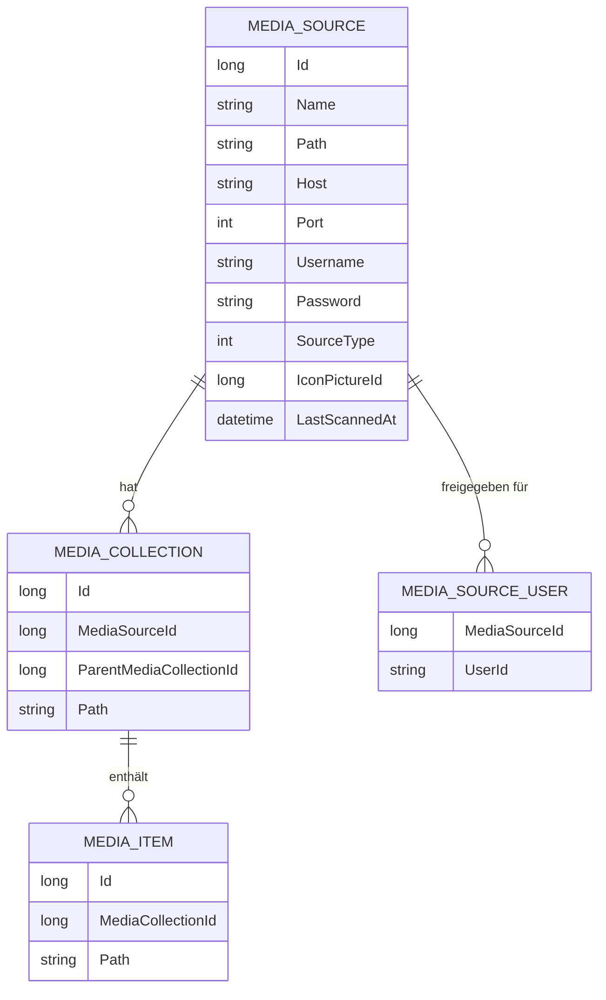

← [Zurück zur Übersicht](index.md)

# Medienquellen — Datenmodell

## Entitäten

### `MediaSource` (Tabelle `MediaSources`)

Erbt von `MediaEntry` (`Id`, `Name`, `Path`, `CreatedAt`, `ClassifiedAt`, `Changed`).

| Eigenschaft | Typ | Beschreibung |
|-------------|-----|--------------|
| `Host` | `string` (non-nullable) | SFTP-Host; bei lokalen Quellen `string.Empty` |
| `Port` | `int` | SFTP-Port (Vorgabe `22`); bei lokalen Quellen `0` |
| `Username` | `string?` | SFTP-Benutzername; bei lokalen Quellen `null` |
| `Password` | `string?` | SFTP-Passwort; bei lokalen Quellen `null` |
| `SourceType` | `MediaSourceType` (`int`-Spalte, non-nullable, Default `0`) | Quelltyp-Diskriminator, neu durch Migration `AddMediaSourceSourceType` |
| `IconPictureId` | `long?` | Optionales Icon-Bild (`MediaSourceIcons`) |
| `IconPicture` | `MediaSourceIcon?` | Navigation zum Icon |
| `LastScannedAt` | `DateTime?` | Zeitpunkt des letzten Scans |
| `MediaCollections` | `ICollection<MediaCollection>` | Gescannte Collections der Quelle |
| `MediaSourceUsers` | `ICollection<MediaSourceUser>` | Benutzerfreigaben |

### `MediaSourceType` (Enum)

| Wert | Konstante | Bedeutung |
|------|-----------|-----------|
| `0` | `Sftp` | Entfernter SFTP-Server — Default, gilt automatisch für Bestandsdaten |
| `1` | `LocalDirectory` | Lokales Verzeichnis auf dem Server (inkl. UNC-Pfade) |

## Beziehungen

- `MediaSource` 1:n `MediaCollection` — die `Path`-Semantik hängt vom `SourceType` ab: Bei `LocalDirectory` enthalten `MediaCollection.Path`/`MediaItem.Path` OS-Dateisystempfade, bei `Sftp` SFTP-Pfade.
- `MediaSource` 1:n `MediaSourceUser` — Benutzerfreigaben (typunabhängig).
- `MediaSource` n:1 `MediaSourceIcon` — optionales Icon.

## Diagramm

## Hinweise zur Migration und zum Restore

- Die Migration `AddMediaSourceSourceType` (`VideoWebPlayer/Migrations/20260922180232_AddMediaSourceSourceType.cs`) fügt `MediaSources.SourceType` als non-nullable `INTEGER` mit Default `0` hinzu; Bestandsdaten erhalten `Sftp`.
- `VideoWebPlayerBackupData` trägt `MediaSources.SourceType` in `OptionalRestoreColumns` und `OptionalRestoreIntDefaults` (Default `0`) ein: Backups älterer Versionen ohne die Spalte sind weiter restorierbar, neue Backups enthalten die Spalte automatisch (Entity-Iteration über `DbContext.Model`).
- `DtoMediaSource` enthält bewusst kein `SourceType` — kein API-Consumer benötigt den Typ; das reflektionsbasierte `ApiBaseController.Create<T>` kopiert nur typgleiche Properties.
