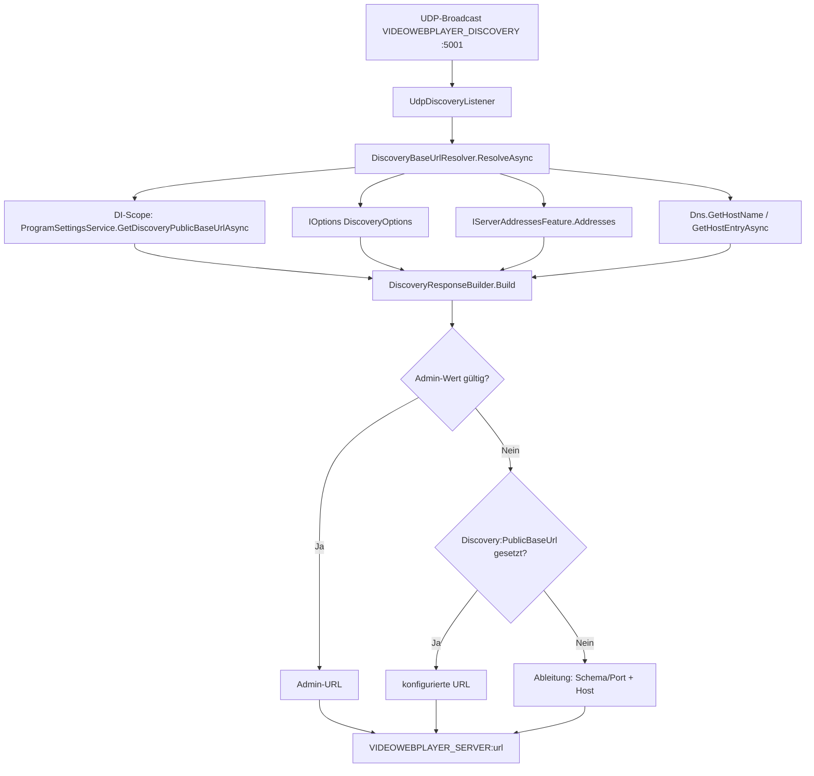

← [Zurück zur Übersicht](index.md)

# Netzwerk-Erkennung — Technischer Ablauf

## Übersicht

Der `UdpDiscoveryListener` beantwortet UDP-Broadcasts `VIDEOWEBPLAYER_DISCOVERY` auf Port 5001 mit `VIDEOWEBPLAYER_SERVER:{url}`. Die gemeldete URL wird **pro Anfrage** aufgelöst: Der Listener ruft ein Resolver-Delegate auf, hinter dem der Singleton `DiscoveryBaseUrlResolver` steht. Dieser sammelt die externen Eingaben (Admin-Wert aus der Datenbank, gebundene Serveradressen, DNS-Identität des Hosts) und übergibt sie an die reine Ableitungsfunktion `DiscoveryResponseBuilder.Build`.

## Start

1. `ServiceCollectionExtensions.AddVideoWebPlayerServices` registriert `DiscoveryOptionsValidator` als `IValidateOptions<DiscoveryOptions>` und bindet die `Discovery`-Sektion mit `ValidateOnStart()` — ein ungültiger `Discovery:PublicBaseUrl`-Wert lässt den Start fehlschlagen.
2. `DiscoveryBaseUrlResolver` wird als Singleton registriert.
3. `Program.cs` instanziiert — hinter der unveränderten Abschirmung `!app.Environment.IsEnvironment("Testing")` — den `UdpDiscoveryListener` mit Port `5001` und dem Delegate `resolver.ResolveAsync`.

## UDP-Anfrage beantworten

1. `UdpDiscoveryListener.ListenAsync` empfängt per `UdpClient.ReceiveAsync` ein Datagramm; entspricht der Text `VIDEOWEBPLAYER_DISCOVERY`, ruft der Listener `_responseFactory(cancellationToken)` auf.
2. `DiscoveryBaseUrlResolver.ResolveAsync`:
   - öffnet einen DI-Scope und liest den Admin-Wert über `ProgramSettingsService.GetDiscoveryPublicBaseUrlAsync` (normalisiert: `Trim`, leer → `null`); Fehler werden geloggt und als `null` weitergereicht (fail-open);
   - liest `IOptions<DiscoveryOptions>.Value`, `IServerAddressesFeature.Addresses` am `IServer` und — fehlerabgeschirmt — `Dns.GetHostName()` sowie `Dns.GetHostEntryAsync(hostName).AddressList`;
   - wertet `DiscoveryResponseBuilder.Build` aus.
3. Der Listener sendet `VIDEOWEBPLAYER_SERVER:{url}` an `result.RemoteEndPoint`.
4. Fehlerbehandlung in der Empfangsschleife: `OperationCanceledException` beendet die Schleife, `SocketException` wird still verschluckt (Windows meldet ICMP „Port unreachable" als `ConnectionReset`), alle übrigen Fehler werden per `ILogger` als Warning geloggt — die Schleife läuft weiter.

Beteiligte Komponenten: `UdpDiscoveryListener`, `DiscoveryBaseUrlResolver`, `DiscoveryResponseBuilder`, `DiscoveryOptions`, `ProgramSettingsService`, `IServiceScopeFactory`, `IServer`/`IServerAddressesFeature`, `System.Net.Dns`.

## Auflösung in `DiscoveryResponseBuilder.Build`

Eingaben: `DiscoveryOptions`, `IConfiguration`, `boundAddresses` (gebundene Serveradressen), `hostAddresses` (DNS-Adressliste des Hosts), `hostName` (Maschinenname) und `adminPublicBaseUrl` (aktueller Admin-Wert aus `Setups`).

1. **Admin-Wert gesetzt und gültig** (`DiscoveryUrlRules.NormalizePublicBaseUrl` + `IsValidPublicBaseUrl`) → unverändert zurückgegeben (vollständige URL inkl. Schema, Host, Port, Pfad). Ein defensiv als ungültig erkannter Admin-Wert fällt auf die nächste Stufe durch.
2. **`Discovery:PublicBaseUrl` gesetzt** → unverändert zurückgegeben. Die Startvalidierung durch `DiscoveryOptionsValidator` ist bereits erfolgt.
3. **Ableitung** (Ergebnis immer `scheme://host:port`, kein Pfad):
   - **Schema + Port** aus der ersten Quelle mit gültiger `http`/`https`-URI: `boundAddresses` → `Kestrel:Endpoints:Http:Url` → `Kestrel:Endpoints:Https:Url` → `Host:Port` (Schema `http`) → `5000` (Schema `http`). Kestrel-Wildcard-Hosts (`*`, `+`) werden für die URI-Auswertung zu `localhost` normalisiert.
   - **Host** in dieser Reihenfolge:
     a. `Host:Address`, sofern nutzbar (kein Loopback, Wildcard oder IPv6-Literal);
     b. erster nutzbarer literal-Host aus `boundAddresses` bzw. den Kestrel-URLs;
     c. erste IPv4-Adresse (`AddressFamily.InterNetwork`, nicht Loopback) aus `hostAddresses` — APIPA-Adressen (`169.254.x.x`) nur als letzte IP-Stufe;
     d. `hostName`; leer → defensiver Fallback `localhost`.
   - Nicht nutzbare Hosts (`IsUsableHost` liefert `false`): `localhost`, Loopback (`127.*`, `::1`), Any/Wildcard (`*`, `+`, `0.0.0.0`, `[::]`) und IPv6-Literale.

## Admin-Wert pflegen

1. `ProgramSettings.razor` (`/admin/program-settings`) lädt `setup.DiscoveryPublicBaseUrl` in `SettingsModel.DiscoveryPublicBaseUrl`.
2. Das Formularfeld (Karte `Öffentliche Basis-URL`, `InputText` mit id `discoveryPublicBaseUrl`) wird über `AbsoluteHttpUrlAttribute` validiert — `OnValidSubmit` feuert nur bei leerem oder gültigem Wert.
3. `SaveAsync` ruft `SettingsService.UpdateGeneralSettingsAsync(new GeneralSettingsUpdate(..., model.DiscoveryPublicBaseUrl))`; der Service normalisiert per `DiscoveryUrlRules.NormalizePublicBaseUrl` und wirft `DiscoveryUrlValidationException` bei ungültiger URL — `SaveAsync` fängt sie und zeigt die Meldung in einer `alert-danger`-Box.
4. Die Schreibung erfolgt atomar mit den übrigen Programmeinstellungen in einem `SaveChangesAsync`. Der neue Wert gilt ohne Neustart bei der nächsten Discovery-Anfrage.

## Diagramm

## Fehlerbehandlung

- Ungültiger `Discovery:PublicBaseUrl` → Start schlägt fehl (`DiscoveryOptionsValidator`, `ValidateOnStart`).
- Ungültige Admin-Eingabe → Formular-Attribut verhindert den Submit; ein umgangener oder manipulierter Wert wird beim Speichern mit `DiscoveryUrlValidationException` abgelehnt.
- DB-Fehler beim Lesen des Admin-Werts → geloggte Warning, Auflösung fährt mit Konfiguration/Ableitung fort (fail-open).
- DNS nicht auflösbar → geloggte Warning, Ableitung fällt auf den Hostnamen zurück.
- Fehler im Delegate oder beim Versand → geloggte Warning, Listener-Schleife läuft weiter.
