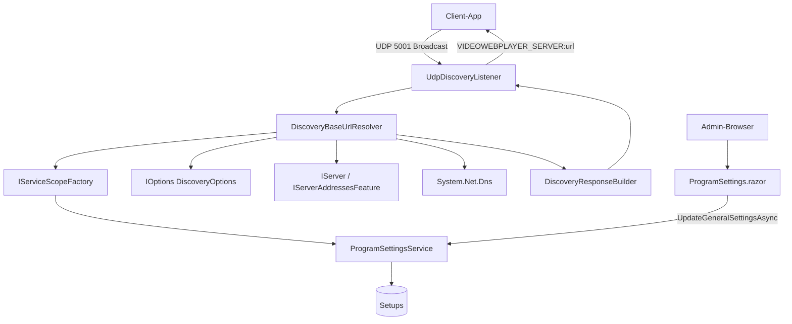

← [Zurück zur Übersicht](index.md)

# Netzwerk-Erkennung — Architektur

## Beteiligte Komponenten

| Komponente | Typ | Rolle |
|------------|-----|-------|
| `UdpDiscoveryListener` | Klasse (per `Start()`/`Stop()` gesteuerter UDP-Empfänger) | Empfängt `VIDEOWEBPLAYER_DISCOVERY` auf Port 5001, ruft das Resolver-Delegate und sendet `VIDEOWEBPLAYER_SERVER:{url}` an den Absender |
| `DiscoveryBaseUrlResolver` | Singleton Service | Löst die zu meldende URL pro Anfrage auf: liest den Admin-Wert in einem eigenen Scope, sammelt gebundene Adressen und DNS-Identität, ruft `DiscoveryResponseBuilder` |
| `DiscoveryResponseBuilder` | `internal static` Klasse | Reine, netzwerkfreie Ableitungsfunktion (Vorrangkette, Loopback-/Wildcard-/IPv6-Verbot, Schema-/Port-/Host-Ketten) — Muster `MdnsServiceProfileBuilder` |
| `DiscoveryOptions` | Options-Klasse (`public sealed`) | Typsichere Bindung der `Discovery`-Sektion, einzige Eigenschaft `PublicBaseUrl` |
| `DiscoveryOptionsValidator` | `IValidateOptions<DiscoveryOptions>` | Start-Validierung von `Discovery:PublicBaseUrl` über `DiscoveryUrlRules` (`ValidateOnStart`) |
| `DiscoveryUrlRules` | `internal static` Klasse | Gemeinsame Regel `IsValidPublicBaseUrl`/`NormalizePublicBaseUrl` und zentraler Meldungstext `PublicBaseUrlRuleText` |
| `AbsoluteHttpUrlAttribute` | `ValidationAttribute` (`public sealed`) | DataAnnotations-Validierung des Formularfelds — delegiert an `DiscoveryUrlRules` |
| `DiscoveryUrlValidationException` | `internal` Exception | Spezifischer Fehlertyp für die serverseitige Ablehnung ungültiger Admin-Werte beim Speichern |
| `GeneralSettingsUpdate` | `public sealed record` | Bündelt die Werte des Programmeinstellungen-Formulars inkl. `DiscoveryPublicBaseUrl` für `UpdateGeneralSettingsAsync` |
| `ProgramSettingsService` | Scoped Service | `GetDiscoveryPublicBaseUrlAsync` (Lesezugriff pro Anfrage), `UpdateGeneralSettingsAsync` (atomare Schreibung mit Validierung) |
| `ProgramSettings.razor` (`/admin/program-settings`) | Blazor-Seite (`InteractiveServer`) | Admin-UI: Karte `Öffentliche Basis-URL (Broadcast-Erkennung)` mit `InputText`-Feld `discoveryPublicBaseUrl` |
| `Setup` | EF-Entität | Nullable Spalte `DiscoveryPublicBaseUrl` (Tabelle `Setups`) |
| `IServer` / `IServerAddressesFeature` | ASP.NET-Core-Infrastruktur | Liefern die tatsächlich gebundenen Serveradressen — erst nach `ApplicationStarted` verfügbar, daher Auflösung pro Anfrage |
| `System.Net.Dns` | .NET-Bibliothek | `GetHostName`/`GetHostEntryAsync` für die Host-Adressliste |
| Client-App (`VideoPlayer.Maui`) | Externe Anwendung | Sendet den Broadcast und verarbeitet die Antwort-URL |

## Auflösung pro Anfrage statt beim Start

Der Listener startet vor `app.Run()`, während die gebundenen Adressen (`IServerAddressesFeature.Addresses`) erst nach dem Serverstart existieren. Die Per-Anfrage-Auflösung umgeht die Startreihenfolge und stellt zugleich sicher, dass der jeweils aktuelle Admin-Wert gilt — Änderungen wirken ohne Neustart. Discovery-Broadcasts sind selten; der Aufwand (Scope-Aufbau, eine DB-Lesung, ein DNS-Aufruf) ist vernachlässigbar.

`ProgramSettingsService` ist scoped — `DiscoveryBaseUrlResolver` ist Singleton und öffnet daher pro Lesung einen eigenen Scope über `IServiceScopeFactory` (Muster `MdnsAdvertiserWorker`).

## DI-Registrierung

| Registrierung | Lebensdauer |
|---------------|-------------|
| `DiscoveryBaseUrlResolver` | Singleton |
| `IValidateOptions<DiscoveryOptions>` → `DiscoveryOptionsValidator` | Singleton |
| `DiscoveryOptions` (Bind `Discovery`, `ValidateOnStart`) | Options |
| `ProgramSettingsService` | Scoped (pro Scope gelesen) |

## Datenfluss

1. `Program.cs` → `UdpDiscoveryListener(5001, resolver.ResolveAsync, logger)` → `listener.Start()` (abgeschirmt durch `!IsEnvironment("Testing")`).
2. Broadcast → `UdpDiscoveryListener` → `DiscoveryBaseUrlResolver` → Scope → `ProgramSettingsService` → `Setups.DiscoveryPublicBaseUrl`; parallel `IOptions<DiscoveryOptions>`, `IServerAddressesFeature.Addresses`, `Dns`.
3. `DiscoveryResponseBuilder.Build` → Antwort-URL → `VIDEOWEBPLAYER_SERVER:{url}` an den Absender.
4. Admin-UI → `ProgramSettingsService.UpdateGeneralSettingsAsync` → `Setups.DiscoveryPublicBaseUrl` (gilt ab der nächsten Anfrage).

## Diagramm

## Zuverlässigkeit

Die Auflösung ist fail-open ausgelegt: Ein nicht lesbarer Admin-Wert oder ein DNS-Fehler degradieren auf die nächste Stufe der Vorrangkette statt die Antwort ausfallen zu lassen; alle Fehler werden geloggt. Da kein Caching existiert, sind Admin-Wert und gebundene Adressen bei jeder Anfrage aktuell — ein Kompromiss zugunsten von Sofortwirkung, der bei seltenen Broadcasts keine Last erzeugt.
