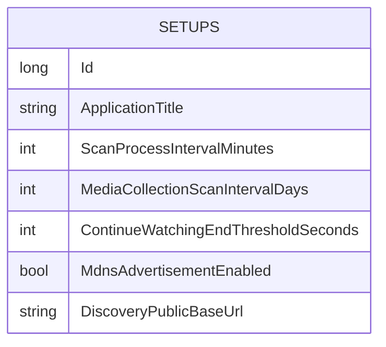

← [Zurück zur Übersicht](index.md)

# Netzwerk-Erkennung — Datenmodell

## Entitäten

### `Setup` (Tabelle `Setups`)

Die `Setup`-Entität enthält genau eine Zeile mit den globalen Programmeinstellungen. Neu durch dieses Feature:

| Eigenschaft | Typ | Beschreibung |
|-------------|-----|--------------|
| `DiscoveryPublicBaseUrl` | `string?` (nullable `TEXT`-Spalte) | Admin-gepflegte öffentliche Basis-URL für `VIDEOWEBPLAYER_SERVER`-Antworten, vollständig inkl. Schema, Host, Port und Pfad. `null` = kein Admin-Override; die Vorrangkette greift auf `Discovery:PublicBaseUrl` bzw. die automatische Ableitung zurück. |

Bestehende, für die Erkennung relevante Spalte:

| Eigenschaft | Typ | Beschreibung |
|-------------|-----|--------------|
| `MdnsAdvertisementEnabled` | `bool` (Default `true`) | Admin-Schalter für die mDNS-Ankündigung — unabhängig von der Broadcast-Erkennung. |

## Diagramm

Die `Setups`-Tabelle steht ohne Beziehungen zu anderen Entitäten; sie wird pro Anfrage über `GetOrCreateSetupAsync` gelesen (angelegt, falls noch keine Zeile existiert).

## Hinweise zur Migration und zum Restore

- Die Migration `AddSetupDiscoveryPublicBaseUrl` (`VideoWebPlayer/Migrations/20261005171612_AddSetupDiscoveryPublicBaseUrl.cs`) fügt `Setups.DiscoveryPublicBaseUrl` als nullable `TEXT`-Spalte hinzu; Bestandszeilen erhalten `NULL` (= automatische Auflösung).
- `VideoWebPlayerBackupData` trägt `Setups.DiscoveryPublicBaseUrl` in `OptionalRestoreColumns` ein: Backups älterer Versionen ohne die Spalte sind weiter restorierbar (der Wert gilt dann als ungesetzt), neue Backups enthalten die Spalte automatisch.
- Da der Wert in Backups mitgesichert wird, kann ein auf einem anderen Host wiederhergestelltes Backup eine an den alten Server gebundene Adresse mitbringen — siehe [Fehlerbehebung](troubleshooting.md).
