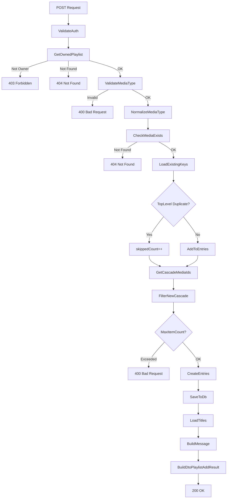
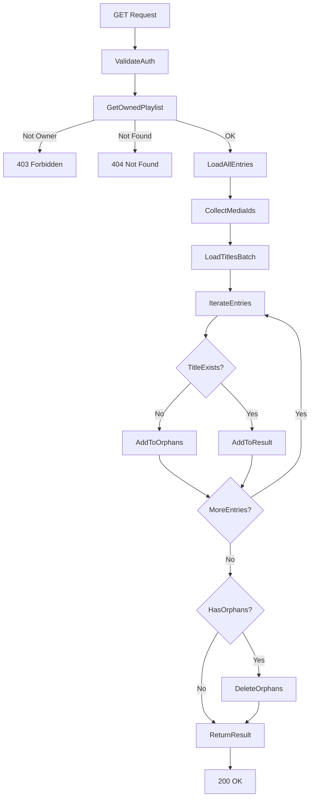
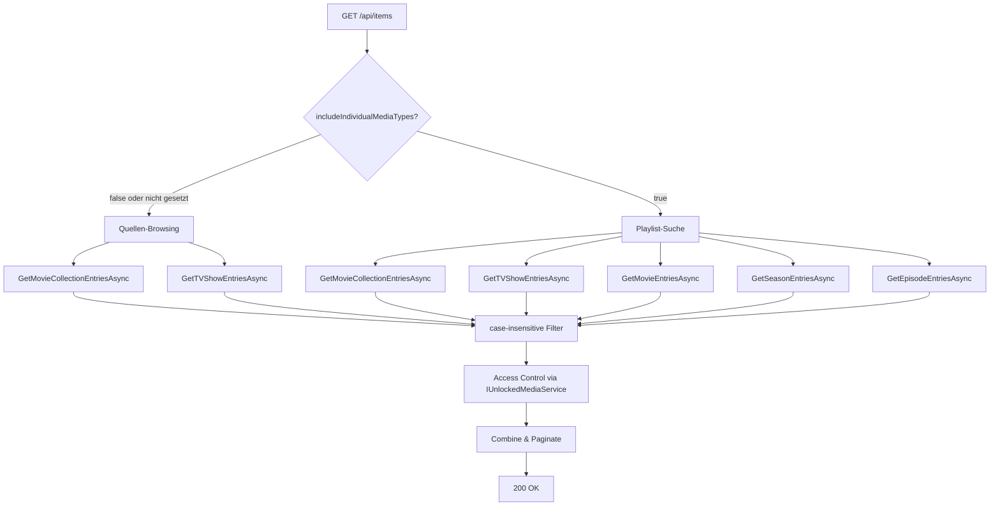
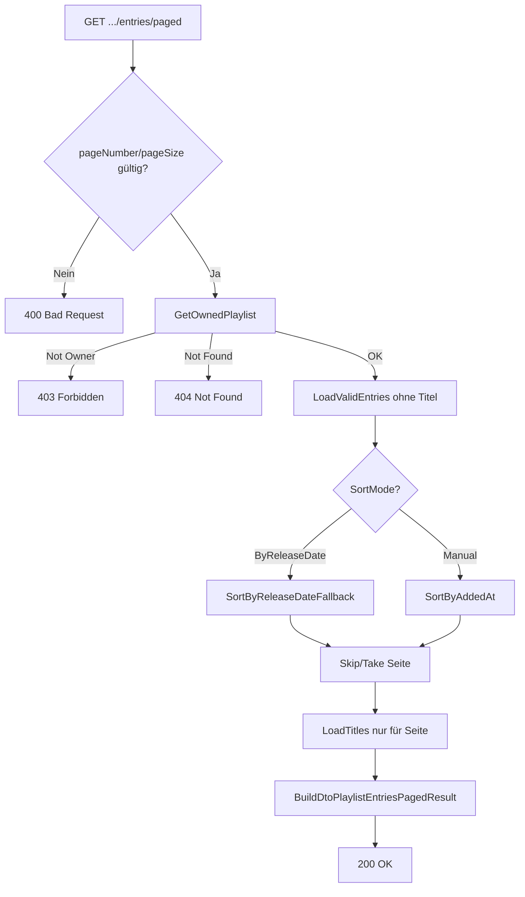
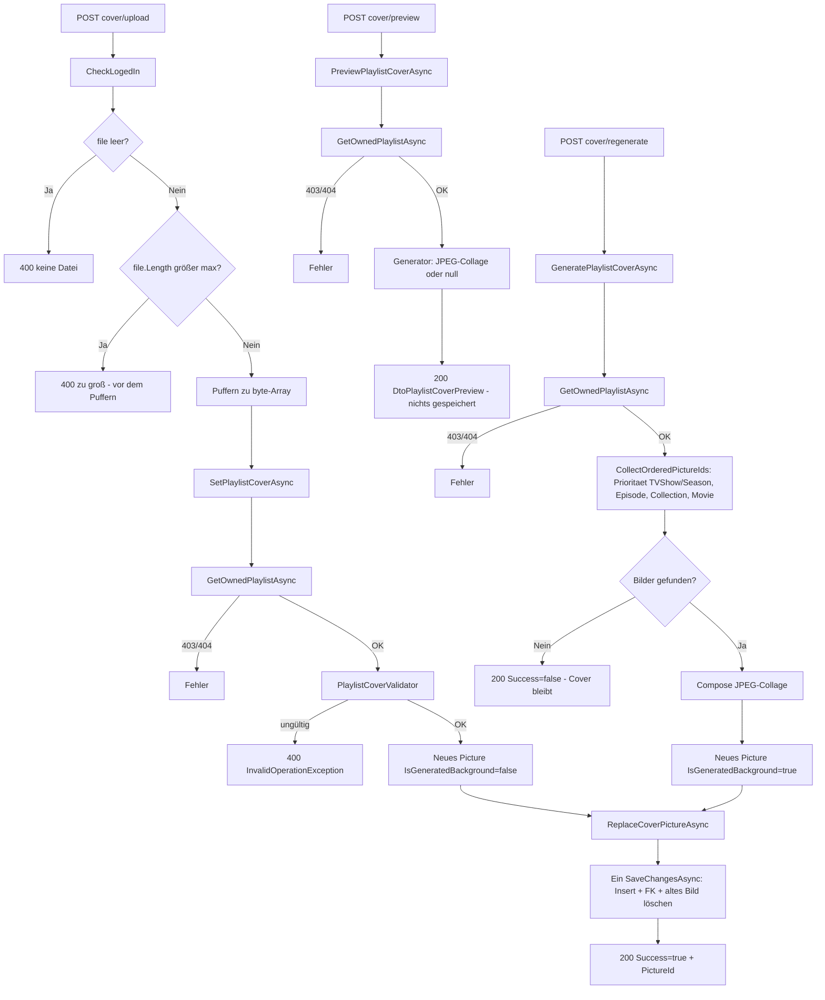

# Playlists – Technischer Programmablauf

## Übersicht

Die Playlist-Verwaltung besteht aus sieben Hauptabläufen (dazu der Hintergrundprozess in „Ablauf 8"):
1. Hinzufügen von Medieninhalten (mit Cascade-Logik)
2. Entfernen von Medieninhalten
3. Abrufen aller Einträge (mit Bereinigung verwaister Einträge)
4. Mediensuche für die Playlist-Auswahl-Oberfläche (case-insensitive Namenssuche, Opt-in für 5 Medientypen, Regression-Schutz für Quellen-Browsing)
5. Abrufen einer sortierten, paginierten Seite von Einträgen (für die Infinity-List der Detailseite)
6. Playlist-Abbildung (Cover): Upload, Vorschau und Übernehmen einer Collage, Abruf und Löschen (Bild-Panel der Detailseite)
7. Aufbau der Detailseite: Kopfbereich, Titelauswahl und Moduswechsel (nur Oberfläche)
8. Automatische Nachlieferung neuer Inhalte (Hintergrundprozess: Markierung, Anstoß, blockweise Verarbeitung, Sicherheitslauf)

Diese Dokumentation beschreibt den internen Ablauf auf Code-Ebene.

---

## Ablauf 1: Medieninhalt hinzufügen

### Schritt-für-Schritt

**Auslöser:** Client ruft `POST /api/playlists/{id}/entries` auf mit `{ mediaType, mediaId }`

1. **Controller-Validierung:**
   - `PlaylistsController.AddMediaToPlaylist()` empfängt Request
   - Benutzer wird aus Auth-Token extrahiert (`CurrentUser`)
   - Service-Methode wird aufgerufen

2. **Berechtigungsprüfung:**
   - `PlaylistService.AddMediaToPlaylistAsync()` ruft `GetOwnedPlaylistAsync()` auf
   - Diese prüft: Existiert die Playlist? Ist der Benutzer der Besitzer?
   - Falls nicht → `PlaylistAccessDeniedException` → HTTP 403

3. **MediaType-Validierung:**
   - `ValidateMediaType()` prüft: Ist `mediaType` einer der 5 gültigen Typen?
   - Gültige Typen: `Movie`, `TVShowEpisode`, `TVShowSeason`, `TVShow`, `MovieCollection`
   - Falls ungültig → `InvalidOperationException` → HTTP 400

4. **Medieninhalt-Existenz prüfen:**
   - `CheckMediaExistsAsync()` prüft via `MediaTypeHandler` in der DB: Existiert der Medieninhalt?
   - Falls nicht → `KeyNotFoundException` → HTTP 404

5. **Bestehende Duplikate abfragen:**
   - Lade alle bestehenden `PlaylistEntry` für diese Playlist
   - Sammle die Schlüssel als `(normalizedMediaType, MediaId)` in einem `HashSet`
   - Normalisiere den `mediaType` zu seinem kanonischen Enum-Wert: `var normalizedMediaType = parsedMediaType.ToString()`
   - Prüfe: Existiert bereits ein Eintrag mit `(normalizedMediaType, mediaId)`?
   - Falls ja → Erhöhe `skippedDuplicateCount`, fahre fort (kein Fehler)

6. **Cascade-Kinder laden:**
   - `GetCascadeMediaIdsAsync()` prüft: Hat dieser `mediaType` Kind-Einträge?
   - Für `TVShow`: Lade alle zugehörigen `TVShowSeason`, dann alle zugehörigen `TVShowEpisode`
   - Für `TVShowSeason`: Lade alle zugehörigen `TVShowEpisode`
   - Für `MovieCollection`: Lade alle zugehörigen `Movie`
   - Für `Movie`, `TVShowEpisode`: Keine Kinder (leere Liste)
   - Rückgabe: Liste von `(type, id)` Tupeln

7. **Cascade-Duplikate filtern:**
   - Filtere die Cascade-Kinder: Für jeden Eintrag Cascade-Eintrag den `mediaType` normalisieren
   - Behalte nur diejenigen, die nicht im bestehenden `HashSet` (mit normalisierten Schlüsseln) sind
   - Für Duplikate: Erhöhe `skippedDuplicateCount`
   - Neue Cascade-Einträge: `newCascadeEntries` (nur noch nicht vorhandene)

8. **Maximale Anzahl prüfen:**
   - Falls `PlaylistSettings.MaxPlaylistItemCount` gesetzt ist (nicht null):
     - Berechne: Neue Einträge = 1 (Top-Level) + `newCascadeEntries.Count`
     - Prüfe: `existingKeys.Count + newEntryCount <= maxItemCount`?
     - Falls nicht → `InvalidOperationException` → HTTP 400

9. **Top-Level-Eintrag vorbereiten:**
   - Falls nicht als Duplikat übersprungen: Erstelle `PlaylistEntry` mit:
     - `PlaylistId = playlistId`
     - `MediaType = normalizedMediaType` (kanonischer Enum-Wert, nicht roher Input)
     - `MediaId = mediaId`
     - `ParentMediaType = null`
     - `ParentMediaId = null`
     - `AddedAt = DateTime.UtcNow`
   - Füge zu `entriesToAdd` Liste hinzu (noch nicht in DB)

10. **Cascade-Einträge vorbereiten:**
    - Für jeden neuen Eintrag in `newCascadeEntries` (nicht Duplikate):
      - Erstelle `PlaylistEntry` mit:
        - `MediaType = normalizedCascadeMediaType` (normalisiert)
        - `ParentMediaType = normalizedMediaType` (normalisiert)
        - `ParentMediaId = mediaId`
      - Füge zu `entriesToAdd` Liste hinzu

11. **Alle Einträge speichern:**
    - `await db.SaveChangesAsync()` — eine Transaktion speichert alle Einträge aus `entriesToAdd` atomar

12. **Benutzer-Nachricht bauen:**
    - Falls `entriesToAdd.Count > 0 && skippedDuplicateCount > 0`: `"{entriesToAdd.Count} Titel hinzugefügt, {skippedDuplicateCount} bereits vorhanden und übersprungen."`
    - Falls `entriesToAdd.Count > 0 && skippedDuplicateCount == 0`: `"{entriesToAdd.Count} Titel hinzugefügt."`
    - Falls `entriesToAdd.Count == 0`: `"Alle {skippedDuplicateCount} Titel waren bereits vorhanden."`

13. **DTOs bauen und Response zusammenstellen:**
    - `BuildAddResultAsync()` konvertiert alle neuen Einträge (`entriesToAdd`) über dieselbe
      `BuildEntryDtosAsync()`-Methode zu `DtoPlaylistEntry`, die auch die beiden Lese-Endpunkte
      (Ablauf 3 und 4) verwenden — inklusive Titel, aufgelöster Bild-ID (`ResolvedPictureId`) und
      echter Freischaltungsprüfung (`IsAccessible`) für den aktuellen Benutzer. Ein soeben
      hinzugefügter, nicht freigeschalteter Titel liefert also unmittelbar `IsAccessible: false`.
    - Baue neue Response: `DtoPlaylistAddResult`:
      - `TopLevelEntry`: Der neu hinzugefügte Top-Level-Eintrag (oder `null`, falls Duplikat)
      - `AddedEntries[]`: Alle neu hinzugefügten Einträge
      - `SkippedDuplicateCount`: Anzahl übersprungener Duplikate
      - `Message`: Benutzer-Nachricht aus Schritt 12
    - Rückgabe an Client (HTTP 200 OK)

### Beteiligte Klassen/Komponenten

| Klasse | Methode | Zweck |
|--------|---------|-------|
| `PlaylistsController` | `AddMediaToPlaylist()` | HTTP-Endpoint-Handler |
| `PlaylistService` | `AddMediaToPlaylistAsync()` | Geschäftslogik mit normalisierter Duplikat-Behandlung und Message-Generierung |
| `PlaylistService` | `GetOwnedPlaylistAsync()` | Berechtigung + Existenz |
| `PlaylistService` | `ValidateMediaType()` | Typ-Validierung (case-insensitiv) |
| `PlaylistService` | `ParseMediaType()` | Parsing und Normalisierung des MediaType-Enums |
| `PlaylistService` | `CheckMediaExistsAsync()` | Existenz-Prüfung |
| `PlaylistService` | `GetCascadeMediaIdsAsync()` | Cascade-Abfrage |
| `PlaylistService` | `GetMediaTitleAsync()` | Titel-Lookup |
| `PlaylistService` | `BuildAddResultAsync()` | Baut `DtoPlaylistAddResult` inkl. Message |
| `PlaylistService` | `BuildEntryDtosAsync()` | Entity → DTO Konvertierung (Titel, `ResolvedPictureId`, `IsAccessible`), gemeinsam mit Ablauf 3/4 |
| `ApplicationDbContext` | `PlaylistEntries` | DB-Zugriff |
| `PlaylistEntry` | — | Datenmodell mit normalisiertem `MediaType` |
| `DtoPlaylistEntry` | — | Client-Modell für einzelne Einträge |
| `DtoPlaylistAddResult` | — | Neue Client-Response-Struktur (TopLevelEntry, AddedEntries[], SkippedDuplicateCount, Message) |

### Diagramm



---

## Ablauf 2: Medieninhalt entfernen

### Schritt-für-Schritt

**Auslöser:** Client ruft `DELETE /api/playlists/{id}/entries/{mediaType}/{mediaId}` auf

1. **Berechtigungsprüfung:**
   - `PlaylistService.RemoveMediaFromPlaylistAsync()` ruft `GetOwnedPlaylistAsync()` auf
   - Falls nicht Besitzer → `PlaylistAccessDeniedException` → HTTP 403

2. **Eintrag suchen:**
   - Lade `PlaylistEntry` mit `PlaylistId = id`, `MediaType = mediaType`, `MediaId = mediaId`
   - Falls nicht gefunden → `KeyNotFoundException` → HTTP 404

3. **Löschen:**
   - Entferne Eintrag aus DbContext
   - `await db.SaveChangesAsync()`

4. **Antwort:**
   - HTTP 204 No Content (leerer Body)

### Beteiligte Klassen

| Klasse | Methode | Zweck |
|--------|---------|-------|
| `PlaylistsController` | `RemoveMediaFromPlaylist()` | HTTP-Endpoint-Handler |
| `PlaylistService` | `RemoveMediaFromPlaylistAsync()` | Geschäftslogik |
| `PlaylistService` | `GetOwnedPlaylistAsync()` | Berechtigung + Existenz |
| `ApplicationDbContext` | `PlaylistEntries` | DB-Zugriff |

---

## Ablauf 3: Alle Einträge abrufen (mit Bereinigung)

### Schritt-für-Schritt

**Auslöser:** Client ruft `GET /api/playlists/{id}/entries` auf

1. **Berechtigungsprüfung:**
   - `PlaylistService.GetPlaylistEntriesAsync()` ruft `GetOwnedPlaylistAsync()` auf
   - Falls nicht Besitzer → HTTP 403

2. **Alle Einträge laden:**
   - Lade alle `PlaylistEntry` mit `PlaylistId = id` aus DB
   - Keine Filterung, keine Sortierung (unsortiert in Einfüge-Reihenfolge; sortierte Anzeige nur
     über den paginierten Endpunkt, siehe Ablauf 4)

3. **Medien-IDs sammeln:**
   - Erstelle Dictionary `mediaIdsByType` mit den Schlüsseln (Medientypen)
   - Für jeden Eintrag:
     - Addiere `entry.MediaId` zur Liste für `entry.MediaType`
     - Falls `ParentMediaType` nicht null: Addiere `ParentMediaId` zur Liste für `ParentMediaType`

4. **Titel in Batch laden:**
   - Für jeden Medientyp: Rufe `GetMediaTitlesAsync()` auf
   - Diese lädt alle Titel für die gegebenen IDs auf einmal (Batch-Optimierung)
   - Rückgabe: Dictionary von ID → Titel für diesen Typ

5. **Verwaiste Einträge bereinigen:**
   - Iteriere über alle Einträge:
     - Prüfe: Existiert der Titel für `entry.MediaType` und `entry.MediaId`?
     - Falls nein (Titel ist null):
       - Markiere Eintrag als Verwaist
       - Füge zu `orphans` Liste hinzu
       - Überspringe zu nächstem Eintrag (nicht in `result` aufnehmen)
     - Falls ja: Behalte den Eintrag für die DTO-Konvertierung in Schritt 7

6. **Verwaiste Einträge löschen:**
   - Falls `orphans.Count > 0`:
     - `db.PlaylistEntries.RemoveRange(orphans)`
     - `await db.SaveChangesAsync()` — Löscht alle Einträge, deren Medieninhalt nicht mehr existiert

7. **DTOs bauen und zurückgeben:**
   - `BuildEntryDtosAsync()` konvertiert die verbleibenden (nicht verwaisten) Einträge zu
     `DtoPlaylistEntry`, inklusive aufgelöster Bild-ID (`ResolvedPictureId`) und echter
     Freischaltungsprüfung (`IsAccessible`) für den aktuellen Benutzer über `IUnlockedMediaService`
     — dieselbe Methode wie in Ablauf 1 und 4
   - HTTP 200 OK mit Array von `DtoPlaylistEntry`

### Beteiligte Klassen

| Klasse | Methode | Zweck |
|--------|---------|-------|
| `PlaylistsController` | `GetPlaylistEntries()` | HTTP-Endpoint-Handler |
| `PlaylistService` | `GetPlaylistEntriesAsync()` | Geschäftslogik + Bereinigung |
| `PlaylistService` | `GetOwnedPlaylistAsync()` | Berechtigung + Existenz |
| `PlaylistService` | `GetMediaTitlesAsync()` | Batch-Titel-Lookup |
| `PlaylistService` | `BuildEntryDtosAsync()` | Entity → DTO Konvertierung (Titel, `ResolvedPictureId`, `IsAccessible`), gemeinsam mit Ablauf 1/4 |
| `IUnlockedMediaService` | `GetUnlockedMovieCollectionIdsForUserAsync()` / `GetUnlockedTVShowIdsForUserAsync()` | Bulk-Freischaltungsprüfung für `IsAccessible` |
| `ApplicationDbContext` | `PlaylistEntries` | DB-Zugriff |

### Diagramm



---

## Ablauf 4: Mediensuche für die Playlist-Auswahl-Oberfläche (case-insensitiv, multi-type)

### Schritt-für-Schritt

**Auslöser:** Client (`MediaSearchSelector.razor`) ruft `GET /api/items?search={term}&includeIndividualMediaTypes=true` auf, während Benutzer einen Suchbegriff eingibt

**Hinweis:** Dieser Ablauf dokumentiert auch das bestehende Quellen-Browsing-Verhalten, wenn `includeIndividualMediaTypes` nicht gesetzt ist oder den Standardwert `false` hat.

1. **Parameter-Validierung:**
   - `ItemsController.Get()` empfängt Query-Parameter:
     - `search` (string, optional): Suchbegriff für Namensabfrage
     - `includeIndividualMediaTypes` (bool, Default `false`): Steuert, ob die 5 Medientypen (Movie, TVShow, TVShowSeason, TVShowEpisode, MovieCollection) durchsucht werden oder nur 2 (TVShow, MovieCollection)
     - `mediaSourceId` (long, optional): Falls gesetzt, wird Quellen-Browsing-Modus aktiviert (filtert nach Medienquelle)
     - `page`, `size`, `genreId`: Weitere Filterparameter

2. **MediaEntryFilter konstruieren:**
   - Konstruiere ein `MediaEntryFilter`-Record mit:
     - `Search = search` (unverändert; die Kleinschreibungs-Faltung erfolgt erst in Schritt 4, Unicode-korrekt über `ToLowerInvariant()`)
     - `IncludeIndividualMediaTypes = includeIndividualMediaTypes`
     - `MediaSourceId = mediaSourceId`
     - `Page = page`
     - `Size = size`

3. **Abfrage-Strategie bestimmen:**
   - Falls `includeIndividualMediaTypes == true` (Playlist-Suche):
     - Rufe alle fünf `Get*EntriesAsync()`-Methoden auf:
       - `GetMovieCollectionEntriesAsync(filter)`
       - `GetTVShowEntriesAsync(filter)`
       - `GetMovieEntriesAsync(filter)` ← nur bei `includeIndividualMediaTypes == true`
       - `GetSeasonEntriesAsync(filter)` ← nur bei `includeIndividualMediaTypes == true`
       - `GetEpisodeEntriesAsync(filter)` ← nur bei `includeIndividualMediaTypes == true`
   - Sonst (Quellen-Browsing oder Standard):
     - Rufe nur die zwei ursprünglichen Methoden auf:
       - `GetMovieCollectionEntriesAsync(filter)`
       - `GetTVShowEntriesAsync(filter)`

4. **Case-insensitive, Unicode-korrekte Namenssuche in jeder Methode:**
   - Jede `Get*EntriesAsync()`-Methode ruft für den Namensvergleich `ApplySearchFilter<T>()` auf, eine über alle fünf Methoden geteilte Hilfsmethode:
     - Der Suchbegriff wird mit `ToLowerInvariant()` (kulturunabhängig statt kultursensitiv `ToLower()`) kleingeschrieben.
     - Die LIKE-Sonderzeichen `\`, `%` und `_` im Suchbegriff werden escaped (Backslash zuerst), damit sie als literale Zeichen statt als Wildcards gesucht werden.
     - Der Vergleich erfolgt über `EF.Functions.Like(AppDbFunctions.LowerInvariant(e.Name), $"%{escaped}%", "\\")`. `AppDbFunctions.LowerInvariant` ist eine als SQLite-Funktion (`lower_invariant`) registrierte, serverseitig ausgeführte Faltung über `string.ToLowerInvariant()` — im Gegensatz zu SQLite's eingebautem `lower()` faltet sie auch Ä/Ö/Ü/ß korrekt zu ä/ö/ü/ß (und umgekehrt bei der Suche nach Großbuchstaben-Varianten).
     - Beispiel: Suche nach „breaking" findet „Breaking Bad", „BREAKING_BAD", etc.; Suche nach „mörder“ findet „Mörder“ ebenso wie „MÖRDER“; ein Suchbegriff mit `%` oder `_` (z. B. Dateinamen-artige Titel) wird literal gesucht statt als Wildcard interpretiert.
   - Falls kein `search` angegeben: Alle Einträge des Medientyps

5. **Zugriffskontrolle in jeder Methode:**
   - Jede Methode prüft zusätzlich Berechtigungen über `IUnlockedMediaService`
   - Nur Einträge, auf die der aktuelle Benutzer zugriff hat (regulärer Quellenzugriff oder individuelle Freischaltung), werden in die Ergebnisse aufgenommen
   - Nicht zugängliche Inhalte erscheinen nicht in den Suchergebnissen

6. **Quellenzugriff filtern (nur bei `mediaSourceId`):**
   - Falls `mediaSourceId` gesetzt ist: Filtere nach `.Where(e => e.MediaSource.Id == mediaSourceId)`
   - Dies ist das bestehende Quellen-Browsing-Verhalten (z. B. Browse einer Netflix-Quelle zeigt nur Inhalte aus Netflix)

7. **Paginierung:**
   - Alle Ergebnisse aus den `Get*EntriesAsync()`-Methoden werden kombiniert (konkateniert)
   - Wende `Skip((page - 1) * size).Take(size)` an
   - Rückgabe: Liste von `MediaEntryDto` mit den angeforderten Einträgen

8. **Rückgabe:**
   - HTTP 200 OK mit Array von `MediaEntryDto`:
     ```csharp
     public class MediaEntryDto
     {
         public string Type { get; set; }       // "Movie", "TVShow", etc.
         public long Id { get; set; }           // Medien-ID
         public string Title { get; set; }      // Titel
         public long? PictureId { get; set; }   // Bild-ID oder null
     }
     ```

### Beispiel 1: Playlist-Medienauswahl mit case-insensitiver Suche

```
Client-Request: GET /api/items?search=breaking&includeIndividualMediaTypes=true

Server:
1. Konstruiere MediaEntryFilter(Search="breaking", IncludeIndividualMediaTypes=true)
2. Rufe alle 5 Get*EntriesAsync-Methoden auf
3. GetMovieEntriesAsync:
   - Suche: WHERE lower_invariant(Name) LIKE '%breaking%' ESCAPE '\'
   - Ergebnis: "Breaking Bad" (Movie), "Breaking Point" (Movie)
4. GetTVShowEntriesAsync:
   - Ergebnis: "Breaking Bad" (TVShow)
5. GetSeasonEntriesAsync:
   - Ergebnis: Staffel 1 von "Breaking Bad" (wenn Titel enthält "breaking")
6. ... etc.
7. Kombiniere und paginiere
8. Rückgabe: 5 Einträge (2 Movies, 1 TVShow, ...)
```

### Beispiel 2: Quellen-Browsing ohne Opt-in (Regression-Schutz)

```
Client-Request: GET /api/items?mediaSourceId=123&includeIndividualMediaTypes=false

Server:
1. Konstruiere MediaEntryFilter(MediaSourceId=123, IncludeIndividualMediaTypes=false)
2. Rufe nur 2 Get*EntriesAsync-Methoden auf (NICHT GetMovieEntriesAsync, etc.)
   - GetMovieCollectionEntriesAsync: WHERE MediaSourceId = 123
   - GetTVShowEntriesAsync: WHERE MediaSourceId = 123
3. Rückgabe: Nur 2 Medientypen, z. B. [MovieCollection, TVShow]
   (Keine Movies, Seasons, Episodes → kein Regression zur alten Oberfläche)
```

### Beteiligte Klassen

| Klasse | Methode | Zweck |
|--------|---------|-------|
| `ItemsController` | `Get(mediaSourceId, search, includeIndividualMediaTypes, ...)` | HTTP-Endpoint-Handler, Koordination der Abfragen |
| `ItemsController` | `GetMovieCollectionEntriesAsync()` | Abfrage MovieCollections mit case-insensitiver Namenssuche |
| `ItemsController` | `GetTVShowEntriesAsync()` | Abfrage TVShows mit case-insensitiver Namenssuche |
| `ItemsController` | `GetMovieEntriesAsync()` | Abfrage Movies mit case-insensitiver Namenssuche (nur wenn `includeIndividualMediaTypes == true`) |
| `ItemsController` | `GetSeasonEntriesAsync()` | Abfrage TVShowSeasons mit case-insensitiver Namenssuche (nur wenn `includeIndividualMediaTypes == true`) |
| `ItemsController` | `GetEpisodeEntriesAsync()` | Abfrage TVShowEpisodes mit case-insensitiver Namenssuche (nur wenn `includeIndividualMediaTypes == true`) |
| `ItemsController` | `ApplySearchFilter<T>()` | Hilfsmethode für case-insensitive, Unicode-korrekte `EF.Functions.Like(...)`-Suche mit LIKE-Escaping, wird von allen 5 Methoden genutzt |
| `AppDbFunctions` | `LowerInvariant()` | Als SQLite-Funktion `lower_invariant` registrierte, kulturunabhängige Kleinschreibungs-Faltung (`ToLowerInvariant()`); faltet Ä/Ö/Ü/ß korrekt, im Gegensatz zu SQLite's eingebautem `lower()` |
| `MediaEntryFilter` (Record) | — | Filter-Parameter-Objekt mit Feldern: `Search`, `IncludeIndividualMediaTypes`, `MediaSourceId`, `Page`, `Size`, `GenreId` |
| `VideoWebPlayerClient` | `RequestItemsAsync()` | Client-Methode für Playlist-Suche, ruft `RequestItemsCoreAsync()` mit `includeIndividualMediaTypes: true` auf |
| `VideoWebPlayerClient` | `RequestSourceItems()` | Client-Methode für Quellen-Browsing, ruft `RequestItemsCoreAsync()` mit `includeIndividualMediaTypes: false` (oder setzt Parameter nicht) auf |
| `VideoWebPlayerClient` | `RequestItemsCoreAsync()` | Kern-Methode für API-Aufruf, übernimmt den `includeIndividualMediaTypes`-Parameter in den Query-String |
| `MediaSearchSelector.razor` | — | UI-Komponente für Medienauswahl, ruft `Client.RequestItemsAsync()` auf |
| `IUnlockedMediaService` | `GetUnlockedMediaIdsAsync()` | Prüft Zugriff des Benutzers auf Individual Media (Movies, Seasons, Episodes) über übergeordnete Sammlung/Serie |

### Diagramm



---

## Ablauf 5: Sortierte, paginierte Einträge abrufen (Infinity-List)

### Schritt-für-Schritt

**Auslöser:** Client (`PlaylistEntriesList.razor`, über einen `IntersectionObserver`-Sentinel am
Listenende) ruft
`GET /api/playlists/{id}/entries/paged?pageNumber=N&pageSize=M` auf, initial für Seite 1 und dann
erneut mit fortlaufend höherem `pageNumber`, sobald der Anwender in der Liste weiter nach unten
scrollt.

1. **Parameter-Validierung (vor der Berechtigungsprüfung):**
   - `PlaylistsController.GetPlaylistEntriesPaged()` löst `pageSize` auf: übergebener Wert oder,
     falls keiner angegeben, `PlaylistSettings.DefaultPageSize`
   - `pageNumber < 1` → HTTP 400
   - `pageSize < 1` oder `pageSize > PlaylistSettings.MaxPageSize` → HTTP 400

2. **Berechtigungsprüfung:**
   - `PlaylistService.GetPlaylistEntriesPagedAsync()` ruft `GetOwnedPlaylistAsync()` auf
   - Falls nicht Besitzer → HTTP 403; falls Playlist nicht gefunden → HTTP 404

3. **Gültige Einträge laden (ohne Titel-Auflösung):**
   - `LoadValidPlaylistEntriesAsync()` lädt alle `PlaylistEntry` der Playlist
   - Für jeden Medientyp wird über `MediaTypeHandler.LoadExistingIdsAsync()` geprüft, welche
     referenzierten Medien-IDs noch existieren (nur ID-Existenzprüfung, keine Titel werden dabei
     geladen)
   - Einträge, deren Medieninhalt nicht mehr existiert, werden als Waisen erkannt und aus der DB
     entfernt (`RemoveRange` + `SaveChangesAsync`), analog zu Ablauf 3

4. **Sortierung:**
   - Bei `Playlist.SortMode == ByReleaseDate`: `SortPlaylistEntriesByReleaseDateAsync()` ermittelt
     für alle gültigen Einträge Erscheinungsdatum (`LoadReleaseDateAsync`) und Hierarchie-Sequenz
     (`GetHierarchySequenceAsync`) pro Medientyp und sortiert nach der Fallback-Kette
     Erscheinungsdatum → `ParentId` → `SequenceNumber` → `AddedAt` (siehe `playlists-business-rules.md`, BR-13)
   - Bei `Manual`: einfache Sortierung nach `AddedAt`

5. **Seite ausschneiden:**
   - `totalCount = sortedEntries.Count`
   - `skip = (pageNumber - 1) * pageSize`
   - `pageEntries = sortedEntries.Skip(skip).Take(pageSize)`

6. **Titel nur für die aktuelle Seite auflösen:**
   - `LoadTitlesForMediaRefsAsync()` lädt die Medientitel ausschließlich für `pageEntries` (nicht
     für die gesamte Playlist)
   - Ebenso werden die Titel etwaiger Eltern-Einträge (`ParentMediaType`/`ParentMediaId`) nur für
     die aktuelle Seite aufgelöst
   - Dadurch skaliert der Aufwand pro Anfrage mit der Seitengröße, nicht mit der Gesamtgröße der
     Playlist

7. **DTOs bauen und zurückgeben:**
   - `BuildEntryDtosAsync()` konvertiert `pageEntries` (nur die aktuelle Seite) zu
     `DtoPlaylistEntry`, inklusive für die Seite aufgelöster Bild-IDs (`ResolvedPictureId`, mit
     Fallback Poster → Banner → Fanart pro Medientyp via `LoadPictureIdsForMediaRefsAsync()`) und
     echter Freischaltungsprüfung (`IsAccessible`) über `IUnlockedMediaService`
     (`LoadUnlockedMediaIdsAsync()`, siehe Hinweis in `playlists-api.md`) — beides skaliert mit der
     Seitengröße, nicht mit der Gesamtgröße der Playlist
   - Rückgabe: `DtoPlaylistEntriesPagedResult { Entries, TotalCount, HasNextPage, PageNumber, PageSize }`
     mit `HasNextPage = skip + pageSize < totalCount`

**Client-seitiges Nachladen (`PlaylistEntriesList.razor`):**
- `LoadInitialPageAsync()` lädt beim Öffnen der Seite die erste Seite (`PageSize = 20`) und setzt
  `allEntries`, `hasMorePages`
- Die Liste rendert normal im Seitenfluss (kein `Virtualize`, keine eigene Scrollbox); solange
  `hasMorePages` gilt, steht am Listenende ein Sentinel-`div`. `OnAfterRenderAsync()` verbindet
  darauf den `IntersectionObserver` (`window.observeBottom`, `wwwroot/js/scroll.js`), der
  `OnBottomVisible()` aufruft, sobald der Sentinel sichtbar wird; `LoadNextPageAsync()` hängt dann
  die nächste Seite an und verbindet den Observer danach neu (ein noch sichtbarer Sentinel meldet
  sich sonst nicht erneut)
- Eine `SemaphoreSlim` (`loadPageSemaphore`) verhindert, dass bei schnellem Scrollen mehrere
  überlappende Ladevorgänge gleichzeitig laufen
- **Fehlerverhalten:** Schlägt ein Ladevorgang fehl (initial oder beim Nachladen), wird
  `loadMoreFailed` gesetzt, die Fehlermeldung (`entriesStatusMessage`) angezeigt und der Observer
  **nicht** neu verbunden — ein frisch verbundener Observer meldet einen sichtbaren Sentinel sofort,
  was bei anhaltendem Fehler eine Endlosschleife an Wiederholungsversuchen ausgelöst hätte. Solange
  `loadMoreFailed` gesetzt ist, ignoriert `OnBottomVisible()` Observer-Meldungen; erneut geladen
  wird erst über die Schaltfläche „Erneut versuchen" (`RetryLoadNextPageAsync()`) oder durch ein
  vollständiges Neuladen der Liste (`LoadInitialPageAsync()`, z. B. nach Hinzufügen/Entfernen)
- Nach der letzten Seite (`hasMorePages == false`) wird der Observer getrennt
  (`disconnectMediaSourceBottomObserver`), ebenso beim Entfernen der Komponente

### Beteiligte Klassen/Komponenten

| Klasse | Methode | Zweck |
|--------|---------|-------|
| `PlaylistsController` | `GetPlaylistEntriesPaged()` | HTTP-Endpoint-Handler inkl. Parameter-Validierung |
| `PlaylistService` | `GetPlaylistEntriesPagedAsync()` | Geschäftslogik: Laden, Sortieren, Paginieren, Titel nur für die Seite auflösen |
| `PlaylistService` | `LoadValidPlaylistEntriesAsync()` | Laden aller Einträge + Bereinigung verwaister Einträge (ohne Titel-Auflösung) |
| `PlaylistService` | `SortPlaylistEntriesByReleaseDateAsync()` | Ermittelt Sortierschlüssel und sortiert die vollständige, gültige Eintragsliste |
| `PlaylistService` | `LoadTitlesForMediaRefsAsync()` | Titel-Auflösung, beschränkt auf die übergebenen Referenzen (z. B. nur die aktuelle Seite) |
| `PlaylistService` | `BuildEntryDtosAsync()` | Entity → DTO Konvertierung (Titel, `ResolvedPictureId`, `IsAccessible`), gemeinsam mit Ablauf 1/3 |
| `PlaylistService` | `LoadPictureIdsForMediaRefsAsync()` | Bild-ID-Auflösung (Poster → Banner → Fanart), beschränkt auf die übergebenen Referenzen |
| `PlaylistService` | `LoadUnlockedMediaIdsAsync()` | Bulk-Freischaltungsprüfung über `IUnlockedMediaService` für alle Einträge der Seite |
| `PlaylistEntriesList.razor` | `LoadInitialPageAsync()` | Lädt die erste Seite beim Öffnen/Neuladen der Playlist |
| `PlaylistEntriesList.razor` | `OnBottomVisible()` / `LoadNextPageAsync()` | Vom Sentinel-Observer aufgerufen; hängt die nächste Seite an (nicht nach einem Ladefehler) |
| `PlaylistEntriesList.razor` | `RetryLoadNextPageAsync()` | „Erneut versuchen" nach einem Ladefehler |

### Diagramm



---

## Ablauf 6: Playlist-Abbildung (Cover) — Upload, Vorschau, Regenerierung, Abruf, Löschen

Eine Playlist kann genau ein Cover besitzen: ein vom Besitzer hochgeladenes Bild
(`CoverPictureIsUserUploaded = true`) oder eine automatisch erzeugte Collage (`false`). Ist kein
Cover gesetzt (`CoverPictureId = null`), zeigen Übersicht und Detailseite den
`PlaylistCoverPlaceholder` (aus der Playlist-Id deterministisch abgeleiteter Farbverlauf mit
Playlist-Symbol). Alle mutierenden Endpunkte erfordern Besitz; der Abruf steht jedem
angemeldeten Benutzer offen.

### Ablauf 6a: Cover hochladen

**Auslöser:** `PlaylistDetail.razor` öffnet über die Bild-Symbol-Schaltfläche (`#playlist-detail-cover-button`) das
Bild-Panel `PlaylistCoverPanel.razor` (ersetzt die früheren Einzeldialoge `PlaylistCoverUploadDialog` und
`PlaylistCoverRegenerateConfirmationDialog`); der Bestätigungsbutton „Hochladen" ruft
`IPlaylistApiClient.UploadPlaylistCoverAsync()` auf, das `POST /api/playlists/{id}/cover/upload` als
`multipart/form-data` sendet.

**Client-seitig (`PlaylistCoverPanel.razor`, Datei-Auswahl):** die gewählte Datei erscheint zunächst nur als
Vorschau (Data-URL) — gespeichert wird erst mit „Hochladen". Serverseitige Validierungsfehler (`HttpRequestException`
mit dem Klartext des Servers) erscheinen als `#playlist-cover-error` im Panel, das dabei geöffnet bleibt.
- Vorvalidierung nur für UX: gemeldeter `ContentType` gegen `AllowedCoverImageFormats`, Dateigröße
  gegen `MaxCoverImageSizeBytes` (ein fehlender ContentType wird nicht vorab abgelehnt — die
  maßgebliche Prüfung erfolgt serverseitig)
- Bildvorschau als Data-URL, Anzeige von Dateiname und -größe, `accept`-Attribut aus der
  konfigurierten Formatliste
- `OpenReadStream(maxAllowedSize: MaxCoverImageSizeBytes)` begrenzt die clientseitige
  Pufferung bereits beim Lesen
- Bei Erfolg: `OnUploaded`-Callback → `PlaylistDetail` schließt den Dialog und lädt die Playlist
  neu (`HandleCoverUploadedAsync` → `LoadPlaylistAsync`)

**Server-seitig (`PlaylistsController.UploadPlaylistCover`):**

1. `CheckLogedIn()` — Authentifizierung
2. `file is null || file.Length == 0` → HTTP 400 (`"Es wurde keine Datei ausgewählt."`)
3. `file.Length > MaxCoverImageSizeBytes` → HTTP 400 **vor** jedem Stream-Zugriff — ein übergroßer
   Upload wird nie in den Speicher gepuffert. Bewusst kein `[RequestSizeLimit]`: das Limit ist
   zur Laufzeit konfigurierbar und soll nicht mit einem Compile-Zeit-Attribut auseinanderlaufen.
4. Erst danach: Datei in `byte[]` puffern (`CopyToAsync` in `MemoryStream`)
5. `PlaylistService.SetPlaylistCoverAsync()`:
   - `GetOwnedPlaylistAsync()` → 403/404 bei Fremdzugriff bzw. nicht existierender Playlist
   - `PlaylistCoverValidator.ValidateUploadAsync()` prüft in dieser Reihenfolge:
     1. Gemeldeter `ContentType` in `AllowedCoverImageFormats`-Allowlist (Case-insensitive;
        leerer/unbekannter Typ → Fehler mit „Friendly Name", z. B. `"Format BMP wird nicht
        unterstützt. Erlaubte Formate: JPEG, PNG, WebP."`)
     2. `fileSize > MaxCoverImageSizeBytes` → `"Datei zu groß, max. X MB erlaubt."`
     3. Erkennung via ImageSharp `Image.Identify()` (nur Bildkopf; jede dabei geworfene Ausnahme →
        `"Datei ist kein gültiges Bild."`)
     4. Das **tatsächlich erkannte** Format (`DecodedImageFormat.DefaultMimeType`) muss ebenfalls in
        der Allowlist stehen (sonst dieselbe „Format … wird nicht unterstützt"-Meldung); der
        erkannte MIME-Type wird im Ergebnis mitgegeben und später als `Picture.ContentType`
        gespeichert
     5. Pixelgrenzen am Bildkopf, **vor** der Dekodierung: `MaxCoverImageWidthPixels`,
        `MaxCoverImageHeightPixels`, `MaxCoverImageTotalPixels` → `"Bild zu groß (B x H Pixel). …"`
     6. Bei JPEG: `JpegIntegrityChecker.Check()` (Marker-Struktur + Huffman-Scan-Konsistenz, ohne
        Pixelrekonstruktion), danach vollständige strikte Dekodierung (`Image.Load` mit
        `MaxFrames = 1`, `SkipMetadata = true`); schlägt eines davon fehl →
        `"Datei ist beschädigt oder unvollständig und kann nicht als Bild gelesen werden."`
   - Validierungsfehler → `InvalidOperationException` → HTTP 400 (generisches Fehler-Mapping,
     kein `DtoPlaylistCoverResult`)
   - Bei Erfolg tragen `Width`/`Height` des Ergebnisses die ermittelten Bildabmessungen
6. Neues `Picture` anlegen: `Type = "cover"`, `Data` = Upload-Bytes, `ContentType` = aus dem Bild
   erkannter MIME-Type (nicht der vom Client gemeldete), `Width`/`Height` aus der Validierung, `IsGeneratedBackground = false`,
   `PlaylistId` = Playlist-Id
7. `ReplaceCoverPictureAsync(playlist, newPicture, isUserUploaded: true)` — siehe unten
8. HTTP 200 mit `DtoPlaylistCoverResult { Success = true, Message = "Bild erfolgreich
   hochgeladen.", PictureId }`

### Ablauf 6b: Cover als Collage neu erzeugen

**Auslöser:** Im Bild-Panel erzeugt „Aus den Titeln erzeugen" zunächst eine **Vorschau** (Ablauf 6b-1); der
Bestätigungsbutton „Anwenden" ruft `PlaylistCoverPanel.ApplyGeneratedAsync()` →
`IPlaylistApiClient.RegeneratePlaylistCoverAsync(id, confirmReplaceUploadedCover)` →
`POST /api/playlists/{id}/cover/regenerate` auf. Die Bestätigung sendet das Panel mit
(`CoverIsUserUploaded || konfliktGesehen`), weil es das Ersetzen eines hochgeladenen Bildes vorher unter der
Vorschau angekündigt hat; der Klick auf „Anwenden" ist die ausdrückliche Bestätigung. Die serverseitige
Sicherheitsabfrage (Schritt 4 unten) bleibt unverändert bestehen.

#### Ablauf 6b-1: Vorschau ohne Speichern

**Auslöser:** `PlaylistCoverPanel.GenerateAsync()` → `IPlaylistApiClient.PreviewPlaylistCoverAsync()` →
`POST /api/playlists/{id}/cover/preview`.

1. `CheckLogedIn()`; `PlaylistService.PreviewPlaylistCoverAsync(id, userId)` → `GetOwnedPlaylistAsync()` (403/404, auch
   für öffentliche Playlists nur der Besitzer)
2. `PlaylistCoverImageGenerator.GeneratePlaylistCoverAsync(playlistId)` — dieselbe Erzeugung wie bei `regenerate`
3. **Nichts wird gespeichert:** kein `Picture` wird hinzugefügt, `Playlist.CoverPictureId`/`CoverPictureIsUserUploaded`
   bleiben unverändert, deshalb keine Bestätigung und kein 409, auch für ein hochgeladenes Cover
4. HTTP 200 `DtoPlaylistCoverPreview { Success, Message, ContentType = "image/jpeg", ImageData }`; ohne Quellbilder
   `Success = false, Message = "Keine Bilder verfügbar."`. Das Panel zeigt `ImageData` als Data-URL-Vorschau
   (`#playlist-cover-preview`) mit dem Hinweis „noch nicht gespeichert" und stellt den Bestätigungsbutton auf „Anwenden"

**Entscheidung „Übernehmen":** „Anwenden" schickt **keine** Bilddaten zurück an den Server, sondern ruft
`regenerate` auf. Vorteil: kein neuer Weg, beliebige Bytes als „erzeugtes" Cover einzuschleusen (Validierung,
`IsGeneratedBackground`, Größenkonfiguration bleiben an einer Stelle), und das Schutzverhalten aus Schritt 10 (409)
bleibt unverändert. Da `HomeBackgroundImageGenerator.Compose` für gleiche Eingaben deterministisch ist, entspricht das
gespeicherte Bild der Vorschau; ändern sich die Inhalte zwischen Vorschau und „Anwenden", gilt der Stand beim
Anwenden.

1. `CheckLogedIn()`; `PlaylistService.GeneratePlaylistCoverAsync(id, userId,
   confirmReplaceUploadedCover)` → `GetOwnedPlaylistAsync()` (403/404). `confirmReplaceUploadedCover`
   stammt aus dem Query-Parameter gleichen Namens (Standard `false`)
2. `PlaylistCoverImageGenerator.GeneratePlaylistCoverAsync(playlistId)`:
   - `CollectOrderedPictureIdsAsync()`:
     - Lädt alle `PlaylistEntry` der Playlist, sortiert nach `AddedAt`, dann `Id`
     - Weist jedem Eintrag eine Prioritätsstufe zu (`GetMediaTypePriority`):
       `TVShow`/`TVShowSeason` = 0, `TVShowEpisode` = 1, `MovieCollection` = 2, `Movie` = 3,
       unbekannte Typen werden verworfen
     - Stabile Sortierung nach Stufe — innerhalb einer Stufe bleibt die
       Hinzufüge-Reihenfolge erhalten; die Reihenfolge in der Playlist kann also nie einen
       niedriger priorisierten Typ vor einen höher priorisierten ziehen
     - `BuildPosterLookupAsync()` löst pro Referenz die `PosterPictureId` auf; `TVShowSeason`
       erhält das Poster der Eltern-`TVShow` (Staffeln haben kein eigenes Poster)
     - Iteriert in Prioritätsreihenfolge und sammelt bis zu `MaxImages = 5`
       deduplizierte Bild-IDs
   - Lädt die `Data`-Bytes der gesammelten `Picture`-Zeilen in dieser Reihenfolge
   - Komponiert via `HomeBackgroundImageGenerator.Compose()` (Cross-Fade-Collage,
     `TransitionWidth = 32`) eine JPEG-Datei in den konfigurierten Abmessungen
     (`GeneratedCoverWidthPixels` × `GeneratedCoverHeightPixels`, Qualität
     `GeneratedCoverJpegQuality`)
   - Keine Bilder vorhanden oder Generierungsfehler → `null` (Fehler werden geloggt, nicht
     geworfen — konsistent mit den übrigen Bild-Generatoren)
3. Bei `null`: HTTP 200 mit `DtoPlaylistCoverResult { Success = false, Message = "Keine Bilder
   verfügbar." }` — das bestehende Cover bleibt **unverändert** (auch ein hochgeladenes)
4. **Sicherheitsabfrage:** Ist `Playlist.CoverPictureIsUserUploaded` gesetzt und
   `confirmReplaceUploadedCover` nicht `true`, wirft der Service (erst nach erfolgreicher
   Collage-Erzeugung, damit ohne Quellbilder keine sinnlose Rückfrage entsteht) eine
   `UploadedCoverReplacementConfirmationRequiredException`; nichts wird geändert. Der Controller
   antwortet mit HTTP 409 Conflict und `DtoRegeneratePlaylistCoverConflictResponse {
   IsUploadedCoverReplacementConfirmationRequired = true }` (Client: `HttpRequestException` mit
   `StatusCode = Conflict` → `PlaylistCoverPanel` zeigt einen Hinweis und merkt sich den Konflikt; der nächste Klick auf
   „Anwenden" sendet `confirmReplaceUploadedCover = true`. Im Normalfall kennt das Panel das hochgeladene Bild bereits
   und sendet die Bestätigung schon beim ersten Klick)
5. Bei Erfolg: neues `Picture` mit `Type = "cover"`, `ContentType = "image/jpeg"`,
   `Width`/`Height` = konfigurierte Collage-Abmessungen, `IsGeneratedBackground = true`,
   `PlaylistId` = Playlist-Id; `ReplaceCoverPictureAsync(..., isUserUploaded: false)`
   ersetzt das bisherige Cover — ein hochgeladenes nur nach der Bestätigung aus Schritt 4 (siehe
   BR-24/BR-25 in `playlists-business-rules.md`)
6. HTTP 200 mit `{ Success = true, Message = "Cover neu erzeugt.", PictureId }`;
   das Panel meldet `OnChanged`, `PlaylistDetail.HandleCoverChangedAsync()` schließt das Panel und aktualisiert die
   Playlist still (nur `RequestPlaylistAsync`, ohne den Vollseiten-Ladezustand, damit Titelliste und Auswahl erhalten
   bleiben); bei `Success = false` zeigt das Panel `result.Message` als Fehlermeldung

**Wichtig:** Die Regenerierung läuft ausschließlich über diesen expliziten Pfad —
`AddMediaToPlaylistAsync`/`RemoveMediaFromPlaylistAsync` und die automatische
Backfill-Mechanik lassen das Cover bewusst unangetastet (kein automatisches Neu Erzeugen bei
Inhaltsänderungen, anders als die Genre-Ableitung aus Schritt 9).

### Ablauf 6c: Cover-Bild abrufen

**Auslöser:** ``-Tags in `PlaylistsList.razor` (Kachel) und `PlaylistDetail.razor`
(Kopfbereich) mit `GET /api/playlists/{id}/cover`.

1. `CheckLogedIn()` — jeder angemeldete Benutzer darf das Bild sehen (Zugriffsniveau wie
   `PicturesController.GetPicture`; nur mutierende Aktionen erfordern Besitz)
2. `GetPlaylistCoverAsync()` lädt die Playlist `AsNoTracking`, liest `CoverPictureId` und lädt
   das `Picture` — `null`, wenn Playlist oder Cover fehlen
3. `picture is null || Data leer` → HTTP 404; sonst `File(picture.Data, picture.ContentType ??
   "image/jpeg")`

**Client-seitige Anzeige:**
- Die Bild-URL trägt `?access_token={token}` (ein ``-Request kann keinen
  `Authorization`-Header senden) plus `&v={CoverPictureId}` als Cache-Buster — die Id ändert sich
  bei jedem Upload/jeder Regenerierung, sodass der Browser das neue Bild lädt statt eine
  zwischengespeicherte Antwort desselben `/cover`-Endpunkts wiederzuverwenden
- Der `PlaylistCoverPlaceholder` liegt immer **unter** dem ``; `onerror` blendet das Bild
  aus, sodass bei Ladefehlern (oder wenn kein Cover gesetzt ist, dann wird das `` gar nicht
  gerendert) der Platzhalter sichtbar bleibt — ohne dediziertes JS-Interop

### Ablauf 6d: Cover löschen

**Auslöser:** Schaltfläche „Bild entfernen" im Bild-Panel (`PlaylistCoverPanel.RequestRemove()`) →
`IPlaylistApiClient.DeletePlaylistCoverAsync()` → `DELETE /api/playlists/{id}/cover`. Ist das aktuelle Bild
hochgeladen (`CoverIsUserUploaded`), fragt zuvor `PlaylistCoverRemoveConfirmationDialog` („Hochgeladenes Bild
entfernen", nicht wiederherstellbar) nach; ein bloß erzeugtes Bild wird ohne Rückfrage entfernt (jederzeit neu
erzeugbar).

1. `CheckLogedIn()`; `DeletePlaylistCoverAsync()` → `GetOwnedPlaylistAsync()` (403/404)
2. Kein Cover gesetzt → No-Op, trotzdem HTTP 200 `{ Success = true }`
3. Sonst: `CoverPictureId = null`, `CoverPictureIsUserUploaded = false`, die `Picture`-Zeile wird
   entfernt — in einem `SaveChangesAsync`

### `ReplaceCoverPictureAsync` (gemeinsame Austausch-Logik)

Upload und Regenerierung (die Vorschau nicht — sie speichert nichts) enden beide hier:

```csharp
var oldPictureId = playlist.CoverPictureId;
await _db.Pictures.AddAsync(newPicture, cancellationToken);
playlist.CoverPicture = newPicture;                    // Navigation statt Id: EF löst die neue
playlist.CoverPictureIsUserUploaded = isUserUploaded;  // Id nach dem Insert selbst auf
if (oldPictureId.HasValue) { /* altes Picture laden und Remove() */ }
await _db.SaveChangesAsync(cancellationToken);
```

Insert des neuen Bildes, Update des Fremdschlüssels und Löschen des alten Bildes laufen in
**einer** Transaktion — bei zwei getrennten `SaveChangesAsync`-Aufrufen könnte ein Fehler des
zweiten Aufrufs das bereits committed neue Bild dauerhaft verweisen lassen (siehe
`VideoWebPlayer/Services/PlaylistService.cs`, XML-Doku zu `ReplaceCoverPictureAsync`).

### Beteiligte Klassen/Komponenten

| Klasse | Methode | Zweck |
|--------|---------|-------|
| `PlaylistsController` | `UploadPlaylistCover()` | Upload-Endpunkt inkl. Größen-Vorprüfung vor dem Puffern |
| `PlaylistsController` | `PreviewPlaylistCover()` | Vorschau-Endpunkt: Collage als `DtoPlaylistCoverPreview`, speichert nichts, nur Besitzer |
| `PlaylistsController` | `RegeneratePlaylistCover()` | Regenerierungs-Endpunkt („Anwenden"), mappt `null` auf `Success = false` |
| `PlaylistsController` | `GetPlaylistCover()` | Bild-Auslieferung (`FileResult`) für alle angemeldeten Benutzer |
| `PlaylistsController` | `DeletePlaylistCover()` | Lösch-Endpunkt |
| `PlaylistService` | `SetPlaylistCoverAsync()` | Upload: Besitzprüfung, Validierung, `Picture`-Anlage |
| `PlaylistService` | `GeneratePlaylistCoverAsync()` | Regenerierung: Besitzprüfung, Generator-Aufruf, `Picture`-Anlage |
| `PlaylistService` | `PreviewPlaylistCoverAsync()` | Vorschau: Besitzprüfung + Generator-Aufruf, keine Persistenz |
| `PlaylistService` | `GetPlaylistCoverAsync()` | Cover-Auflösung für den GET-Endpunkt (`AsNoTracking`) |
| `PlaylistService` | `DeletePlaylistCoverAsync()` | Referenz leeren + `Picture` löschen (No-Op ohne Cover) |
| `PlaylistService` | `ReplaceCoverPictureAsync()` | Atomarer Austausch: neues Bild einfügen, FK setzen, altes löschen |
| `PlaylistService` | `DeletePlaylistAsync()` | Löscht das Cover-`Picture` beim Löschen der Playlist mit (BR-26) |
| `PlaylistCoverValidator` | `ValidateUploadAsync()` | Allowlist-, Größen- und Echtheitsprüfung inkl. Bildabmessungen |
| `PlaylistCoverImageGenerator` | `GeneratePlaylistCoverAsync()` | Collagen-Erzeugung (JPEG-Bytes), persistiert nichts selbst |
| `PlaylistCoverImageGenerator` | `CollectOrderedPictureIdsAsync()` | Prioritäts- und Reihenfolgenlogik (max. 5 deduplizierte Poster-IDs) |
| `PlaylistCoverImageGenerator` | `BuildPosterLookupAsync()` | Bulk-Auflösung der `PosterPictureId` pro Referenz, Staffel-Fallback auf Serienposter |
| `HomeBackgroundImageGenerator` | `Compose()` | Wiederverwendeter Collagen-Renderer (Cross-Fade, `TransitionWidth = 32`) |
| `PlaylistCoverPanel.razor` | `OnFileSelectedAsync()`/`GenerateAsync()`/`ApplyAsync()`/`RemoveAsync()` | Bild-Panel: Vorvalidierung und Vorschau (Datei oder erzeugt), „Hochladen"/„Anwenden", Entfernen; Fehlermeldungen im Panel |
| `PlaylistCoverRemoveConfirmationDialog.razor` | — | Rückfrage vor dem Entfernen eines hochgeladenen Bildes |
| `PlaylistDetail.razor` | `OpenCoverPanel()`/`HandleCoverChangedAsync()`/`CoverImageUrl` | Kopfbereich: Cover-Anzeige, Bild-Symbol-Button, stilles Aktualisieren nach Änderung |
| `PlaylistsList.razor` | `GetCoverImageUrl()` | Kachel-Cover-URL mit `access_token` + `v={CoverPictureId}` |
| `PlaylistCoverPlaceholder.razor` | — | Deterministischer Platzhalter (Farbverlauf aus `PlaylistId * 47 % 360`) |
| `IPlaylistApiClient`/`VideoWebPlayerClient` | `UploadPlaylistCoverAsync()`/`PreviewPlaylistCoverAsync()`/`RegeneratePlaylistCoverAsync()`/`DeletePlaylistCoverAsync()` | Client-Methoden; Upload sendet `multipart/form-data` |
| `DtoPlaylistCoverPreview` | — | Ergebnis der Vorschau (`Success`, `Message`, `ContentType`, `ImageData`) |
| `DtoPlaylistCoverResult` | — | Ergebnis-Typ (`Success`, `Message`, `PictureId`) |
| `PlaylistSettings` | — | `AllowedCoverImageFormats`, `MaxCoverImageSizeBytes`, `MaxCoverImageWidthPixels`, `MaxCoverImageHeightPixels`, `MaxCoverImageTotalPixels`, `GeneratedCoverWidthPixels`, `GeneratedCoverHeightPixels`, `GeneratedCoverJpegQuality` |

### Diagramm (Upload / Regenerierung)



---

## Ablauf 7: Öffentliche Playlists (Schritt 11)

### 7a: Lesender Zugriff (Betrachter)

1. `PlaylistsController` liest den Anfragenden (`CurrentUser`) und ruft die Service-Methode mit dessen ID auf.
2. `PlaylistService.GetReadablePlaylistAsync` lädt die Playlist (`KeyNotFoundException` → 404) und prüft
   `UserId == userId || IsPublic` (sonst `PlaylistAccessDeniedException` → 403); zurückgegeben wird zusätzlich `isOwner`.
3. `LoadValidPlaylistEntriesAsync(playlist, removeOrphans: isOwner)`: verwaiste Einträge werden nur für den Besitzer
   entfernt (BR-30); Betrachter erhalten die gültigen Einträge.
4. `PlaylistEntryAccessResolver.ResolveAccessibilityAsync(entries, userId, …)` mit der ID des **Anfragenden** (BR-29);
   dieselbe ID wird von `StartPlaylistAsync`/`FindAdjacentPlayableEntryAsync` (Next/Previous/Advance) verwendet.
5. `ToDto(playlist, genres, requesterId)` schneidet das DTO auf den Anfragenden zu (`IsOwner`, BR-28).

### 7b: Schreibender Zugriff

Jede schreibende Methode beginnt mit `GetOwnedPlaylistAsync` (Besitzprüfung → 403 für alle Nicht-Besitzer).
`SetPlaylistPublicAsync` prüft zusätzlich den Administrator-Status (vom Controller aus `CurrentUser.IsAdmin`).

### 7c: Kennzeichnung entfernen

`SetPlaylistPublicAsync(…, isPublic: false)` setzt `IsPublic = false` am getrackten Entity und ruft
`ContinueWatchingService.DetachOtherUsersFromPlaylistAsync`, das für alle anderen Anwender (a) gebundene Einträge
entfernt, wenn bereits ein Eintrag ohne Playlist-Bezug für dasselbe Video existiert, und (b) sonst `PlaylistId = null`
setzt — alles in **einem** `SaveChangesAsync` mit der Playlist-Änderung. Danach werden die betroffenen Anwender per
SignalR benachrichtigt.

### 7d: Titel entfernen / Playlist löschen

- `RemoveMediaFromPlaylistAsync`: `ContinueWatchingService.GetUserIdsWithPlaylistBoundEntryAsync` liefert alle Anwender mit
  gebundenem Eintrag für den Titel. Ist der Besitzer darunter und nicht bestätigt → `ContinueWatchingConfirmationRequiredException`
  (409). Für jeden Anwender wird der nächste für **ihn** zugängliche Titel vor dem Entfernen bestimmt
  (`ResolveNextEntriesPerUserAsync`) und nach dem Entfernen über `ResolvePlaylistEntryRemovalAsync` angewendet.
- Dieselbe Auflösung gilt für die stillen Pfade (Waisen-Bereinigung des Besitzers, `ResolvePlaylistBoundContinueWatchingReplacementsForSourceDeletionAsync`).
- `DeletePlaylistAsync`: `ResolvePlaylistDeletionConflictsAsync(playlistId)` löst die UNIQUE-Konflikte für **alle** Anwender
  (nicht nur den Besitzer); `UserManagement.DeleteUser` ruft vor dem Löschen eines Kontos
  `ResolveDeletionConflictsForOwnedPlaylistsAsync` auf (Kaskade über die Playlists des Kontos).

### Beteiligte Klassen/Komponenten

`PlaylistsController` (`GET public`, `PUT {id}/public`), `PlaylistService`, `ContinueWatchingService`,
`PlaylistDetail`/`PlaylistEntriesList` (Nur-Lese-Modus), `PlaylistsList` (zusammengefasste Übersicht: lädt `GET /api/playlists` und `GET /api/playlists/public` parallel mit demselben Genre-Filter, führt sie clientseitig zusammen — eigene zuerst, fremde öffentliche danach, Duplikate über die Playlist-Id ausgeschlossen — und filtert nach „Alle/Eigene/Öffentliche"; Alias-Route `/playlists/public` wählt den Filter „Öffentliche" vor), `PlaylistTile` (mit Fremd-Symbol für fremde Playlists).

---

## Ablauf 8: Automatische Nachlieferung neuer Inhalte (Markierung statt Dauerprüfung)

Fachliche Regeln: `playlists-business-rules.md`, BR-18/BR-19. Hier der Ablauf auf Code-Ebene.

### Schritt-für-Schritt

1. **Markieren beim Speichern** (`ApplicationDbContext.SaveChanges`/`SaveChangesAsync`, Datei
   `ApplicationDbContext.PlaylistBackfillMarking.cs`): Der `ChangeTracker` wird einmal nach hinzugefügten oder
   umgehängten `Movie` (`MovieCollectionId`), `TVShowSeason` (`TVShowId`) und `TVShowEpisode`
   (`TVShowSeasonId`) durchsucht. Ohne solche Einträge geschieht nichts weiter (keine Abfrage, keine Transaktion).
   Sonst werden die Markierungen im Speicher dedupliziert (Episode → Staffel + Serie, Staffel → Serie, Film →
   Sammlung; die Serie einer nicht getrackten Staffel wird mit höchstens einer Abfrage je 500 Staffeln ermittelt;
   in derselben Speicherung neu angelegte Eltern zählen nicht). Dann läuft in **einer Transaktion**:
   `base.SaveChanges` → gebündelter Upsert `INSERT ... ON CONFLICT(MediaType, MediaId) DO UPDATE SET Version =
   Version + 1` (je 200 Zeilen) → Commit. Besteht bereits eine äußere Transaktion, nimmt der Upsert daran teil.
   Beim EF-InMemory-Provider (nur Tests) gibt es einen Fallback ohne Roh-SQL.
2. **Signal:** Nach dem Commit ruft der Kontext `IPlaylistBackfillSignal.NotifyMarkersWritten()`. Solange ein Scan
   läuft (`BeginScan()` in `MediaSourceScanService` und im manuellen Komplettscan `MediaSourceAdmin.razor`), weckt das
   nicht; das Ende des letzten offenen Scan-Bereichs weckt den Worker einmal. Mehrere Signale werden zu einem
   zusammengefasst (Kanal mit einem Platz).
3. **Worker** (`PlaylistBackfillWorker`): Nach einer Anlaufverzögerung (30 s) verarbeitet er einmal offene
   Markierungen aus der Zeit vor dem Herunterfahren und holt einen fälligen Sicherheitslauf nach. Danach wartet er ohne Zeitschleife mit `Task.WhenAny` auf (a) das Signal - dann
   `BackfillSettleSeconds` Beruhigungszeit und `ProcessPendingAsync` - oder (b) den einzigen Zeitgeber, der auf den
   persistierten Fälligkeitszeitpunkt des Sicherheitslaufs gestellt ist (`RunSafetySweepIfDueAsync`).
4. **Koordinator** (`PlaylistBackfillCoordinator.ProcessPendingAsync`): `PlaylistBackfillService.PlanPendingAsync`
   liest die Markierungen (Id + Version) und die betroffenen Playlists per Join
   `PlaylistEntries ⋈ PlaylistBackfillMarkers` auf `(MediaType, MediaId)` (Index
   `IX_PlaylistEntries_MediaType_MediaId`). Ist nichts markiert, endet der Lauf nach dieser einen Abfrage.
   Die Playlist-Ids werden in Blöcke zu `BackfillBatchSize` geteilt; je Block ein eigener DI-Scope, ein Lease auf
   `IBackgroundProcessingGate` und `PlaylistBackfillService.BackfillPlaylistsAsync` (je Playlist `try/catch`; bei einem
   Fehler wird der `ChangeTracker` geleert und mit der nächsten Playlist fortgefahren); zwischen den Blöcken
   `BackfillBlockPauseSeconds` Pause.
5. **Nachlieferungslogik je Playlist** (unverändert gegenüber Schritt 8): Sammel-Einträge laden, Kind-Inhalte per
   `MediaHierarchyRegistry.LoadCascadeChildrenAsync` ermitteln, gegen vorhandene Einträge und
   `PlaylistEntryExclusion` abgleichen, `MaxPlaylistItemCount` (Teilauffüllen) anwenden, Sortierung
   (`Manual` → ans Ende, `ByReleaseDate` → `SortOrder = null`) über `PlaylistEntryReorderService`, speichern, Genres
   neu berechnen (`PlaylistGenreService`).
6. **Markierungen freigeben** (`ReleaseMarkersAsync`): Entfernt werden die Markierungen des Plans, außer denen einer
   fehlgeschlagenen Playlist; das Löschen erfolgt bedingt (`WHERE Id IN (...) AND Version = <verarbeitete Version>`,
   nach Version gruppiert in Blöcken von 500), so dass eine inzwischen erneut markierte Zeile (höhere `Version`)
   bestehen bleibt.
7. **Sicherheitslauf** (`RunSafetySweepAsync`): läuft, wenn `BackfillSafetySweepIntervalHours` > 0 und der in
   `Setups.PlaylistBackfillLastSweepAt` gespeicherte Zeitpunkt des letzten abgeschlossenen Laufs mindestens ein Intervall
   zurückliegt (nie gelaufen = fällig). Er geht per Cursor (`LoadSweepBlockAsync`, aufsteigende Playlist-Id) alle
   Playlists mit einem Sammel-Eintrag blockweise mit denselben Pausen durch, liest/entfernt keine Markierungen und
   speichert erst nach vollständigem Durchlauf den Zeitpunkt. Scheitert er insgesamt, versucht der Worker es nach
   einer Stunde erneut.

### Beteiligte Klassen/Komponenten

| Klasse | Aufgabe |
|--------|---------|
| `ApplicationDbContext` (partial `ApplicationDbContext.PlaylistBackfillMarking.cs`) | Markierungs-Hook in `SaveChanges`/`SaveChangesAsync`, `DbSet<PlaylistBackfillMarker>` |
| `PlaylistBackfillMarker` | Persistente Markierung (`MediaType`, `MediaId`, `MarkedAt`, `Version`) |
| `IPlaylistBackfillSignal` / `PlaylistBackfillSignal` (Singleton) | Wecksignal: `NotifyMarkersWritten`, `BeginScan`, `WaitAsync` |
| `PlaylistBackfillWorker` (`BackgroundService`) | Wartet auf Signal, Start-Nachholung und Sicherheitslauf-Zeitgeber; keine Zeitschleife |
| `PlaylistBackfillCoordinator` (Singleton) | Blockweise Arbeitseinheiten mit Pausen, Gate, Scope je Block; Sicherheitslauf inkl. Fälligkeit |
| `PlaylistBackfillService` (scoped) | Plan aus Markierungen, Nachlieferungslogik je Playlist, Markierungen freigeben, Sicherheitslauf-Blöcke |
| `ProgramSettingsService` / `Setup` | Ablage des Zeitpunkts des letzten Sicherheitslaufs |

### Konfiguration (`Playlists`)

| Schlüssel | Standard | Wirkung |
|-----------|----------|---------|
| `BackfillBatchSize` | `25` | Playlists je Block |
| `BackfillBlockPauseSeconds` | `2` | Pause zwischen Blöcken |
| `BackfillSettleSeconds` | `10` | Beruhigungszeit nach dem Wecken |
| `BackfillSafetySweepIntervalHours` | `24` | Abstand des Sicherheitslaufs, `0` = aus |

`BackfillIntervalMinutes` (früherer 15-Minuten-Takt) entfällt.

### Diagramm

```
Scan (oder jeder andere EF-Weg, der Medien anlegt)
   │  SaveChanges (Movie/Season/Episode neu oder umgehängt)
   ▼
ApplicationDbContext ── eine Transaktion ──► Medium + Upsert PlaylistBackfillMarkers (Version+1)
   │  nach Commit: NotifyMarkersWritten (außerhalb eines Scans)      Scan-Ende: BeginScan-Scope disposed
   ▼                                                                       │
PlaylistBackfillSignal ◄──────────────────────────────────────────────────┘
   ▼
PlaylistBackfillWorker ── Beruhigungszeit ──► Coordinator.ProcessPendingAsync
                                                 │ PlanPendingAsync (Join auf Index) ─ nichts markiert → Ende
                                                 ▼
                                   Blöcke (BatchSize) + Pause ─ je Block: Scope + Gate + BackfillPlaylistsAsync
                                                 ▼
                                   ReleaseMarkersAsync (nur verarbeitete Version, nicht bei Fehler)

Zeitgeber (1x, fällig laut Setups.PlaylistBackfillLastSweepAt) ──► Coordinator.RunSafetySweepAsync (alle Playlists, Blöcke)
```

### Grenzen

- Nur Wege über `SaveChanges` markieren; Roh-SQL/Massenbefehle werden erst vom Sicherheitslauf erfasst (siehe BR-18, Grenzen).
- Eine äußere Transaktion, die nach dem Speichern zurückgerollt wird, hat das Signal bereits ausgelöst (folgenlos:
  der Lauf findet dann keine Markierung).

---

## Cascade-Logik im Detail

### MediaTypeHandler

Die Cascade-Logik wird durch `MediaTypeHandler` implementiert — ein Dictionary, das für jeden Medientyp definiert, wie Kinder geladen werden.

```csharp
private sealed class MediaTypeHandler
{
    public required Func<ApplicationDbContext, IReadOnlyCollection<long>, CancellationToken, Task<Dictionary<long, string>>> LoadTitlesAsync { get; init; }
    
    public Func<ApplicationDbContext, long, CancellationToken, Task<List<(string type, long id)>>>? LoadCascadeChildrenAsync { get; init; }
}
```

**Handler pro Typ:**

| Typ | `LoadTitlesAsync` | `LoadCascadeChildrenAsync` |
|-----|-------------------|---------------------------|
| `Movie` | Titel aus `Movies` | null (keine Kinder) |
| `TVShowEpisode` | Titel aus `TVShowEpisodes` | null |
| `TVShowSeason` | Titel aus `TVShowSeasons` | Alle Episoden dieser Staffel |
| `TVShow` | Titel aus `TVShows` | Alle Staffeln + Episoden dieser Serie |
| `MovieCollection` | Titel aus `MovieCollections` | Alle Filme dieser Sammlung |

### Beispiel: Series hinzufügen

```
Hinzufügen: TVShow ID=100

1. LoadCascadeChildrenAsync(db, 100):
   - Lade alle TVShowSeason mit ShowId=100
   - Beispiel: Season 1 (ID=200), Season 2 (ID=201)
   - Für jede Season: Lade alle TVShowEpisode
   - Season 1: Episode 1 (ID=1001), Episode 2 (ID=1002)
   - Season 2: Episode 3 (ID=1003), Episode 4 (ID=1004)

2. Cascade-Liste:
   (TVShow, 100)      ← Top-Level
   (TVShowSeason, 200)
   (TVShowSeason, 201)
   (TVShowEpisode, 1001)
   (TVShowEpisode, 1002)
   (TVShowEpisode, 1003)
   (TVShowEpisode, 1004)

3. Duplikat-Filter:
   - Behalte nur Einträge, die noch nicht im PlaylistEntry existieren
   - Falls z. B. Episode 1002 bereits vorhanden: Überspringe

4. Einträge erstellen:
   - PlaylistEntry(mediaType=TVShow, mediaId=100, parentMediaType=null, parentMediaId=null)
   - PlaylistEntry(mediaType=TVShowSeason, mediaId=200, parentMediaType=TVShow, parentMediaId=100)
   - ... etc.
```

---

## Datenbank-Transaktionen

Alle Schreib-Operationen verwenden implizite Transaktionen via Entity Framework Core:

- **`AddMediaToPlaylistAsync()`:** Eine Transaktion speichert Top-Level + Cascade-Einträge atomar
- **`RemoveMediaFromPlaylistAsync()`:** Eine Transaktion löscht einen Eintrag
- **`GetPlaylistEntriesAsync()`:** Separate Transaktionen für Lesevorgänge (keine Sperrungen) und Löschung verwaister Einträge (wenn vorhanden)
- **`ReplaceCoverPictureAsync()` (Upload/Regenerierung):** Eine Transaktion fügt das neue Cover-`Picture` ein, aktualisiert `Playlist.CoverPictureId`/`CoverPictureIsUserUploaded` und löscht das bisherige Bild (Ablauf 6)
- **`DeletePlaylistCoverAsync()` / `DeletePlaylistAsync()`:** Eine Transaktion leert die Cover-Referenz bzw. löscht Playlist samt Cover-`Picture`

Fehler während `SaveChangesAsync()` führen zu Rollback — alle oder keine Einträge werden gespeichert.

---

## Performance-Überlegungen

### Batch-Titel-Lookup

Statt jeden Titel einzeln zu laden, werden alle Titel pro Medientyp in einem Aufruf geladen:

```csharp
// Effizient: Ein Query pro Medientyp
var titlesByType = new Dictionary<string, Dictionary<long, string>>();
foreach (var (mediaType, mediaIds) in mediaIdsByType)
    titlesByType[mediaType] = await GetMediaTitlesAsync(mediaType, mediaIds, cancellationToken);
```

Ohne Batch-Optimierung würden 100 Einträge 100 separate Queries erfordern. Mit Batch-Optimierung: maximal 5 Queries (eine pro Medientyp).

### Orphan-Bereinigung bei Read

Verwaiste Einträge werden aktiv beim Abrufen der Liste gelöscht. Dies verhindert:
- Weiterwachsen der `PlaylistEntry`-Tabelle mit ungültigen Einträgen
- Debugging-Schwierigkeiten bei der Diagnose von Duplikaten

Nachteil: Der Read-Vorgang könnte bei vielen Waisen einen Write-Vorgang auslösen. Dies wird als akzeptabel erachtet, da Löschungen von Medieninhalten selten sind.

---

## Fehlerbehandlung

Alle echten Fehlerfälle führen zu expliziten HTTP-Status-Codes:

| Exception | Mapping | HTTP-Status |
|-----------|---------|------------|
| `PlaylistAccessDeniedException` | Direkt | 403 Forbidden |
| `KeyNotFoundException` | Direkt | 404 Not Found |
| `InvalidOperationException` (Max-Item-Limit überschritten) | `MapInvalidOperationException()` | 400 Bad Request |
| `InvalidOperationException` (ungültiger MediaType) | `MapInvalidOperationException()` | 400 Bad Request |
| Ungültige `pageNumber`/`pageSize` (kein Exception, direkte Prüfung im Controller) | Direkte `BadRequest()`-Rückgabe | 400 Bad Request |
| Cover-Upload: fehlende/übergroße Datei (direkte Prüfung im Controller, vor dem Puffern) | Direkte `BadRequest()`-Rückgabe | 400 Bad Request |
| Cover-Upload: `InvalidOperationException` aus `PlaylistCoverValidator` (Format, Echtheit) | `MapInvalidOperationException()` | 400 Bad Request |
| Cover-Regenerierung ohne Quellbilder | Kein Fehler: `DtoPlaylistCoverResult { Success = false }` | 200 OK |
| Andere Exceptions | Generischer Error | 500 Internal Server Error |

**Wichtig:** Duplikate führen **nicht** mehr zu einem Fehler. Sie werden übersprungen, gezählt und in der `DtoPlaylistAddResult`-Message beschrieben. Die Antwort bleibt immer HTTP 200 OK.

---

## Ablauf 7: Aufbau der Detailseite — Kopfbereich, Titelauswahl, Moduswechsel

Reine Oberflächenlogik (Kundenrückmeldung zur Detailansicht); alle Rechte werden weiterhin serverseitig geprüft,
die Oberfläche blendet nur aus.

**Kopfbereich (`PlaylistDetail.razor`).** Verwendet die CSS-Klassen der Serien-/Filmseiten (`.tvshow-header`,
`.tvshow-header-overlay`, `.tvshow-header-content`, `.tvshow-meta`, `.tvshow-plot`, `.back-arrow`, `.play-button`,
`.metadata-action-bar`, `.metadata-icon-btn`) statt eigener Werte: dieselbe Höhenregel (`min-height:
clamp(360px, 52vw, 620px)`), derselbe Abdunklungsverlauf im Overlay und dieselbe Position der Aktionsbuttons auf dem
Bild. Das Cover ist ein absolut positioniertes `` (`.playlist-header-cover-image`, `object-fit: cover`, `inset:
0`) und beeinflusst die Höhe daher nicht; der Platzhalter liegt darunter. Eigene Regeln (`.playlist-header ...` in
`wwwroot/app.css`) ergänzen nur: Position der Aktionsleiste (rechtsbündig, da Favorit-/Freischalt-Button fehlen),
das kleine Poster eines ausgewählten Titels und die Datumszeile. Datumsangaben formatiert `FormatDateTime` als
`dd.MM.yyyy, HH:mm 'Uhr'` mit der Kultur `de-DE` (lokale Serverzeit wie zuvor), beschriftet „Erstellt:" /
„Aktualisiert:" mit Leerzeichen und `gap` zwischen den beiden Angaben.

**Rahmen der Overlay-Fenster.** Die Farbvariablen `--admin-border`, `--admin-surface` usw. waren nur innerhalb von
`.admin-console` definiert; die Playlist-Dialoge (`ConfirmationDialog`, `PlaylistForm`, `PlaylistCoverPanel`,
`PlaylistGenreEditor`) liegen außerhalb, wodurch `border` und `background` von `.admin-dialog` ungültig wurden (kein
Rahmen, transparenter Hintergrund). `.admin-dialog-overlay` definiert die Variablen jetzt selbst (gleiche Werte wie
`.admin-console`, daher ändert sich die Genre-Verwaltung nicht) und `.admin-dialog` erhält einen zusätzlichen
Schlagschatten/Ring. Ein Playwright-Test prüft für jeden Dialog den berechneten Rahmen und Hintergrund, einer die
Genre-Verwaltung.

**Titelauswahl.** `PlaylistDetail` hält `selectedEntry` und reicht `SelectedEntryId` an `PlaylistEntriesList`;
Klick, Enter, Leertaste auf eine Kachel (`role="option"`, `tabindex="0"`, `aria-selected`) ruft `OnEntrySelected`,
Escape und der Zurück-Pfeil setzen `null`. Die Auswahl ändert weder die URL noch startet sie die Wiedergabe: der
Query-Parameter `?entryId=` steuert weiterhin ausschließlich die Wiedergabe. Die Angaben zum ausgewählten Titel
stammen aus `DtoPlaylistEntry` (`ReleaseDate`, `Plot`, `EpisodeNumber`, `ParentMediaTitle`, `ResolvedPictureId`;
serverseitig gesammelt je Medientyp in `PlaylistService.LoadEntryDetailsAsync`). „Abspielen" im Kopfbereich ruft
`StartPlaybackAsync(entry.Id)` (wie der Doppelklick), „Entfernen" ruft `PlaylistEntriesList.RemoveEntryAsync` —
inklusive der Sicherheitsabfrage aus Schritt 7 (409 → `PlaylistEntryContinueWatchingConfirmationDialog`) — und
meldet über `OnEntryRemoved`, damit die Auswahl aufgehoben wird.

**Moduswechsel.** `PlaylistEntriesList` hält den Modus (`Entries` / `Add`). Nach dem ersten erfolgreichen Laden wird
er einmalig gesetzt: leere Liste (kein Eintrag mit eigener Kachel, nichts nachzuladen) und Besitzer → `Add`, sonst
`Entries`. Der Umschalter (`#playlist-content-mode-group`, wiederverwendete Klassen der Filterleiste) wird nur für
den Besitzer gerendert; im Lesemodus (`IsReadOnly`) gibt es weder Umschalter noch Suche. Hinzufügen belässt den
Modus (mehrere Titel nacheinander), das Entfernen des letzten Titels schaltet auf `Add`, der Wechsel nach `Add`
hebt die Auswahl auf.

**Umordnen per Ziehen.** Die Kacheln tragen keine nativen Drag-&-Drop-Attribute (`draggable`,
`@ondragstart`, `@ondragover:preventDefault`, `@ondrop`) mehr. Die gesamte Geste läuft im Browser in
`wwwroot/js/playlistDragDrop.js` über Pointer-Ereignisse ab: `pointerdown` auf einer Kachel (nicht auf den
Schnellaktions-Schaltflächen), ab 6 px Mausbewegung — bei Finger/Stift nach 400 ms Halten — beginnt das
Ziehen, `pointermove` bestimmt die Zielkachel und markiert Quelle (`playlist-entry-dragging`) und Ziel
(`playlist-entry-drop-target` plus `-before`/`-after` für die Einfügelinie; bewusst in der Zweitfarbe, damit
Ziel und Auswahl unterscheidbar bleiben). `Escape` und `pointercancel` brechen ab; danach wird auch der
folgende `click` verschluckt, damit ein Abbruch keine Auswahl auslöst. Erst `pointerup` ruft einmalig
`ReorderEntryByDropAsync(gezogeneId, zielId)` per `DotNetObjectReference` auf; die zurückgegebene Zusage
wird ausgewertet (`console.warn` plus sichtbarer Hinweis, wenn der Aufruf abgelehnt wird, etwa weil der
Circuit beendet ist). Die Komponente schlägt beide Ids in `allEntries` nach und ruft unverändert
`MoveEntryBetweenAsync` mit `NewSortOrder` = `SortOrder` der Zielkachel (Ablauf 6). An- und abgemeldet wird
das Modul in `OnAfterRenderAsync` über `UpdateReorderHandlersAsync`, und zwar nur für den Besitzer im
manuellen Sortiermodus bei sichtbarer Titelliste; der Server weist Umordnungen anderer Benutzer bzw. im
Datumsmodus unabhängig davon ab.

*Zielbestimmung.* `document.elementFromPoint` liefert die Kachel unter dem Zeiger. Liegt dort keine (die
Kacheln stehen in einem mehrspaltigen Raster mit 1 rem Abstand, am Listenende folgt freier Raum), wird die
nächstgelegene Kachel genommen, solange der Zeiger nicht weiter als eine Kachelhöhe (mindestens 80 px,
höchstens 340 px) neben der Liste steht; darüber hinaus gibt es kein Ziel, und das Loslassen erzeugt einen
sichtbaren Hinweis, statt wortlos nichts zu tun. Diese Hinweise hängen direkt am `<body>`
(`#playlist-reorder-hint`), nicht im von Blazor verwalteten Baum, und brauchen keine Serververbindung.

*Automatisches Scrollen am Rand.* Nähert sich der Zeiger während des Ziehens dem oberen oder unteren
Fensterrand (Maus 56 px, Finger/Stift 120 px), scrollt die Seite selbsttätig weiter, mit 400 bis 2000 px/s
je nach Randnähe. Zwei Fallstricke stecken darin: die Geschwindigkeit wird in px/s gerechnet und mit der
tatsächlich vergangenen Zeit multipliziert (ein `setInterval` lief unter Last nur alle ~90 ms statt alle
16 ms), und gescrollt wird mit `behavior: "instant"` — Bootstrap setzt auf `:root` ein
`scroll-behavior: smooth`, wodurch jedes `scrollBy` eine Animation startet, die der nächste Takt sofort
abbricht; gemessen blieben davon statt der angeforderten rund 1700 px/s nur etwa 150 px/s übrig, und auf
Handy-Größe kam die Nachbarkachel nie heran.

*Gleichzeitige Umordnungen.* Solange ein Serveraufruf läuft, beginnt das Modul keine neue Geste, und
`ReorderEntryByDropAsync` weist einen trotzdem eintreffenden zweiten Aufruf ab (`isReordering`): er würde
seine Zielposition aus der noch nicht neu geladenen Liste lesen. Nach einem gescheiterten Aufruf wird die
Liste neu geladen, damit ein zwischenzeitlich entfernter Eintrag nicht als Kachel stehen bleibt. Ändert ein
zweiter Browser-Tab die Reihenfolge, arbeitet dieser Tab bis zum nächsten Laden mit veralteten
Sortierwerten; das Ergebnis kann dann von der erwarteten Position abweichen (die Liste wird nach jedem
Umordnen neu geladen und zeigt den tatsächlichen Stand).

*Warum kein natives Drag & Drop:* dort verteilt sich der Ablauf auf zwei Server-Roundtrips — `@ondragstart`
merkt sich den gezogenen Eintrag serverseitig, `@ondrop` liest ihn zurück. Erreicht die dragstart-Nachricht
den Server nicht vor dem Drop (langsame oder unzuverlässige Verbindung, SignalR-Long-Polling ohne
garantierte Reihenfolge, kurzer Verbindungsabbruch), ist das Feld beim Drop noch `null` und der Drop wird
ohne jede Meldung verworfen. Das ist im Browser nachgestellt (der E2E-Test
`E2E_DragWithMouse_FirstMessageDelayed_StillReordersEntry` hält den Fall fest); **ob der Melder genau das
erlebt hat, ist nicht belegt** — ebenso plausibel ist, dass neben eine Kachel losgelassen wurde, was in der
alten Fassung ebenfalls wortlos nichts bewirkte. Beides ist jetzt ausgeschlossen. Zusätzlich kennt natives
Drag & Drop keine Touch-Eingabe, und jede optische Rückmeldung während des Ziehens hätte einen weiteren
Roundtrip gekostet.

---

## Ablauf 9: Weiterschauen-Eintrag einer Playlist — ein Eintrag je Playlist, Nachfolger aus der Playlist

Betrifft BR-35 und BR-36 (`docs/help/playlists-business-rules.md`). Auslöser sind die drei Stellen, an
denen `ContinueWatchingService` einen Eintrag mit `PlaylistId` schreibt.

### Schritt-für-Schritt

1. Der Player meldet Fortschritt mit `playlistId` (`PlaylistPlaybackContext` → `POST /api/continue-watching/progress`).
   `ReportProgressAsync` prüft den Lesezugriff auf die Playlist (`ValidatePlaylistAccessAsync`) und legt die
   Meldung in den `ContinueWatchingBuffer` (Schlüssel inkl. `playlistId`).
2. Noch vor dem Puffern wird die Playlist-Bindung normalisiert (`NormalizePlaylistBindingAsync`): Ist der
   gemeldete Titel kein `PlaylistEntry` dieser Playlist (mehr), wird die Meldung ohne Playlist-Bezug
   geführt (`PlaylistId = null`). Das gilt auch beim Pufferschlüssel, damit die Entdopplung wiederholter
   Meldungen zur späteren Bindung passt.
3. `ContinueWatchingWorker` ruft `ProcessBufferedEntryAsync` — dort wird die Bindung erneut normalisiert,
   weil der Titel zwischen Puffern und Verarbeiten die Playlist verlassen haben kann.
4. **Vor der Endsequenz:** `UpsertAsync` legt den Eintrag an oder aktualisiert ihn. Bei gesetzter
   `PlaylistId` entfernt `RemoveOtherEntriesOfPlaylistAsync` zuvor alle übrigen Einträge desselben
   Anwenders mit derselben `PlaylistId` (BR-35). Die Bereinigung läuft auch beim reinen Aktualisieren,
   damit Altbestände von selbst verschwinden. Ohne `PlaylistId` gilt unverändert die engere Regel
   `RemoveExistingTVShowEntry`/`RemoveExtsingMovieCollectionEntry` (nur beim Anlegen).
5. **Endsequenz erreicht** (`duration - position <= GetContinueWatchingEndThresholdAsync()`):
   `MarkWatchedAsync`, danach werden **alle** Einträge dieses Videos entfernt (playlist-übergreifend,
   unverändert). Der Nachfolger wird nur dann ermittelt, wenn dabei wirklich ein Eintrag entfernt wurde
   oder die Playlist für diesen Anwender noch gar keinen Eintrag hat (`ShouldResolveSuccessorAsync`) —
   sonst zeigt der eine Eintrag der Playlist schon auf den Nachfolger und es ist nichts zu tun. Dann
   liefert `ResolveNextMediaAsync` den Nachfolger:
   - mit `playlistId`: `ResolvePlaylistSuccessorAsync` → aktuellen Titel über (`PlaylistId`, `MediaType`,
     `MediaId`) auf seinen `PlaylistEntry` abbilden (je Playlist eindeutig, Unique-Index) und
     `IPlaylistService.GetNextPlaylistEntryAsync` aufrufen — dieselbe Navigation wie beim Weiterschalten
     (`FindAdjacentPlayableEntryAsync`: Sortiermodus der Playlist, überspringt nicht abspielbare und für
     den Anwender nicht zugängliche Einträge).
   - ohne `playlistId`: `GetNextMovieAsync`/`GetNextEpisodeAsync` wie bisher.
6. Gibt es einen Nachfolger, schreibt `UpsertAsync` ihn mit derselben `PlaylistId` und Position `0`
   (und räumt dabei nach Schritt 3 auf). Gibt es keinen, bleibt die Playlist ohne Eintrag; wurde etwas
   entfernt, geht trotzdem eine SignalR-Benachrichtigung raus.
7. `SkipAsync` nutzt denselben `ResolveNextMediaAsync` und dieselbe Aufräumregel
   (`RemoveSupersededEntriesAsync`), behält aber die `ListOrder` des ersetzten Eintrags.
8. `GetListAsync`/`EnrichPlaylistInfoAsync` löst für den neuen Eintrag wieder `PlaylistName` und
   `PlaylistEntryId` auf (Deep-Link `/playlists/{PlaylistId}?entryId={PlaylistEntryId}`), weil der
   Nachfolger selbst ein Eintrag dieser Playlist ist.

### Randfälle

- **Aktueller Titel nicht (mehr) in der Playlist:** Die Meldung verliert ihren Playlist-Bezug
  (`NormalizePlaylistBindingAsync`, Schritt 2/3). Der Titel bekommt einen eigenen Eintrag mit
  `PlaylistId = null` und fällt ab da unter die Regeln ohne Playlist; der eine Eintrag der Playlist —
  beim Entfernen bereits auf den Ersatz gesetzt (`ResolvePlaylistEntryRemovalAsync`, BR-17) — bleibt
  unangetastet. `ResolvePlaylistSuccessorAsync` behält die Prüfung zusätzlich als Absicherung für
  `SkipAsync`, das auf einem bestehenden Eintrag arbeitet und nicht auf einer Meldung.
- **Playlist nicht mehr lesbar / gelöscht:** `GetNextPlaylistEntryAsync` wirft `KeyNotFoundException`
  bzw. `PlaylistAccessDeniedException`; beides wird abgefangen und als „kein Nachfolger" behandelt.
- **Öffentliche Playlist:** Der Nachfolger wird für den **meldenden** Anwender aufgelöst (BR-29), die
  Ein-Eintrag-Regel gilt je Anwender.
- **Erneutes Anspielen nach der Endsequenz:** Meldet der Player für den beendeten Titel später wieder
  eine Position vor der Endsequenz — der Anwender hat zurückgespult und pausiert oder den Player
  geschlossen —, wird dieser Titel wieder der eine Eintrag der Playlist und der Nachfolger entfällt
  (BR-35, Abschnitt „Erneutes Anspielen"; letzter Schreiber gewinnt, ohne Playlist gilt dasselbe).
  Über den Puffer allein ist das nicht auslösbar: `ContinueWatchingBuffer` hält je
  (Anwender, Film, Episode, Playlist) genau einen Schnappschuss und überschreibt ihn mit dem neueren,
  und `continueWatching.js` sendet nur bei wachsender Position bzw. erzwungen mit der dann aktuellen
  Position — eine kleinere Position entsteht nur durch ein echtes Zurückspulen.
- **Altbestand beim Lesen:** Enthält die Datenbank noch mehrere Einträge je Playlist, zeigt
  `GetListAsync` nur den zuletzt aktualisierten (`CollapseToOneEntryPerPlaylist`, rein lesend, ohne zu
  löschen).

### Beteiligte Klassen/Komponenten

`ContinueWatchingService` (`ProcessBufferedEntryAsync`, `SkipAsync`, `UpsertAsync`,
`ResolveNextMediaAsync`, `ResolvePlaylistSuccessorAsync`, `NormalizePlaylistBindingAsync`,
`ShouldResolveSuccessorAsync`, `CollapseToOneEntryPerPlaylist`, `RemoveSupersededEntriesAsync`,
`RemoveOtherEntriesOfPlaylistAsync`), `ContinueWatchingBuffer`/`ContinueWatchingWorker`,
`PlaylistService.GetNextPlaylistEntryAsync`/`FindAdjacentPlayableEntryAsync`, `ProgramSettingsService`,
`ContinueWatchingList.razor`.
