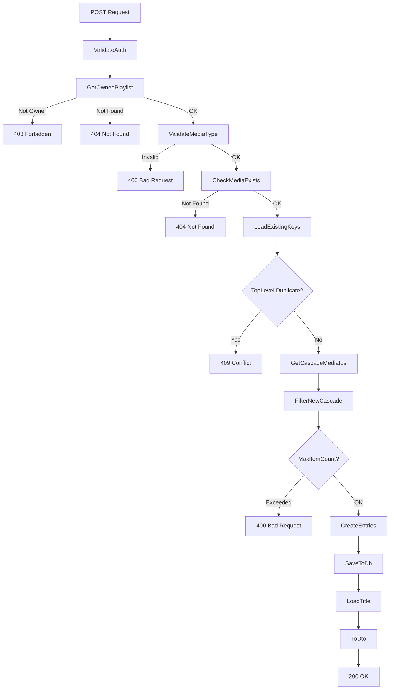
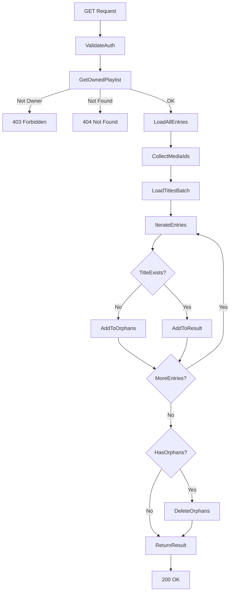

# Playlists – Technischer Programmablauf

## Übersicht

Die Playlist-Verwaltung besteht aus drei Hauptabläufen:
1. Hinzufügen von Medieninhalten (mit Cascade-Logik)
2. Entfernen von Medieninhalten
3. Abrufen aller Einträge (mit Bereinigung verwaister Einträge)

Diese Dokumentation beschreibt den internen Ablauf auf Code-Ebene.

---

## Ablauf 1: Medieninhalt hinzufügen

### Schritt-für-Schritt

**Auslöser:** Client ruft `POST /api/playlists/{id}/entries` auf mit `{ mediaType, mediaId }`

1. **Controller-Validierung:**
   - `PlaylistsController.AddMediaToPlaylist()` empfängt Request
   - Benutzer wird aus Auth-Token extrahiert (`CurrentUser`)
   - Service-Methode wird aufgerufen

2. **Berechtigungsprüfung:**
   - `PlaylistService.AddMediaToPlaylistAsync()` ruft `GetOwnedPlaylistAsync()` auf
   - Diese prüft: Existiert die Playlist? Ist der Benutzer der Besitzer?
   - Falls nicht → `PlaylistAccessDeniedException` → HTTP 403

3. **MediaType-Validierung:**
   - `ValidateMediaType()` prüft: Ist `mediaType` einer der 5 gültigen Typen?
   - Gültige Typen: `Movie`, `TVShowEpisode`, `TVShowSeason`, `TVShow`, `MovieCollection`
   - Falls ungültig → `InvalidOperationException` → HTTP 400

4. **Medieninhalt-Existenz prüfen:**
   - `CheckMediaExistsAsync()` prüft via `MediaTypeHandler` in der DB: Existiert der Medieninhalt?
   - Falls nicht → `KeyNotFoundException` → HTTP 404

5. **Bestehende Duplikate abfragen:**
   - Lade alle bestehenden `PlaylistEntry` für diese Playlist
   - Sammle die Schlüssel als `(MediaType, MediaId)` in einem `HashSet`
   - Prüfe: Existiert bereits ein Eintrag mit `(mediaType, mediaId)`?
   - Falls ja → `InvalidOperationException` → HTTP 409 Conflict

6. **Cascade-Kinder laden:**
   - `GetCascadeMediaIdsAsync()` prüft: Hat dieser `mediaType` Kind-Einträge?
   - Für `TVShow`: Lade alle zugehörigen `TVShowSeason`, dann alle zugehörigen `TVShowEpisode`
   - Für `TVShowSeason`: Lade alle zugehörigen `TVShowEpisode`
   - Für `MovieCollection`: Lade alle zugehörigen `Movie`
   - Für `Movie`, `TVShowEpisode`: Keine Kinder (leere Liste)
   - Rückgabe: Liste von `(type, id)` Tupeln

7. **Cascade-Duplikate filtern:**
   - Filtere die Cascade-Kinder: Behalte nur diejenigen, die nicht im bestehenden `HashSet` sind
   - Neue Cascade-Einträge: `newCascadeEntries`

8. **Maximale Anzahl prüfen:**
   - Falls `PlaylistSettings.MaxPlaylistItemCount` gesetzt ist (nicht null):
     - Berechne: Neue Einträge = 1 (Top-Level) + `newCascadeEntries.Count`
     - Prüfe: `existingKeys.Count + newEntryCount <= maxItemCount`?
     - Falls nicht → `InvalidOperationException` → HTTP 400

9. **Top-Level-Eintrag erstellen:**
   - Erstelle `PlaylistEntry` mit:
     - `PlaylistId = playlistId`
     - `MediaType = mediaType`
     - `MediaId = mediaId`
     - `ParentMediaType = null`
     - `ParentMediaId = null`
     - `AddedAt = DateTime.UtcNow`
   - Füge zu DbContext hinzu (noch nicht gespeichert)

10. **Cascade-Einträge erstellen:**
    - Für jeden Eintrag in `newCascadeEntries`:
      - Erstelle `PlaylistEntry` mit:
        - `ParentMediaType = mediaType`
        - `ParentMediaId = mediaId`
      - Füge zu DbContext hinzu

11. **Alle Einträge speichern:**
    - `await db.SaveChangesAsync()` — eine Transaktion speichert Top-Level + Cascade-Einträge

12. **Titel laden:**
    - `GetMediaTitleAsync()` ruft via `MediaTypeHandler` den Titel des Top-Level-Eintrags ab

13. **DTO konvertieren:**
    - `ToDto()` konvertiert die Entity zu `DtoPlaylistEntry`
    - Rückgabe an Client (HTTP 200 OK)

### Beteiligte Klassen/Komponenten

| Klasse | Methode | Zweck |
|--------|---------|-------|
| `PlaylistsController` | `AddMediaToPlaylist()` | HTTP-Endpoint-Handler |
| `PlaylistService` | `AddMediaToPlaylistAsync()` | Geschäftslogik |
| `PlaylistService` | `GetOwnedPlaylistAsync()` | Berechtigung + Existenz |
| `PlaylistService` | `ValidateMediaType()` | Typ-Validierung |
| `PlaylistService` | `CheckMediaExistsAsync()` | Existenz-Prüfung |
| `PlaylistService` | `GetCascadeMediaIdsAsync()` | Cascade-Abfrage |
| `PlaylistService` | `GetMediaTitleAsync()` | Titel-Lookup |
| `PlaylistService` | `ToDto()` | Entity → DTO Konvertierung |
| `ApplicationDbContext` | `PlaylistEntries` | DB-Zugriff |
| `PlaylistEntry` | — | Datenmodell |
| `DtoPlaylistEntry` | — | Client-Modell |

### Diagramm



---

## Ablauf 2: Medieninhalt entfernen

### Schritt-für-Schritt

**Auslöser:** Client ruft `DELETE /api/playlists/{id}/entries/{mediaType}/{mediaId}` auf

1. **Berechtigungsprüfung:**
   - `PlaylistService.RemoveMediaFromPlaylistAsync()` ruft `GetOwnedPlaylistAsync()` auf
   - Falls nicht Besitzer → `PlaylistAccessDeniedException` → HTTP 403

2. **Eintrag suchen:**
   - Lade `PlaylistEntry` mit `PlaylistId = id`, `MediaType = mediaType`, `MediaId = mediaId`
   - Falls nicht gefunden → `KeyNotFoundException` → HTTP 404

3. **Löschen:**
   - Entferne Eintrag aus DbContext
   - `await db.SaveChangesAsync()`

4. **Antwort:**
   - HTTP 204 No Content (leerer Body)

### Beteiligte Klassen

| Klasse | Methode | Zweck |
|--------|---------|-------|
| `PlaylistsController` | `RemoveMediaFromPlaylist()` | HTTP-Endpoint-Handler |
| `PlaylistService` | `RemoveMediaFromPlaylistAsync()` | Geschäftslogik |
| `PlaylistService` | `GetOwnedPlaylistAsync()` | Berechtigung + Existenz |
| `ApplicationDbContext` | `PlaylistEntries` | DB-Zugriff |

---

## Ablauf 3: Alle Einträge abrufen (mit Bereinigung)

### Schritt-für-Schritt

**Auslöser:** Client ruft `GET /api/playlists/{id}/entries` auf

1. **Berechtigungsprüfung:**
   - `PlaylistService.GetPlaylistEntriesAsync()` ruft `GetOwnedPlaylistAsync()` auf
   - Falls nicht Besitzer → HTTP 403

2. **Alle Einträge laden:**
   - Lade alle `PlaylistEntry` mit `PlaylistId = id` aus DB
   - Keine Filterung, keine Sortierung (wird in späteren Schritten hinzugefügt)

3. **Medien-IDs sammeln:**
   - Erstelle Dictionary `mediaIdsByType` mit den Schlüsseln (Medientypen)
   - Für jeden Eintrag:
     - Addiere `entry.MediaId` zur Liste für `entry.MediaType`
     - Falls `ParentMediaType` nicht null: Addiere `ParentMediaId` zur Liste für `ParentMediaType`

4. **Titel in Batch laden:**
   - Für jeden Medientyp: Rufe `GetMediaTitlesAsync()` auf
   - Diese lädt alle Titel für die gegebenen IDs auf einmal (Batch-Optimierung)
   - Rückgabe: Dictionary von ID → Titel für diesen Typ

5. **Verwaiste Einträge bereinigen:**
   - Iteriere über alle Einträge:
     - Prüfe: Existiert der Titel für `entry.MediaType` und `entry.MediaId`?
     - Falls nein (Titel ist null):
       - Markiere Eintrag als Verwaist
       - Füge zu `orphans` Liste hinzu
       - Überspringe zu nächstem Eintrag (nicht in `result` aufnehmen)
     - Falls ja: Konvertiere zu DTO und füge zu `result` hinzu

6. **Verwaiste Einträge löschen:**
   - Falls `orphans.Count > 0`:
     - `db.PlaylistEntries.RemoveRange(orphans)`
     - `await db.SaveChangesAsync()` — Löscht alle Einträge, deren Medieninhalt nicht mehr existiert

7. **DTOs zurückgeben:**
   - HTTP 200 OK mit Array von `DtoPlaylistEntry`

### Beteiligte Klassen

| Klasse | Methode | Zweck |
|--------|---------|-------|
| `PlaylistsController` | `GetPlaylistEntries()` | HTTP-Endpoint-Handler |
| `PlaylistService` | `GetPlaylistEntriesAsync()` | Geschäftslogik + Bereinigung |
| `PlaylistService` | `GetOwnedPlaylistAsync()` | Berechtigung + Existenz |
| `PlaylistService` | `GetMediaTitlesAsync()` | Batch-Titel-Lookup |
| `PlaylistService` | `ToDto()` | Entity → DTO Konvertierung |
| `ApplicationDbContext` | `PlaylistEntries` | DB-Zugriff |

### Diagramm



---

## Cascade-Logik im Detail

### MediaTypeHandler

Die Cascade-Logik wird durch `MediaTypeHandler` implementiert — ein Dictionary, das für jeden Medientyp definiert, wie Kinder geladen werden.

```csharp
private sealed class MediaTypeHandler
{
    public required Func<ApplicationDbContext, IReadOnlyCollection<long>, CancellationToken, Task<Dictionary<long, string>>> LoadTitlesAsync { get; init; }
    
    public Func<ApplicationDbContext, long, CancellationToken, Task<List<(string type, long id)>>>? LoadCascadeChildrenAsync { get; init; }
}
```

**Handler pro Typ:**

| Typ | `LoadTitlesAsync` | `LoadCascadeChildrenAsync` |
|-----|-------------------|---------------------------|
| `Movie` | Titel aus `Movies` | null (keine Kinder) |
| `TVShowEpisode` | Titel aus `TVShowEpisodes` | null |
| `TVShowSeason` | Titel aus `TVShowSeasons` | Alle Episoden dieser Staffel |
| `TVShow` | Titel aus `TVShows` | Alle Staffeln + Episoden dieser Serie |
| `MovieCollection` | Titel aus `MovieCollections` | Alle Filme dieser Sammlung |

### Beispiel: Series hinzufügen

```
Hinzufügen: TVShow ID=100

1. LoadCascadeChildrenAsync(db, 100):
   - Lade alle TVShowSeason mit ShowId=100
   - Beispiel: Season 1 (ID=200), Season 2 (ID=201)
   - Für jede Season: Lade alle TVShowEpisode
   - Season 1: Episode 1 (ID=1001), Episode 2 (ID=1002)
   - Season 2: Episode 3 (ID=1003), Episode 4 (ID=1004)

2. Cascade-Liste:
   (TVShow, 100)      ← Top-Level
   (TVShowSeason, 200)
   (TVShowSeason, 201)
   (TVShowEpisode, 1001)
   (TVShowEpisode, 1002)
   (TVShowEpisode, 1003)
   (TVShowEpisode, 1004)

3. Duplikat-Filter:
   - Behalte nur Einträge, die noch nicht im PlaylistEntry existieren
   - Falls z. B. Episode 1002 bereits vorhanden: Überspringe

4. Einträge erstellen:
   - PlaylistEntry(mediaType=TVShow, mediaId=100, parentMediaType=null, parentMediaId=null)
   - PlaylistEntry(mediaType=TVShowSeason, mediaId=200, parentMediaType=TVShow, parentMediaId=100)
   - ... etc.
```

---

## Datenbank-Transaktionen

Alle Schreib-Operationen verwenden implizite Transaktionen via Entity Framework Core:

- **`AddMediaToPlaylistAsync()`:** Eine Transaktion speichert Top-Level + Cascade-Einträge atomar
- **`RemoveMediaFromPlaylistAsync()`:** Eine Transaktion löscht einen Eintrag
- **`GetPlaylistEntriesAsync()`:** Separate Transaktionen für Lesevorgänge (keine Sperrungen) und Löschung verwaister Einträge (wenn vorhanden)

Fehler während `SaveChangesAsync()` führen zu Rollback — alle oder keine Einträge werden gespeichert.

---

## Performance-Überlegungen

### Batch-Titel-Lookup

Statt jeden Titel einzeln zu laden, werden alle Titel pro Medientyp in einem Aufruf geladen:

```csharp
// Effizient: Ein Query pro Medientyp
var titlesByType = new Dictionary<string, Dictionary<long, string>>();
foreach (var (mediaType, mediaIds) in mediaIdsByType)
    titlesByType[mediaType] = await GetMediaTitlesAsync(mediaType, mediaIds, cancellationToken);
```

Ohne Batch-Optimierung würden 100 Einträge 100 separate Queries erfordern. Mit Batch-Optimierung: maximal 5 Queries (eine pro Medientyp).

### Orphan-Bereinigung bei Read

Verwaiste Einträge werden aktiv beim Abrufen der Liste gelöscht. Dies verhindert:
- Weiterwachsen der `PlaylistEntry`-Tabelle mit ungültigen Einträgen
- Debugging-Schwierigkeiten bei der Diagnose von Duplikaten

Nachteil: Der Read-Vorgang könnte bei vielen Waisen einen Write-Vorgang auslösen. Dies wird als akzeptabel erachtet, da Löschungen von Medieninhalten selten sind.

---

## Fehlerbehandlung

Alle Fehlerfälle führen zu expliziten HTTP-Status-Codes:

| Exception | Mapping | HTTP-Status |
|-----------|---------|------------|
| `PlaylistAccessDeniedException` | Direkt | 403 Forbidden |
| `KeyNotFoundException` | Direkt | 404 Not Found |
| `InvalidOperationException("... bereits in dieser Playlist vorhanden")` | `MapInvalidOperationException()` | 409 Conflict |
| `InvalidOperationException` (sonstige) | `MapInvalidOperationException()` | 400 Bad Request |
| Andere Exceptions | Generischer Error | 500 Internal Server Error |

Die `MapInvalidOperationException()`-Methode entscheidet basierend auf der Exception-Message, ob 400 oder 409 zurückgegeben wird.
