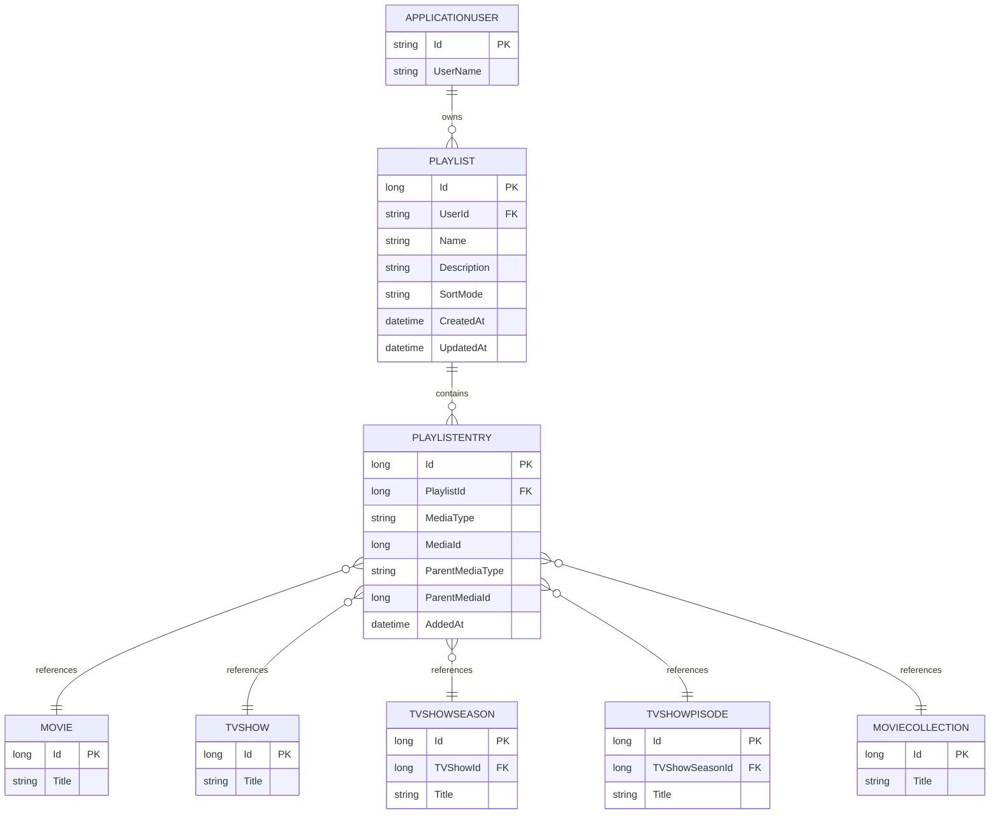

# Playlists – Datenmodell

## Übersicht

Das Playlist-Feature verwendet zwei Hauptentitäten:
1. **`Playlist`** (bestehend, Erweiterung)
2. **`PlaylistEntry`** (neu)

Eine `Playlist` gehört einem Benutzer und enthält eine Sammlung von `PlaylistEntry`-Einträgen.

---

## Entität: `Playlist`

Repräsentiert eine Benutzer-Playlist.

### Spalten

| Spalte | Typ | Beschreibung |
|--------|-----|--------------|
| `Id` | `long` (PK) | Eindeutige Identifier |
| `UserId` | `string` (FK) | Verweis auf `ApplicationUser.Id` |
| `Name` | `string` | Name der Playlist (max. 255 Zeichen) |
| `Description` | `string?` | Optionale Beschreibung (max. 2000 Zeichen) |
| `SortMode` | `PlaylistSortMode` (Enum) | Sortiermodus: `ByReleaseDate` oder `Manual` |
| `CreatedAt` | `DateTime` | Erstellungszeitpunkt (UTC) |
| `UpdatedAt` | `DateTime` | Letzte Änderung (UTC) |

### Navigation

| Navigation | Zieltyp | Multiplizität | Beschreibung |
|------------|---------|---------------|--------------|
| `PlaylistEntries` | `ICollection<PlaylistEntry>` | 1:n | Alle Einträge dieser Playlist |

### Constraints

- **Primary Key:** `Id`
- **Foreign Key:** `UserId` → `ApplicationUser.Id` (mit CascadeDelete)
- **Eindeutigkeit:** Pro Benutzer: `(UserId, Name)` darf nicht doppelt vorkommen (Case-Insensitive)

### Indizes

- Primary Index auf `Id`
- Index auf `UserId` (zum schnellen Abrufen aller Playlists eines Benutzers)

---

## Entität: `PlaylistEntry` (NEU)

Repräsentiert einen einzelnen Medieninhalt in einer Playlist.

### Spalten

| Spalte | Typ | Beschreibung |
|--------|-----|--------------|
| `Id` | `long` (PK) | Eindeutige Identifier |
| `PlaylistId` | `long` (FK) | Verweis auf `Playlist.Id` |
| `Playlist` | Navigation | Referenz zur Besitzer-Playlist |
| `MediaType` | `string` (Required) | Art des Medieninhalts (kanonische Schreibweise): `"Movie"`, `"TVShow"`, `"TVShowSeason"`, `"TVShowEpisode"`, `"MovieCollection`. Input wird normalisiert, um case-insensitive Duplikat-Erkennung zu gewährleisten. |
| `MediaId` | `long` | ID des Medieninhalts in seiner Tabelle (z. B. Movie.Id, TVShow.Id) |
| `ParentMediaType` | `string?` | Medientyp des Sammelwerks, falls dieser Eintrag durch Cascade hinzugefügt wurde (z. B. `"TVShow"` oder `"TVShowSeason"` oder `"MovieCollection"`); `null` für Top-Level-Einträge |
| `ParentMediaId` | `long?` | ID des Sammelwerks (z. B. der Serie, wenn dieser Eintrag eine Episode ist); `null` für Top-Level-Einträge |
| `AddedAt` | `DateTime` | Zeitpunkt des Hinzufügens zur Playlist (UTC) |

### Navigation

| Navigation | Zieltyp | Multiplizität | Beschreibung |
|------------|---------|---------------|--------------|
| `Playlist` | `Playlist` | n:1 | Die Playlist, der dieser Eintrag angehört |

### Constraints

- **Primary Key:** `Id`
- **Foreign Key:** `PlaylistId` → `Playlist.Id` (mit CascadeDelete: Löschen der Playlist löscht alle Einträge)
- **Composite Unique Constraint:** `(PlaylistId, MediaType, MediaId)` — keine Duplikate pro Playlist
- **Validierung:** `MediaId > 0` (serverseitig geprüft)

### Indizes

- Primary Index auf `Id`
- Foreign Key Index auf `PlaylistId`
- **Composite Index** auf `(PlaylistId, MediaType, MediaId)` (für Duplikatsprüfung)
- Index auf `(PlaylistId, ParentMediaType, ParentMediaId)` (für spätere Gruppierung/Sortierung in Schritt 3)

---

## Beziehungsdiagramm (ER-Diagramm)

```
┌──────────────────────────────────────┐
│         ApplicationUser              │
│  (AspNetCore Identity)               │
├──────────────────────────────────────┤
│ Id (PK)                              │
│ UserName                             │
│ ...                                  │
└──────────────────────────────────────┘
         ▲
         │ (1:n)
         │ UserId
         │
┌──────────────────────────────────────┐
│         Playlist                     │
├──────────────────────────────────────┤
│ Id (PK)                              │
│ UserId (FK) ──────┐                  │
│ Name              │                  │
│ Description       │                  │
│ SortMode          │                  │
│ CreatedAt         │                  │
│ UpdatedAt         │                  │
│ PlaylistEntries   │                  │
└──────────────────────────────────────┘
         ▲
         │ (1:n)
         │ PlaylistId
         │
┌──────────────────────────────────────┐
│      PlaylistEntry (NEU)             │
├──────────────────────────────────────┤
│ Id (PK)                              │
│ PlaylistId (FK) ──────┐              │
│ Playlist              │              │
│ MediaType             │              │
│ MediaId               │              │
│ ParentMediaType       │              │
│ ParentMediaId         │              │
│ AddedAt               │              │
│                       │              │
│ UC: (PlaylistId,      │              │
│      MediaType,       │              │
│      MediaId)         │              │
└──────────────────────────────────────┘

                    
Externe Verweise (keine FK, da Medien-Tabellen separate Entitäten sind):
                    
PlaylistEntry.MediaId  ──→ Movie.Id
                       ──→ TVShow.Id
                       ──→ TVShowSeason.Id
                       ──→ TVShowEpisode.Id
                       ──→ MovieCollection.Id
```

---

## Mermaid ER-Diagramm



---

## Datenbankmigrationen

### Migration: `NormalizePlaylistEntryMediaTypes` (neu in Schritt 2.1)

**Betroffene Tabellen:**
- `PlaylistEntries.MediaType` (Wert-Migration)

**Beschreibung:** Normalisiert alle bestehenden `MediaType`-Werte auf ihre kanonischen Enum-Werte.
Dies stellt sicher, dass Duplikat-Prüfungen case-insensitiv funktionieren (z. B. `"movie"` wird zu `"Movie"`).

**SQL-Aktion (vereinfacht):**
```sql
UPDATE PlaylistEntries SET MediaType = 'Movie' WHERE LOWER(MediaType) = 'movie';
UPDATE PlaylistEntries SET MediaType = 'TVShow' WHERE LOWER(MediaType) = 'tvshow';
UPDATE PlaylistEntries SET MediaType = 'TVShowSeason' WHERE LOWER(MediaType) = 'tvshowseason';
UPDATE PlaylistEntries SET MediaType = 'TVShowEpisode' WHERE LOWER(MediaType) = 'tvshowepisode';
UPDATE PlaylistEntries SET MediaType = 'MovieCollection' WHERE LOWER(MediaType) = 'moviecollection';
```

### Migration: `AddPlaylistEntriesTable`

**Betroffene Tabellen:**
- `PlaylistEntries` (neue Tabelle)

**SQL-Aktion (vereinfacht):**
```sql
CREATE TABLE PlaylistEntries (
    Id BIGINT PRIMARY KEY IDENTITY(1,1),
    PlaylistId BIGINT NOT NULL,
    MediaType NVARCHAR(255) NOT NULL,
    MediaId BIGINT NOT NULL,
    ParentMediaType NVARCHAR(255) NULL,
    ParentMediaId BIGINT NULL,
    AddedAt DATETIME2 NOT NULL,
    FOREIGN KEY (PlaylistId) REFERENCES Playlists(Id) ON DELETE CASCADE,
    UNIQUE (PlaylistId, MediaType, MediaId)
);

CREATE INDEX IX_PlaylistEntries_PlaylistId ON PlaylistEntries(PlaylistId);
CREATE INDEX IX_PlaylistEntries_Parent ON PlaylistEntries(PlaylistId, ParentMediaType, ParentMediaId);
```

**Entity Framework Core Konfiguration (PlaylistEntryConfiguration):**
```csharp
public class PlaylistEntryConfiguration : IEntityTypeConfiguration<PlaylistEntry>
{
    public void Configure(EntityTypeBuilder<PlaylistEntry> builder)
    {
        builder.HasKey(e => e.Id);

        builder.Property(e => e.MediaType).IsRequired();
        builder.Property(e => e.MediaId).IsRequired();
        builder.Property(e => e.AddedAt).IsRequired();

        builder.HasOne(e => e.Playlist)
            .WithMany(p => p.PlaylistEntries)
            .HasForeignKey(e => e.PlaylistId)
            .OnDelete(DeleteBehavior.Cascade);

        builder.HasIndex(e => new { e.PlaylistId, e.MediaType, e.MediaId })
            .IsUnique(true)
            .HasName("IX_PlaylistEntries_Unique_Key");

        builder.HasIndex(e => new { e.PlaylistId, e.ParentMediaType, e.ParentMediaId })
            .HasName("IX_PlaylistEntries_Parent");
    }
}
```

---

## Datenbeispiele

### Beispiel-Daten in `PlaylistEntry`

Angenommen:
- Playlist ID=1 gehört Benutzer "user1"
- Serie "The Crown" hat ID=100, mit Staffel 1 (ID=200) und Episoden (ID=1001, 1002)
- Film "The Matrix" hat ID=500

**Szenario:** Benutzer fügt:
1. Film "The Matrix" hinzu
2. Serie "The Crown" hinzu

**Resultierende PlaylistEntries:**

| Id | PlaylistId | MediaType | MediaId | ParentMediaType | ParentMediaId | AddedAt |
|----|----------|-----------|---------|-----------------|---------------|---------|
| 1 | 1 | Movie | 500 | null | null | 2026-09-05 14:00:00Z |
| 2 | 1 | TVShow | 100 | null | null | 2026-09-05 14:05:00Z |
| 3 | 1 | TVShowSeason | 200 | TVShow | 100 | 2026-09-05 14:05:00Z |
| 4 | 1 | TVShowEpisode | 1001 | TVShowSeason | 200 | 2026-09-05 14:05:00Z |
| 5 | 1 | TVShowEpisode | 1002 | TVShowSeason | 200 | 2026-09-05 14:05:00Z |

**Gruppierung (später in Schritt 3):**
- Film: The Matrix (1 Eintrag, top-level)
- Serie: The Crown (1 Eintrag, top-level)
  - Staffel 1 (1 Eintrag, Parent=Serie)
    - Episode 1 (1 Eintrag, Parent=Staffel)
    - Episode 2 (1 Eintrag, Parent=Staffel)

---

## Kardinalitäten

| Beziehung | Multiplizität | Beschreibung |
|-----------|--------------|--------------|
| ApplicationUser → Playlist | 1:n | Ein Benutzer hat mehrere Playlists |
| Playlist → PlaylistEntry | 1:n | Eine Playlist enthält mehrere Einträge |
| PlaylistEntry → Playlist | n:1 | Jeder Eintrag gehört zu genau einer Playlist |

**Keine Fremdschlüssel zu Medien:** `PlaylistEntry` speichert nur die ID und den Typ des Medieninhalts, nicht eine Fremdschlüssel-Referenz. Dies ist bewusst, um Entkopplung zu erreichen (Medien-Tabellen sind separaten Services/Bounded Contexts).

---

## Performance-Hinweise

### Indizes

1. **Clustered Index** auf `(PlaylistId)` — schnelle Abfrage aller Einträge einer Playlist
2. **Unique Index** auf `(PlaylistId, MediaType, MediaId)` — Duplikatsprüfung bei Insert
3. **Non-Clustered Index** auf `(PlaylistId, ParentMediaType, ParentMediaId)` — Vorbereitung für Sortierung nach Parent in Schritt 3

### Query-Optimierungen

Typische Abfragen:
```csharp
// Abfrage: Alle Einträge einer Playlist
var entries = db.PlaylistEntries
    .Where(e => e.PlaylistId == id)
    .ToList();
// → Nutzt Clustered Index auf PlaylistId

// Abfrage: Duplikat-Prüfung
var isDuplicate = db.PlaylistEntries
    .Any(e => e.PlaylistId == id && e.MediaType == type && e.MediaId == mid);
// → Nutzt Unique Index auf (PlaylistId, MediaType, MediaId)

// Abfrage: Alle Kind-Einträge einer Serie (später in Schritt 3)
var childEntries = db.PlaylistEntries
    .Where(e => e.PlaylistId == id && e.ParentMediaType == "TVShow" && e.ParentMediaId == seriesId)
    .ToList();
// → Nutzt Non-Clustered Index auf (PlaylistId, ParentMediaType, ParentMediaId)
```

---

## Kaskadierende Löschungen

### Cascade-Delete-Verhalten

Wenn eine `Playlist` gelöscht wird:
- **Alle zugehörigen `PlaylistEntry`-Reihen werden automatisch gelöscht**
- Foreign Key: `PlaylistEntry.PlaylistId` → `Playlist.Id` mit `DeleteBehavior.Cascade`

Wenn ein Medieninhalt gelöscht wird:
- **Zugehörige `PlaylistEntry`-Reihen werden NICHT automatisch gelöscht** (kein FK)
- Stattdessen: Beim nächsten Laden der Playlist werden verwaiste Einträge identifiziert und gelöscht (siehe `GetPlaylistEntriesAsync()`)

---

## Constraints und Validierung

| Constraint | Ort | Typ | Beschreibung |
|-----------|-----|-----|--------------|
| Unique (PlaylistId, MediaType, MediaId) | DB | Eindeutigkeit | Keine Duplikate pro Playlist; MediaType ist normalisiert, daher case-insensitive Duplikat-Erkennung |
| Foreign Key (PlaylistId) | DB | Referenzielle Integrität | PlaylistEntry muss zu existierender Playlist gehören |
| MediaId > 0 | Service | Business Logic | Positive IDs nur |
| MediaType normalisiert | Service | Normalisierung | MediaType-Input wird auf kanonischen Enum-Wert normalisiert vor Speicherung |
| ParentMediaType in {TVShow, TVShowSeason, MovieCollection, null} | Service | Enumeration | Nur gültige Parent-Typen |

---

## Schemaentwicklung (zukünftig)

Mögliche zukünftige Änderungen für späteren Ausbau:

1. **Schritt 3 (Sortierung):**
   - `SortOrder` (int, nullable) — Manuelle Sortierreihenfolge
   - `DisplayOrder` (int, computed) — Berechnete Anzeige-Reihenfolge basierend auf SortMode

2. **Schritt 4+ (erweiterte Metadaten):**
   - `Notes` (string, nullable) — Benutzer-Notizen pro Eintrag
   - `Watched` (bool) — Benutzer hat Eintrag bereits gesehen
   - `Rating` (decimal, nullable) — Benutzerbewertung

Diese Änderungen würden Migrationen erfordern, würden aber keine Breaking Changes darstellen.
