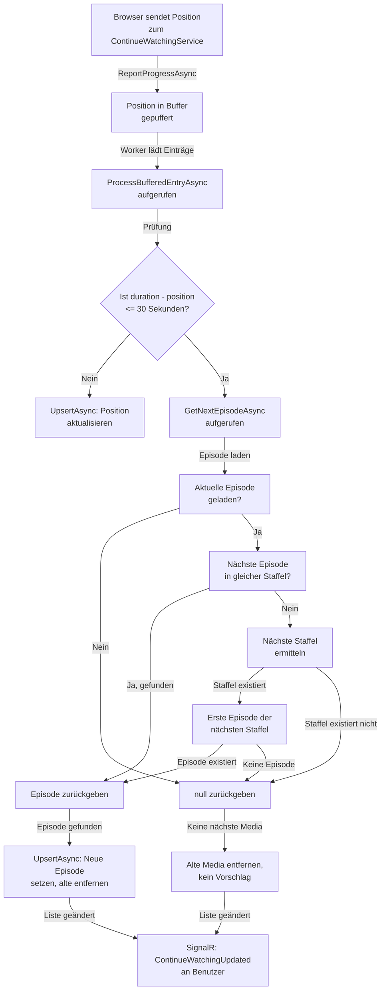

← [Zurück zur Übersicht](index.md)

# Weiterschauen — Technischer Ablauf

## Übersicht

Das "Weiterschauen"-Feature besteht aus zwei Hauptkomponenten: dem Puffer-System zur Erfassung von Wiedergabepositionen und dem Service zur Ermittlung der nächsten Episode oder des nächsten Films. Die Verarbeitung erfolgt asynchron im Hintergrund durch einen Worker.

## Ablauf: Position speichern und Puffer füllen

### 1. Benutzer spielt Media ab

**Komponente:** `ContinueWatchingService.ReportProgressAsync()`

Wenn die Anwendung eine Wiedergabeposition übermittelt:

1. Position muss mindestens 5 Sekunden betragen (Rausch-Filter)
2. Einträge werden mit Benutzer-ID, Media-ID und Position in den `ContinueWatchingBuffer` eingefügt
3. Puffer sammelt Einträge und dedupliziert sie (nur die neueste Position pro Media pro Benutzer wird behalten)

Beteiligte Komponenten:
- `ContinueWatchingService` (Methode `ReportProgressAsync`)
- `ContinueWatchingBuffer` (In-Memory-Puffer)

### 2. Worker verarbeitet Puffer

**Komponente:** `ContinueWatchingWorker` (Background-Service)

Der Worker lädt regelmäßig gepufferte Einträge:

1. Entnimmt einen Eintrag aus dem Puffer (mit Benutzer-ID, Media-ID, Position, Dauer)
2. Ruft `ProcessBufferedEntryAsync()` auf

## Ablauf: Wiedergabe beenden und nächste Media ermitteln

### 1. Ermittlung: Ist die Media zu Ende?

**Komponente:** `ContinueWatchingService.ProcessBufferedEntryAsync()`

```csharp
if (duration - position <= EndThreshold)  // EndThreshold = 30 Sekunden
{
    // Media als zu Ende erkannt
    // Nächste Media ermitteln
}
```

Wenn `duration - position <= 30 Sekunden`, gilt die Media als abgeschlossen.

### 2. Ermittlung der nächsten Episode (für Serien)

**Komponente:** `ContinueWatchingService.GetNextEpisodeAsync()`

**Eingabe:** `currentEpisodeId` (ID der aktuellen Episode)

**Ablauf:**

1. Aktuelle Episode laden aus Datenbank
   - Prüfung: Existiert die Episode? Falls nicht: `null` zurückgeben

2. Aktuelle Staffel laden (über `current.TVShowSeasonId`)
   - Prüfung: Existiert die Staffel? Falls nicht: `null` zurückgeben

3. **Suche nach nächster Episode in gleicher Staffel:**
   ```sql
   SELECT e.Id FROM TVShowEpisodes e
   WHERE e.TVShowSeasonId == current.TVShowSeasonId 
     AND e.Number > current.Number
   ORDER BY e.Number
   LIMIT 1
   ```
   - Sortierung nach `Number` (Episodennummer, aufsteigend)
   - Falls Episode gefunden: Episode zurückgeben und fertig

4. **Staffelwechsel (falls keine nächste Episode in aktueller Staffel):**
   - Alle Staffeln der Serie laden, sortiert nach `Name` (lexikographisch)
   - Nächste Staffel in alphabetischer Reihenfolge ermitteln
   - Falls nächste Staffel nicht existiert: `null` zurückgeben
   - Falls nächste Staffel existiert: Erste Episode (`ORDER BY Number`) laden
   - Falls keine Episoden in nächster Staffel: `null` zurückgeben
   - Erste Episode zurückgeben

**Beteiligte Klassen:**
- `TVShowEpisode` (Eigenschaften: `Id`, `Number`, `TVShowSeasonId`)
- `TVShowSeason` (Eigenschaften: `Id`, `Name`, `TVShowId`)
- `TVShow` (Eigenschaft: `Id`)
- Entity Framework Core (LINQ-Queries)

### 3. Ermittlung des nächsten Films (für Filme)

**Komponente:** `ContinueWatchingService.GetNextMovieAsync()`

**Eingabe:** `currentMovieId` (ID des aktuellen Films)

**Ablauf:**

1. Aktuellen Film laden
   - Prüfung: Existiert der Film? Hat er eine Filmsammlung (`MovieCollectionId`)? Falls nicht: `null` zurückgeben

2. Alle Filme der Sammlung laden, sortiert:
   ```sql
   SELECT m.Id FROM Movies m
   WHERE m.MovieCollectionId == current.MovieCollectionId
   ORDER BY 
     CASE WHEN m.ReleaseDate IS NULL THEN 1 ELSE 0 END,
     m.ReleaseDate,
     CASE WHEN m.PremieredAt IS NULL THEN 1 ELSE 0 END,
     m.PremieredAt,
     m.Name
   ```
   - Sortierreihenfolge: NULL-Werte nach Vorne schieben, dann nach Datum, dann nach Name
   - Alle Film-IDs in dieser Reihenfolge sammeln

3. Position des aktuellen Films in der Sortiert-Liste ermitteln
   - Falls Position + 1 < Liste.Länge: Nächsten Film zurückgeben
   - Falls Position + 1 >= Liste.Länge (aktueller Film ist letzter): `null` zurückgeben

**Beteiligte Klassen:**
- `Movie` (Eigenschaften: `Id`, `MovieCollectionId`, `ReleaseDate`, `PremieredAt`, `Name`)
- `MovieCollection` (Eigenschaft: `Id`)

### 4. Bereinigung der "Weiterschauen"-Liste

**Komponente:** `ContinueWatchingService.UpsertAsync()`

Wenn eine neue Episode oder ein neuer Film hinzugefügt wird:

1. **Für Serien:** Alle anderen Episoden derselben Serie entfernen
   - Query: Alle `ContinueWatchingEntry` mit gleicher `TVShowId` (über Episode → Season → Show-Verknüpfung), aber unterschiedlicher `TVShowEpisodeId`
   - Diese Einträge werden gelöscht

2. **Für Filme:** Alle anderen Filme derselben Sammlung entfernen
   - Query: Alle `ContinueWatchingEntry` mit gleicher `MovieCollectionId`, aber unterschiedlicher `MovieId`
   - Diese Einträge werden gelöscht

3. Neue oder aktualisierte Episode/Film wird eingefügt/aktualisiert

4. SignalR-Benachrichtigung (`ContinueWatchingUpdated`) wird an den Benutzer gesendet

**Beteiligte Klassen:**
- `ContinueWatchingEntry` (Datenbankentität)
- `MediaUpdateNotificationService` (SignalR-Benachrichtigungen)
- Entity Framework Core (Change Tracker)

## Diagramm: Erkennung von Serienende und Ermittlung nächster Episode



## Error Handling

| Szenario | Fehlerfall | Verhalten |
|----------|-----------|-----------|
| Episode-ID ungültig | `GetNextEpisodeAsync(id)` mit nicht-existierender ID | `null` zurückgeben, alte Media aus "Weiterschauen"-Liste entfernen |
| Staffel-Struktur beschädigt | Staffel existiert, aber hat keine `TVShowId` | `null` zurückgeben, alte Media entfernen |
| Datenbank-Fehler bei Ermittlung | Exception in EF Core Query | Exception propagiert, Worker loggt Fehler, alte Media bleibt in "Weiterschauen"-Liste |
| Datenbank-Fehler beim Update | Exception bei `SaveChangesAsync()` | Exception propagiert, Worker loggt Fehler, Benutzer erhält keine Benachrichtigung |
| Filmsammlung ungültig | Movie ohne `MovieCollectionId` | `null` zurückgeben, alte Media entfernen |

## Performance-Überlegungen

- **In-Memory-Puffer:** Verhindert DB-Hammering durch häufige kleine Positions-Updates
- **Index auf `TVShowSeasonId` und `Number`:** Schnelle Abfrage der nächsten Episode
- **AsyncLock für Puffer:** Verhindert Race Conditions zwischen Worker und neuen Positionen
- **Caching:** Keine separaten Cache-Strategien implementiert; EF Core führt die Queries bei jedem Aufruf aus

## Abhängigkeiten

- **Entity Framework Core:** Für Datenbank-Abfragen
- **ASP.NET Identity:** Zur Benutzer-Identifikation
- **SignalR:** Für Echtzeit-Benachrichtigungen an Clients
- **Logging:** Für Fehlerbehandlung und Debugging
