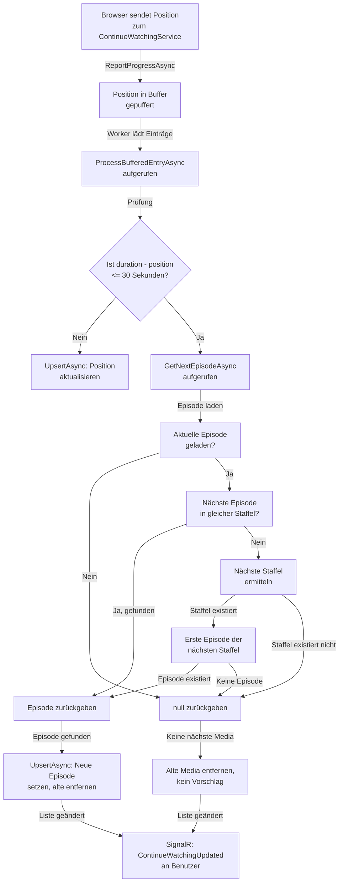

← [Zurück zur Übersicht](index.md)

# Weiterschauen — Technischer Ablauf

## Übersicht

Das "Weiterschauen"-Feature besteht aus zwei Hauptkomponenten: dem Puffer-System zur Erfassung von Wiedergabepositionen und dem Service zur Ermittlung der nächsten Episode oder des nächsten Films. Die Verarbeitung erfolgt asynchron im Hintergrund durch einen Worker.

## Ablauf: Position speichern und Puffer füllen

### 1. Benutzer spielt Media ab

**Komponente:** `ContinueWatchingService.ReportProgressAsync()`

Wenn die Anwendung eine Wiedergabeposition übermittelt:

1. Position muss mindestens 5 Sekunden betragen (Rausch-Filter)
2. Optional werden die Playlist-Kontext-Informationen extrahiert (sofern das Video aus einer Playlist heraus gestartet wurde)
3. Playlist-Ownership wird validiert: Wenn eine `PlaylistId` übergeben wird, wird geprüft, dass der Benutzer diese Playlist besitzt
4. Einträge werden mit Benutzer-ID, Media-ID, Position **und optional Playlist-ID** in den `ContinueWatchingBuffer` eingefügt
5. Puffer sammelt Einträge und dedupliziert sie (nur die neueste Position pro Media-Playlist-Kombination pro Benutzer wird behalten)

Beteiligte Komponenten:
- `ContinueWatchingService` (Methode `ReportProgressAsync`)
- `ContinueWatchingBuffer` (In-Memory-Puffer)
- `IPlaylistService` (zur Validierung der Playlist-Ownership, falls `PlaylistId` vorhanden)

### 2. Worker verarbeitet Puffer

**Komponente:** `ContinueWatchingWorker` (Background-Service)

Der Worker lädt regelmäßig gepufferte Einträge:

1. Entnimmt einen Eintrag aus dem Puffer (mit Benutzer-ID, Media-ID, Position, Dauer)
2. Ruft `ProcessBufferedEntryAsync()` auf

## Ablauf: Wiedergabe beenden und nächste Media ermitteln

### 1. Ermittlung: Ist die Media zu Ende?

**Komponente:** `ContinueWatchingService.ProcessBufferedEntryAsync()`

```csharp
if (duration - position <= EndThreshold)  // EndThreshold = 30 Sekunden
{
    // Media als zu Ende erkannt
    // Nächste Media ermitteln
}
```

Wenn `duration - position <= 30 Sekunden`, gilt die Media als abgeschlossen.

**Wichtig:** Ist die Media zu Ende, werden **ALLE Varianten** dieses Videos aus der Weiterschauen-Liste entfernt — unabhängig von ihrer `PlaylistId`. Dies geschieht durch eine Abfrage auf `(UserId, MediaId)` ohne Playlist-Filter. Dies ist das playlist-übergreifende Verhalten der Gesehen-Markierung (`WatchedEntry`).

### 2. Ermittlung der nächsten Episode (für Serien)

**Komponente:** `ContinueWatchingService.GetNextEpisodeAsync()`

**Eingabe:** `currentEpisodeId` (ID der aktuellen Episode)

**Ablauf:**

1. Aktuelle Episode laden aus Datenbank
   - Prüfung: Existiert die Episode? Falls nicht: `null` zurückgeben

2. Aktuelle Staffel laden (über `current.TVShowSeasonId`)
   - Prüfung: Existiert die Staffel? Falls nicht: `null` zurückgeben

3. **Suche nach nächster Episode in gleicher Staffel:**
   ```sql
   SELECT e.Id FROM TVShowEpisodes e
   WHERE e.TVShowSeasonId == current.TVShowSeasonId 
     AND e.Number > current.Number
   ORDER BY e.Number
   LIMIT 1
   ```
   - Sortierung nach `Number` (Episodennummer, aufsteigend)
   - Falls Episode gefunden: Episode zurückgeben und fertig

4. **Staffelwechsel (falls keine nächste Episode in aktueller Staffel):**
   - Alle Staffeln der Serie laden, sortiert nach `Name` (lexikographisch)
   - Nächste Staffel in alphabetischer Reihenfolge ermitteln
   - Falls nächste Staffel nicht existiert: `null` zurückgeben
   - Falls nächste Staffel existiert: Erste Episode (`ORDER BY Number`) laden
   - Falls keine Episoden in nächster Staffel: `null` zurückgeben
   - Erste Episode zurückgeben

**Beteiligte Klassen:**
- `TVShowEpisode` (Eigenschaften: `Id`, `Number`, `TVShowSeasonId`)
- `TVShowSeason` (Eigenschaften: `Id`, `Name`, `TVShowId`)
- `TVShow` (Eigenschaft: `Id`)
- Entity Framework Core (LINQ-Queries)

### 3. Ermittlung des nächsten Films (für Filme)

**Komponente:** `ContinueWatchingService.GetNextMovieAsync()`

**Eingabe:** `currentMovieId` (ID des aktuellen Films)

**Ablauf:**

1. Aktuellen Film laden
   - Prüfung: Existiert der Film? Hat er eine Filmsammlung (`MovieCollectionId`)? Falls nicht: `null` zurückgeben

2. Alle Filme der Sammlung laden, sortiert:
   ```sql
   SELECT m.Id FROM Movies m
   WHERE m.MovieCollectionId == current.MovieCollectionId
   ORDER BY 
     CASE WHEN m.ReleaseDate IS NULL THEN 1 ELSE 0 END,
     m.ReleaseDate,
     CASE WHEN m.PremieredAt IS NULL THEN 1 ELSE 0 END,
     m.PremieredAt,
     m.Name
   ```
   - Sortierreihenfolge: NULL-Werte nach Vorne schieben, dann nach Datum, dann nach Name
   - Alle Film-IDs in dieser Reihenfolge sammeln

3. Position des aktuellen Films in der Sortiert-Liste ermitteln
   - Falls Position + 1 < Liste.Länge: Nächsten Film zurückgeben
   - Falls Position + 1 >= Liste.Länge (aktueller Film ist letzter): `null` zurückgeben

**Beteiligte Klassen:**
- `Movie` (Eigenschaften: `Id`, `MovieCollectionId`, `ReleaseDate`, `PremieredAt`, `Name`)
- `MovieCollection` (Eigenschaft: `Id`)

### 4. Bereinigung der "Weiterschauen"-Liste

**Komponente:** `ContinueWatchingService.UpsertAsync()` und `RemoveExistingTVShowEntry()` / `RemoveExtsingMovieCollectionEntry()`

Wenn eine neue Episode oder ein neuer Film hinzugefügt wird:

1. **Für Serien:** Alle anderen Episoden derselben Serie und **gleicher Playlist** entfernen
   - Query: Alle `ContinueWatchingEntry` mit gleicher `TVShowId` (über Episode → Season → Show-Verknüpfung), aber unterschiedlicher `TVShowEpisodeId` **und gleicher `PlaylistId`**
   - Diese Einträge werden gelöscht
   - **Wichtig:** Nur Einträge mit der gleichen `PlaylistId` werden entfernt. Sind mehrere Playlist-Varianten vorhanden, werden nur diejenigen mit der gleichen Playlist-ID bereinigt.

2. **Für Filme:** Alle anderen Filme derselben Sammlung und **gleicher Playlist** entfernen
   - Query: Alle `ContinueWatchingEntry` mit gleicher `MovieCollectionId`, aber unterschiedlicher `MovieId` **und gleicher `PlaylistId`**
   - Diese Einträge werden gelöscht

3. Neue oder aktualisierte Episode/Film wird eingefügt/aktualisiert (mit der entsprechenden `PlaylistId`)

4. SignalR-Benachrichtigung (`ContinueWatchingUpdated`) wird an den Benutzer gesendet

**Beteiligte Klassen:**
- `ContinueWatchingEntry` (Datenbankentität mit optionalem `PlaylistId`)
- `MediaUpdateNotificationService` (SignalR-Benachrichtigungen)
- Entity Framework Core (Change Tracker)

## Diagramm: Erkennung von Serienende und Ermittlung nächster Episode



## Anzeigedaten-Pufferung für mehrfache Varianten desselben Videos

### Problematik bei mehrfachen Varianten

Wenn dasselbe Video mehrfach in der Weiterschauen-Liste erscheint (mit unterschiedlichen Playlist-Bezügen oder gar ohne), müssen die Anzeigedaten (Titel, Bild, Playlist-Name) eindeutig jeder Variante zugeordnet werden. Eine Indizierung nach `Entry.Id` (Medien-ID) würde zu Kollisionen führen: mehrere `ContinueWatchingDto`-Instanzen mit derselben `Entry.Id` würden sich gegenseitig in den Dictionaries überschreiben.

### Lösung: Indizierung nach ContinueWatchingDto.Id

Die Lösung nutzt die eindeutige Datenbank-ID jedes `ContinueWatchingEntry`-Eintrags:

1. **DTO-Erweiterung:** `ContinueWatchingDto.Id` speichert die Datenbank-ID der zugehörigen `ContinueWatchingEntry` (nicht die Media-ID).
2. **Dictionary-Indizierung:** In `ContinueWatchingList.razor` werden alle Display-Data-Dictionaries (`titles`, `images`, `links`, `playlistSubtitles`) nach `it.Id` indiziert, nicht nach `it.Entry.Id`.
3. **Blazor-Key:** Das `@key`-Attribut in der `MediaBox`-Schleife wird auf `@key="it.Id"` gesetzt, was Eindeutigkeit pro Datenbankzeile garantiert und Blazor-Key-Duplikat-Fehler verhindert.

Beteiligte Komponenten:
- `ContinueWatchingList.razor` — Umindizierung aller Display-Data-Dictionaries auf `it.Id`
- `ContinueWatchingService.GetListAsync()` — Setzt `ContinueWatchingDto.Id` aus `ContinueWatchingEntry.Id`

## Konfliktauflösung beim Löschen einer Playlist mit konkurrierendem playlist-losem Eintrag

### Problematik: Unique-Constraint-Konflikt

Das Datenbankschema erzwingt einen bedingten Unique-Index auf `(UserId, MovieId, NULL)` und `(UserId, TVShowEpisodeId, NULL)` für playlist-lose Einträge. Wenn eine Playlist gelöscht wird, setzt die FK-Aktion `ON DELETE SET NULL` automatisch `PlaylistId = NULL` für alle zugehörigen `ContinueWatchingEntry`-Zeilen. Kollidiert dies mit einem bereits existierenden playlist-losen Eintrag für das gleiche Video, schlägt `SaveChangesAsync()` mit einer Unique-Constraint-Verletzung fehl.

**Beispiel:**
- Zeile 1: `UserId=u1, MovieId=42, PlaylistId=1` (playlist-gebunden)
- Zeile 2: `UserId=u1, MovieId=42, PlaylistId=NULL` (playlist-los, existiert bereits)
- Aktion: Playlist mit ID=1 löschen
- Fehler: FK-Aktion setzt Zeile 1 auf `PlaylistId=NULL`, kollidiert mit Zeile 2

### Lösung: Explizite Konfliktauflösung

Vor dem Löschen einer Playlist wird explizite Konfliktauflösungslogik ausgeführt:

1. **Alle Einträge mit dieser `PlaylistId` laden** (für den aktuellen Benutzer)
2. **Für jeden Eintrag:** Prüfen, ob bereits ein playlist-loser Eintrag existiert (`UserId`, `MovieId` oder `TVShowEpisodeId`, `PlaylistId = NULL`)
3. **Falls ja:** Den playlist-gebundenen Eintrag löschen (statt ihn auf NULL zu setzen)
4. **Falls nein:** Den Eintrag wie geplant auf NULL setzen
5. **Dann:** Die Playlist selbst löschen
6. **Abschließend:** `SaveChangesAsync()` aufrufen — keine Unique-Constraint-Verletzung mehr

Beteiligte Komponenten:
- `PlaylistService.DeletePlaylistAsync()` — Ruft vor dem eigentlichen Löschen die Konfliktauflösungslogik auf
- `ContinueWatchingService.ResolvePlaylistDeletionConflictsAsync()` — Implementiert die Konfliktprüfung und Duplikat-Entfernung

### Erweiterung in Schritt 11 (öffentliche Playlists)

`ResolvePlaylistDeletionConflictsAsync(playlistId)` betrachtet nicht mehr nur die Einträge des Besitzers, sondern die
**aller** Anwender mit Bezug zu der Playlist: pro Anwender wird der gebundene Eintrag entfernt, wenn ein Eintrag ohne
Playlist-Bezug für dasselbe Video existiert (zusätzlich wird verhindert, dass zwei gebundene Einträge desselben Anwenders
für dasselbe Video aus verschiedenen, gleichzeitig entfallenden Playlists kollidieren). Derselbe Mechanismus (mit
`PlaylistId = NULL` für die Überlebenden) löst die Einträge anderer Anwender, wenn die Kennzeichnung „öffentlich" entfernt
wird (`DetachOtherUsersFromPlaylistAsync`, in einem `SaveChangesAsync` mit der Playlist-Änderung), und wird vor dem Löschen
eines Benutzerkontos für dessen Playlists ausgeführt (`ResolveDeletionConflictsForOwnedPlaylistsAsync`).

## Error Handling

| Szenario | Fehlerfall | Verhalten |
|----------|-----------|-----------|
| Episode-ID ungültig | `GetNextEpisodeAsync(id)` mit nicht-existierender ID | `null` zurückgeben, alte Media aus "Weiterschauen"-Liste entfernen |
| Staffel-Struktur beschädigt | Staffel existiert, aber hat keine `TVShowId` | `null` zurückgeben, alte Media entfernen |
| Datenbank-Fehler bei Ermittlung | Exception in EF Core Query | Exception propagiert, Worker loggt Fehler, alte Media bleibt in "Weiterschauen"-Liste |
| Datenbank-Fehler beim Update | Exception bei `SaveChangesAsync()` | Exception propagiert, Worker loggt Fehler, Benutzer erhält keine Benachrichtigung |
| Filmsammlung ungültig | Movie ohne `MovieCollectionId` | `null` zurückgeben, alte Media entfernen |
| Unique-Constraint-Konflikt beim Playlist-Löschen | Mehrere Einträge für das gleiche Video (`UserId`, `MovieId`, unterschiedliche `PlaylistId`) | Konfliktauflösungslogik entfernt playlist-gebundene Duplikate; kein Error, Operation erfolgreich |

## Performance-Überlegungen

- **In-Memory-Puffer:** Verhindert DB-Hammering durch häufige kleine Positions-Updates
- **Index auf `TVShowSeasonId` und `Number`:** Schnelle Abfrage der nächsten Episode
- **AsyncLock für Puffer:** Verhindert Race Conditions zwischen Worker und neuen Positionen
- **Caching:** Keine separaten Cache-Strategien implementiert; EF Core führt die Queries bei jedem Aufruf aus

## Abhängigkeiten

- **Entity Framework Core:** Für Datenbank-Abfragen
- **ASP.NET Identity:** Zur Benutzer-Identifikation
- **SignalR:** Für Echtzeit-Benachrichtigungen an Clients
- **Logging:** Für Fehlerbehandlung und Debugging
